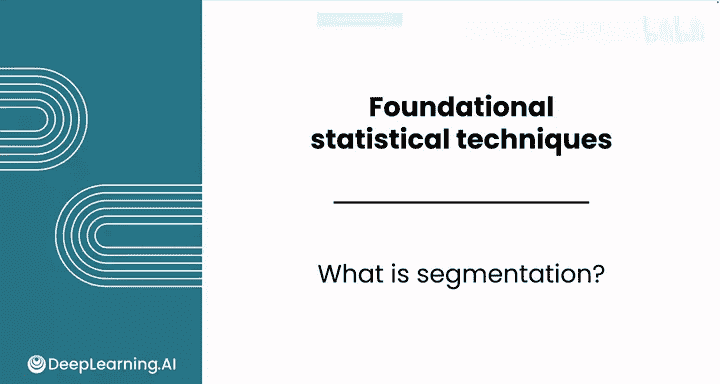
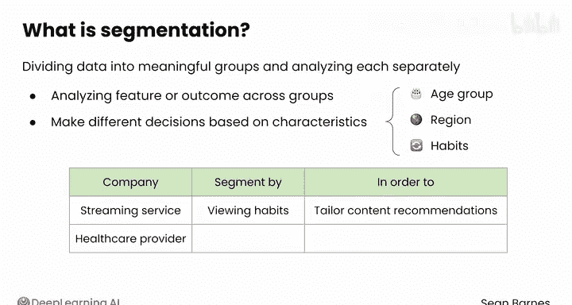
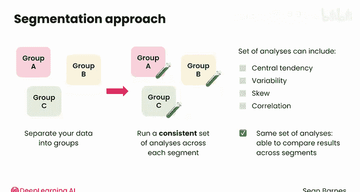
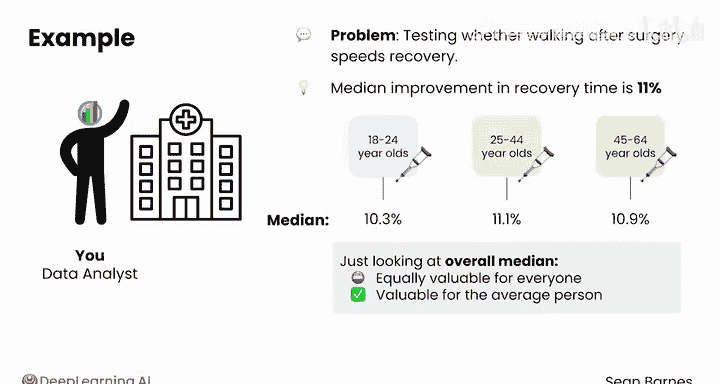
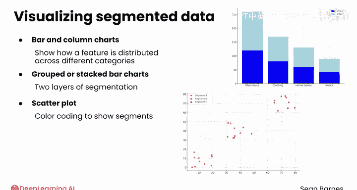

# 095：什么是分群分析？🔍

在本节课中，我们将要学习一种强大的数据分析技术——分群分析。我们将了解其核心概念、应用场景、基本步骤以及可视化方法。

---

分群分析是一种强大的技术，它允许你针对数据的子集开发洞察。

你已经在数据分析基础中看到了几个分群分析的例子，但现在让我们正式定义这个概念。

分群分析的核心在于将数据划分为有意义的组别，并分别分析每个组。

通常，当你希望分析不同组别之间的特定特征或结果时，分群分析非常有用。当你可能希望根据不同组别的特征做出不同决策时，它也很有价值。

常见的分群维度包括年龄组、地理区域或行为习惯。例如，流媒体服务可能会根据用户的观看习惯进行分群，以定制内容推荐；或者，医疗保健提供者可能会根据风险因素对患者进行分群，以确定适当的干预措施。

该方法的步骤很直接：你将数据分离到这些组别中，然后在每个分群上运行一套一致的分析。

这些分析通常包括描述性统计，如集中趋势、变异性的度量，以及相关性分析。

使用同一套分析方法很重要，因为你希望能够比较不同分群之间的结果。

---

让我们更仔细地看看医疗保健的例子。假设你正在测试术后散步是否能加速康复。

你知道康复时间的中位数改善是11%，但你可能希望比较不同年龄组的效果。

术后散步对年轻人更有效，还是对老年人更有效？

因此，你按年龄组对数据进行分群，并测量每个组的康复时间中位数。

假设你发现，对于18至24岁的人群，康复时间的中位数改善是10.3%；对于25至40岁的人群，是11.1%；对于45至64岁的人群，是10.9%。

所以，无论年龄大小，术后散步都是有益的。如果你只看整体的中位数，你将无法确定它对每个人是否具有同等价值，只能确定它对“平均”人是有价值的。

分群分析在医疗领域至关重要。药物和其他干预措施通常对男性和女性的影响不同，并且对儿童需要不同的剂量。

---

分群分析没有神奇的固定方法。它不像皮尔逊相关系数那样有一个公式。

它描述了一种分解数据并试图了解不同子集之间如何比较的分析思路。

---

为了可视化分群数据，你有几个选择。

以下是可视化分群数据的几种常用图表：

*   **条形图和柱状图**：非常适合展示单个特征在不同类别间的分布情况。
*   **分组或堆叠条形图**：可以用于进一步细分数据，实现两层分群。
*   **散点图**：可以通过颜色编码来增强，以显示数据中的不同分群。你也可以在一个网格中显示多个较小的散点图，每个代表一个分群。
*   **折线图**：可以通过使用多条线来进行分群，每条线代表一个不同的组。

一如既往，在创建这些可视化图表时，不要忘记你已经学过的良好设计原则。

清晰度、效率和上下文在展示分群数据时仍然至关重要。

---

本节课中，我们一起学习了分群分析。我们了解到，分群分析是将数据划分为有意义的组别并进行独立分析的过程，它对于发现不同群体间的差异和制定针对性策略至关重要。其核心步骤是**定义分组 -> 分别分析 -> 比较结果**。虽然没有固定公式，但通过条形图、散点图等可视化工具，我们可以清晰地展示和比较不同分群的数据特征。

分群分析做得很好。在下一个视频中，我将介绍一个强大的电子表格技术，用于处理来自多个文件的数据，这在分群分析任务中很常见。