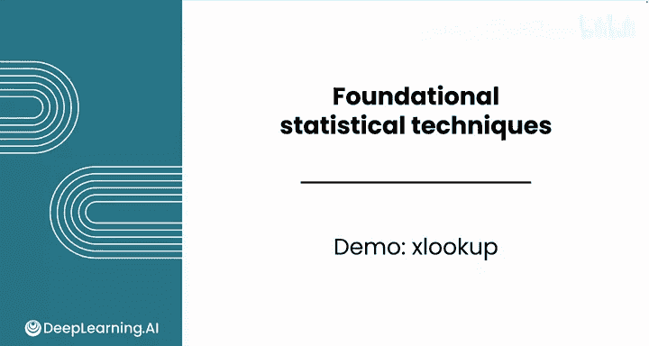
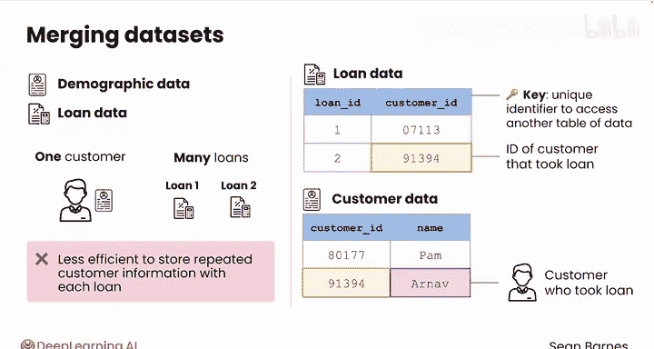

# 096：使用XLOOKUP函数合并数据集 📊

在本节课中，我们将学习如何将存储在不同表格中的数据集合并起来。这是数据分析中的一项常见任务，例如，当我们需要结合客户特征来分析产品使用模式时。

## 概述：为什么需要合并数据？

客户数据和产品数据通常分开存储。它们可能以不同的方式被收集和分析。然而，如果你想基于客户特征来细分产品使用模式，就需要合并这些数据集。

以本模块中一直使用的借贷树贷款数据为例，客户人口统计数据（如收入）和贷款数据（如已付利息）最初很可能存储在不同的文件中。一位客户可能有多笔贷款，因此将重复的客户信息与每笔贷款一起存储效率较低。

## 关键概念：数据键

以下是典型的情况：贷款数据中有一个名为“客户ID”的特征，其每笔贷款的值对应着借款客户的ID。因此，如果你使用这个键去搜索客户数据集，就会得到一个唯一的结果：借款的客户。

这种方法的主要优点是，你可以分开存储客户和贷款数据，同时仍能访问两者。特征“客户ID”被称为**键**——一个允许你访问另一个数据表的唯一标识符。

## 引入XLOOKUP函数

为了执行细分分析，你需要合并这两个数据集。这样你才能回答诸如“收入如何与利息支付相关”等问题。电子表格有一个强大的函数叫 **`XLOOKUP`**，它允许你合并来自多个表格的数据。在本例中，它可以用来创建拥有最盈利贷款的客户的详细档案。

让我们看看它是如何工作的。

## 实践：合并客户职业数据

提醒一下，你之前在处理关于不同贷款的数据以分析潜在的投资机会。在本例中，申请者的人口统计数据在一个标签页中，贷款数据在另一个标签页中。

请注意，在申请者标签页中，数据并未按客户ID排序。因此，即使客户数据已排序，直接将贷款数据复制到申请者数据中也不那么简单，因为一位申请者可能有多笔贷款，这会打乱两个数据集的对齐。你可能还注意到，两个数据表中都有一个客户ID列。

**客户ID是数据的键，使你能够将两个数据集连接起来。**

假设你想将一些申请者人口统计数据加入到贷款数据中。例如，如果你想将第一位客户的职位添加到这个数据中，你可以复制客户ID，然后在申请者人口统计数据中搜索该ID。这个人是办公室管理员，你可以将此值复制到你的贷款数据中，并将其添加到第一行。显然，这不是一个高效的过程，因此必须有一种更高效的方法，使用程序化解决方案。

对于这个任务，你将使用 **`XLOOKUP`** 函数。你可能想查看帮助以了解这个函数实际如何工作。

以下是使用步骤：

1.  **确定查找值**：函数的第一个参数是搜索键。这是你想用来将申请者数据连接到贷款数据的客户ID。这将是特定行的客户ID。
2.  **指定查找范围**：下一个参数是查找范围。这将是申请者数据集中客户ID的整个列。
3.  **选择返回范围**：第三个值是结果范围。这是你希望在数据中返回的特征所在的列。

**公式示例**：`=XLOOKUP(查找值, 查找范围, 返回范围)`

关闭括号。然后你会看到它提取了“办公室管理员”这个值。你可以选择将此公式向下填充到整列，或者将整个公式包装在一个数组公式中。

## 进阶：使用数组公式批量处理

数组公式函数只是接收一个像 **`XLOOKUP`** 这样的函数，并将其应用于一个单元格范围。数组公式在这里很有用，因为你想将此 **`XLOOKUP`** 函数应用于第一列中的每一个客户ID。

请注意，在第一个单元格中，你必须将单个单元格引用更改为整个列。这比搜索单个客户ID然后将结果复制粘贴到列中要快得多。

## 再次实践：合并雇佣时长数据

让我们为申请者数据集中的另一个特征“雇佣时长”重复这个过程。同样，你可以使用数组公式和 **`XLOOKUP`** 函数。

数组公式将把此 **`XLOOKUP`** 函数应用于一个单元格范围，而不仅仅是一个单元格。选择你的客户ID，选择引用范围，这次你想选择“雇佣时长”列。

所以，这里再次发生的情况是：你获取客户ID，用它来搜索申请者数据集中匹配的客户ID，然后你想返回C列中对应的雇佣时长。这样，你就完成了。你现在已将所有客户的雇佣时长合并到了你的贷款数据中。

## 总结

本节课中，我们一起学习了如何使用 **`XLOOKUP`** 函数和数组公式，高效地将基于共同“键”（如客户ID）的不同数据集合并起来。这使我们能够创建更丰富、更全面的数据视图，为后续的细分分析（如下节课将用数据透视表进行的描述性统计）奠定了基础。

出色的工作。请跟随我进入本模块的最后一个视频，在那里你将探索如何使用数据透视表对细分数据应用描述性统计。