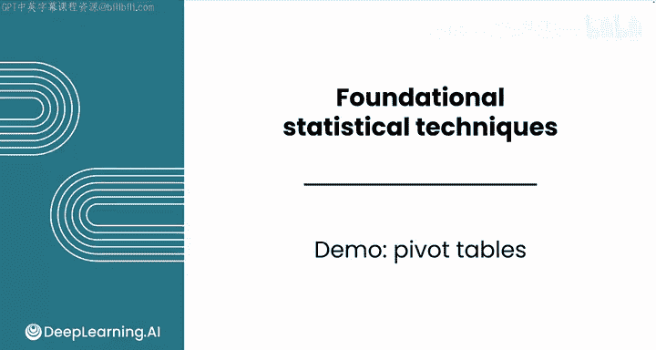
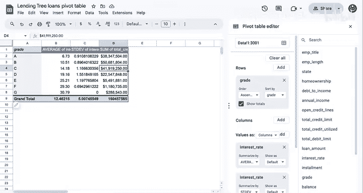
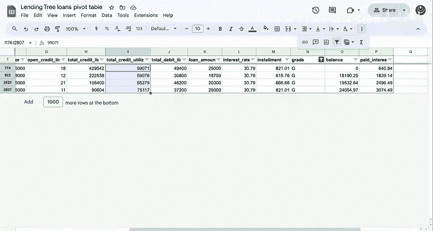
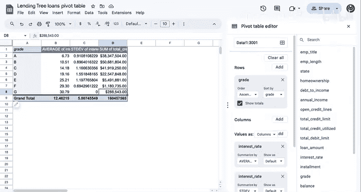

# 097：数据透视表示例 📊

在本节课中，我们将学习如何使用数据透视表来对数据进行分段分析，并计算各分段的描述性统计量。数据透视表是电子表格中的强大工具，能帮助我们快速汇总和比较不同数据类别的信息。

除了图表，你通常还需要检查分段数据的描述性统计量。电子表格的高级用户会使用数据透视表来完成这项任务，下面我们来看看它是如何工作的。

## 分析背景与目标

上一节我们介绍了数据集合并与可视化分段。本节中，我们来看看如何使用数据透视表进行数值分析。

提醒一下，你之前正在处理关于不同贷款的数据，以分析潜在的投资机会。不同类型的贷款对贷款人而言具有不同的风险水平。这反映了借款人可能无法偿还贷款的可能性，而利率则反映了这些风险水平。高风险贷款的利率更高。因此，只要借款人能够偿还，这些贷款可能更有利可图。

假设你有兴趣调查利率的差异，以更好地了解你的潜在贷款。为了做到这一点，你可能希望按“等级”对利率进行分段。请记住，“等级”是一个分类系统，它为贷款分配一个质量分数，其中A级代表风险最低，G级风险最高。

请记得在下载选项卡中查看此电子表格及其解决方案。

## 创建数据透视表

为了执行此分析，你需要选择整个数据集，然后插入一个数据透视表。

以下是创建数据透视表的步骤：

1.  **选择数据并插入**：首先，选中整个数据集。然后，在菜单栏中找到并点击“插入数据透视表”。
2.  **选择位置**：会出现一个弹出菜单。选择“插入到新工作表”。或者，你也可以使用现有工作表，并在右侧选择你希望数据透视表出现的位置。
3.  **使用数据透视表编辑器**：之后，你将看到数据透视表编辑器。这是你设置数据透视表的地方。

## 配置数据透视表

在数据透视表编辑器中，你可以配置行、列和值。

*   **对于行**：你需要添加“等级”特征。这是你想用于分段的特征。你可以看到所有唯一的等级都出现在表格的左侧。
*   **对于列**：如果你想基于两个特征进行透视，可以在这里添加第二个特征，但我们现在先跳过这一步。
*   **对于值**：你可以添加你想要聚合的特征。点击“添加”，然后选择“利率”。选择值后，你可以看到它们已填充到数据透视表中。

## 调整汇总方式与格式

这很有趣，A级贷款的利率4786是什么意思？这是由于汇总函数的选择造成的，它默认是“求和”。所以这实际上是所有A级贷款的利率总和。这不是你想要汇总每个贷款等级利率的方式。

要改变这一点，你需要更改“汇总依据”选项。在这种情况下，你可能需要选择“平均值”。现在你可以看到结果更新了，并且在不同等级类别中看到了更合理的利率。

让我们将格式更改为数字，以便只保留两位小数。请注意，这些代表百分比，所以你不应将格式更改为百分比。

正如预期的那样，A级贷款的利率最低，并且随着风险等级的提高，利率持续上升。再次强调，更高的风险意味着更高的利率。

如果你不小心关闭了数据透视表编辑器，只需点击表格左下角的铅笔按钮，你就可以再次获得所有选项。

## 添加更多分析维度

你还可以向数据透视表添加更多值。假设你还想探索利率的变异性。

你可以再次添加“利率”，将求和汇总函数更改为“标准差”。这让你了解每个等级类别贷款中利率的变异性。这里没有简单的规律，但确实，当你转向风险更高的贷款类别时，变异性实际上增加了。这是可以预料的，因为更高的利率通常伴随着更高的变异性。

请注意，G级的标准差实际上为零。你认为这里发生了什么？要么每个G级贷款的利率都与平均值相同，要么只有一个数据点。

## 探索其他特征

你还可以添加更多特征。在这种情况下，也许你想查看不同的特征，比如“总信用额度使用量”。将汇总函数更改为“平均值”。你可以将结果格式化为美元，这代表了每个等级类别在平台上的总借贷资金量。总信用额度使用量主要集中在更高质量的等级中。

有趣的是，如果我们假设只有一个G级贷款，它是288,000美元。这值得检查数据，看看G级贷款到底发生了什么情况。让我们回到数据。

在这里，你实际上可以看到总共有四个G级贷款。所以并不像你最初怀疑的那样只有一个G级贷款。事实证明，有四个G级贷款，它们都有完全相同的利率。所以对于这种低质量贷款，可能存在一个最高利率，它们都有这个值。然后你可以看到，这四个贷款实际上总计为你在数据透视表中看到的288,000美元。按等级调查所有这些统计数据非常有趣。

## 课程总结

分段分析做得很好。你学习了如何将两个数据集合并为一个，可视化数据中的分段，并使用数据透视表为每个分段计算描述性统计量。接下来，你将完成本课的练习评估。你还将完成本模块的两个评分项目，包括评分评估和评分实验。在实验中，你将运用在本模块中学到的所有技能来帮助葡萄牙国家公园管理局预防森林火灾。

完成这些项目后，你将进入下一个模块：概率与模拟。一旦你对总体进行了抽样并描述了该样本的分布，你就可以应用概率和统计规则来估计整个总体的特征。我们将在下一个模块中学习更多内容。