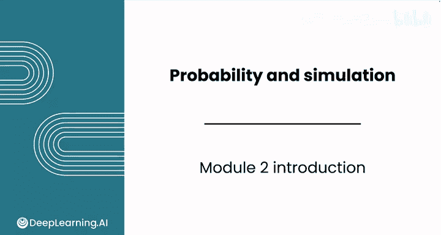
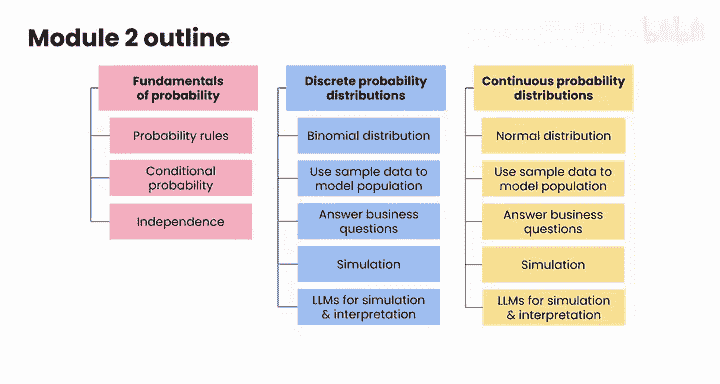

# 098：概率与模拟入门 🎲

在本课程中，我们将学习概率论与模拟技术的基础知识。概率是量化不确定性的语言，而模拟则是利用随机数据来建模和分析复杂场景的强大工具。掌握这些概念对于任何数据分析师都至关重要。



---

## 模块2简介：从不确定性到决策

上一节我们介绍了数据分析的整体框架，本节中我们来看看如何运用概率与模拟来理解和处理不确定性。


欢迎来到《概率与模拟》模块。

你将首先学习概率论，这是用于量化不确定性的语言。

你将涵盖关键的概率规则和概念，例如条件概率和独立性，所有这些都将结合数据分析师会遇到的真实案例进行讲解。

---

## 概率的核心概念

接下来，你将探索概率分布，包括离散分布和连续分布。

你将了解常见的分布，如**二项分布**和**正态分布**，以及它们如何对现实世界的现象进行建模。

**二项分布**的概率质量函数公式为：
`P(X = k) = C(n, k) * p^k * (1-p)^(n-k)`
其中 `n` 是试验次数，`k` 是成功次数，`p` 是单次试验的成功概率。

你还将看到如何利用样本数据来理解总体的分布，并学习如何回答诸如“某些特定结果出现的频率有多高”之类的商业问题。

---

## 模拟技术实践

在本模块中，你将动手实践模拟技术。

你将看到如何生成遵循特定分布的随机数据，从而能够对复杂场景进行建模并支持决策制定。

以下是使用Python生成正态分布随机数的示例代码：
```python
import numpy as np
# 生成1000个服从均值为0、标准差为1的正态分布的随机数
data = np.random.normal(0, 1, 1000)
```

你还将利用大语言模型来创建模拟交互界面，并帮助你解读结果。

到本模块结束时，你将建立起坚实的概率与模拟基础，这是任何数据分析师都至关重要的工具。😊



---

## 学习目标与进阶路径


这些概念将为你学习更高级的统计技术以及后续模块（包括创建置信区间和执行假设检验）做好准备。

让我们开始吧。

请跟随我进入下一个视频，该视频将全面讲解随机性与不确定性。