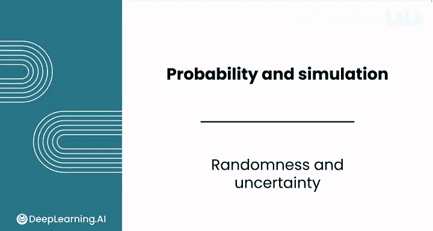
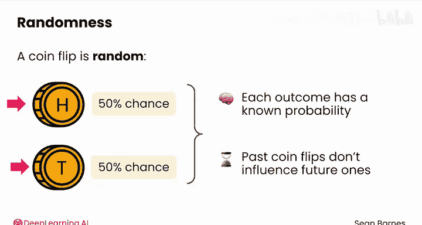
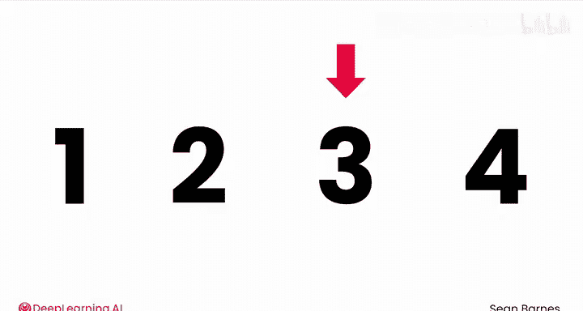
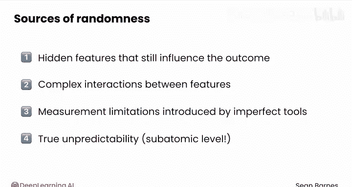
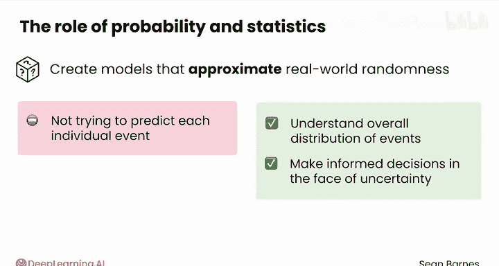
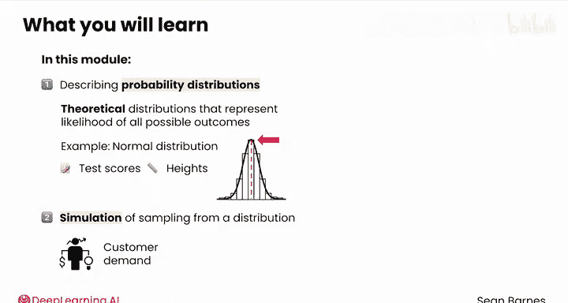
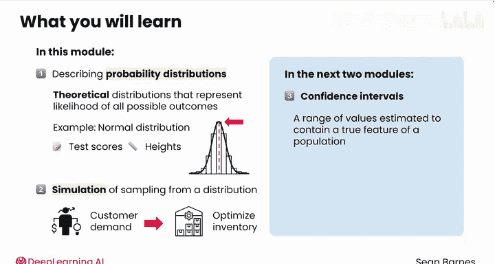

# 099：随机性与不确定性 🎲

在本节课中，我们将要学习概率论如何作为描述不确定性的语言，并理解数据分析师为何需要用它来量化和推理现实世界中的随机性。

## 概述：什么是概率？

概率是不确定性的语言。

想象你在早高峰等火车。火车是7:52到还是7:59到？像火车时刻这样的现实世界数据，都受到随机性的影响。概率论为你作为数据分析师提供了工具，来量化和推理这种不确定性。

## 理解随机性

上一节我们介绍了概率的基本概念，本节中我们来看看随机性的不同类型。

让我们先谈谈随机性。抛硬币是随机的，有50%的概率正面朝上，50%的概率反面朝上。然而，抛硬币是**每个结果都有已知概率**的实验示例，并且过去的抛掷结果不会影响未来的结果。你大约会有一半的次数得到正面，一半的次数得到反面。

现实世界的随机性则更为复杂。我给你举个例子。

### 现实世界随机性的复杂性

以下是现实世界随机性的一个例子。我将向你展示下一张幻灯片上的一些数字，我希望你从中挑选一个。不要想太多，直接选一个。

让我猜一下，你选了3吗？你可能会惊讶地发现，近75%的人会选3。你可以在朋友和家人身上试试这个实验。即使是“从这四个数字中选一个”这样简单的任务，人们也并非真正随机地选择。看似简单的“四分之一机会”背后，实际上是一个非常复杂的实验。

这是另一个例子。假设你试图预测你的朋友是否会准时赴咖啡之约。这里有无数因素在起作用：交通状况、他们的闹钟是否响了、他们当天的感觉如何。这些因素大多对你来说是未知或无法测量的。

### 不确定性的来源

这种随机性或不确定性源于几个方面。

以下是其主要来源：
*   **隐藏特征**：你不知道但仍会影响结果的特征。
*   **特征间的复杂交互**：即使你知道所有特征，它们也可能以难以建模的方式相互作用。
*   **测量限制**：由我们观察世界的不完美工具引入。
*   **真正的不可预测性**：尤其是在某些原子层面。是的，我在谈论物理学。有些事情确实无法预测。

## 概率分布与数据分析

理解了随机性的来源后，我们来看看分析师如何应对它。

分析师使用概率和统计学来创建模型，以近似这种现实世界的随机性。你的目标不是完美预测每一个单独事件，而是理解事件的整体分布，并在不确定的情况下做出明智的决策。

你在上一个模块中已经探索了样本数据的分布。在这个模块中，你将从描述**概率分布**开始。概率分布是理论分布，代表了随机实验中所有可能结果的**可能性**。

另一方面，**样本数据分布**来自于实际从世界中、从总体中抽样。

### 概率分布示例

一个概率分布的例子是所谓的**正态分布**。它模拟了大多数值聚集在均值周围的行为分布，例如考试成绩或身高。

可以对从分布中抽样进行模拟，你将在最后两节课中看到这一点。例如，你可能会模拟客户需求以优化库存水平。

在接下来的两个模块中，你还将探索两种基于概率论和分布的统计工具。

以下是这两种工具：
*   **置信区间**：一个估计包含总体真实特征（如均值）的数值范围。
*   **假设检验**：一种帮助你确定观察到的结果是否可能代表真实效应的技术。

这些定义现在可能不太容易理解，但在下一个模块中你会对它们非常熟悉。

## 总结

本节课中我们一起学习了概率论作为数据分析师量化与建模随机性或不确定性的目的。现在你已经看到了概率对于数据分析师的意义，请加入下一个视频，学习概率的基本规则。