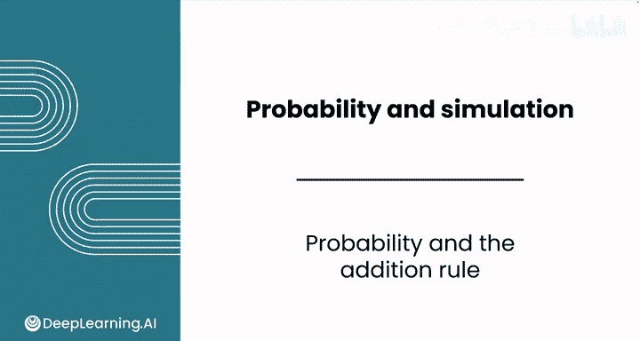
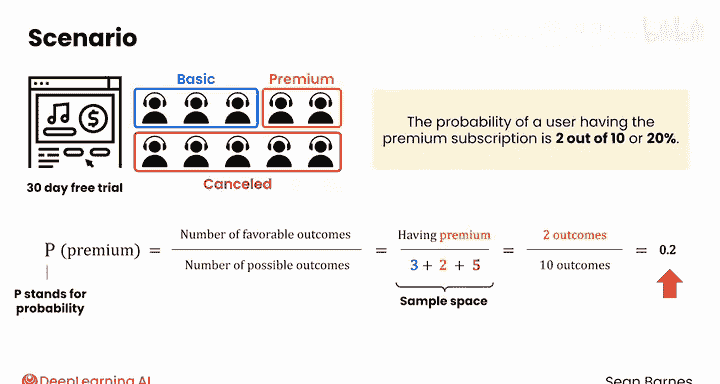
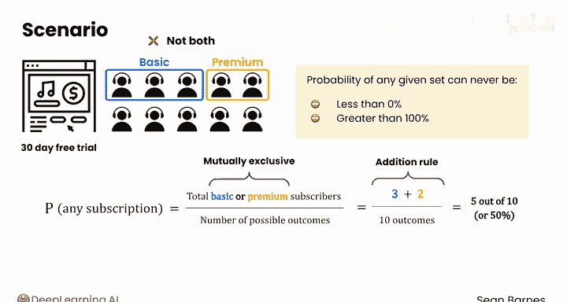

# 100：概率与加法规则 📊

在本节课中，我们将要学习概率的基本概念，以及如何计算单一事件或多个互斥事件发生的可能性。我们会通过一个音乐订阅服务的实际例子，来理解概率的定义、表示方法以及核心的加法规则。

---

## 概率是什么？

概率描述的是一个事件发生的机会。

当一个事件的结果不确定时，你可以使用概率来讨论它发生的可能性。例如，抛一枚硬币，它正面朝上的概率是 **1/2** 或 **50%**。

你对此类事件的概率有一种直觉。现在，让我们通过一个现实世界的例子来正式定义这种关于概率的直觉。

---

## 一个现实案例：音乐订阅服务

假设一个音乐订阅服务向10位客户提供了30天免费试用。在试用期结束时，客户可以选择继续使用基础订阅、升级到高级订阅，或者取消订阅。

你发现，有3位客户选择了基础订阅，2位选择了高级订阅，5位取消了订阅。

为了讨论概率，你需要了解三个术语：**实验**、**事件**和**结果**。

---

## 定义：实验、事件与结果

假设你随机选择一位客户进行访谈，了解他们的使用体验。那么，这位客户选择了高级订阅的可能性有多大？

*   **实验**：选择一位客户这个行为，在概率论中被称为一个实验。
*   **结果**：你观察到的是所有可能结果集合中实际发生的那一个。选择每一位具体的客户，都称为实验的一个结果。
*   **事件**：你感兴趣测量的特定结果集合。在这里，“客户拥有高级订阅”就是一个事件。

对于“客户拥有高级订阅”这个事件，存在两个可能的结果，因为你可以随机选择那两位高级订阅客户中的任意一位。

---

## 如何计算概率？

那么，这位客户选择了高级订阅的可能性有多大？你可以这样书写这个事件的概率：

**P(premium)**

其中，**P** 代表概率。

以下是估算这个概率的方法：一个事件的概率等于 **有利结果的数量** 除以 **所有可能结果的数量**。

*   **有利结果**：就是你正在寻找的结果。在本例中，即“拥有高级订阅”。
*   **所有可能结果**：你需要将分母中所有可能结果的数量相加。3人选择基础版，2人选择高级版，5人取消，所以总共有 **10** 个可能的结果。这个所有可能结果的集合有时被称为**样本空间**。

你感兴趣的事件是“拥有高级订阅”。因此，分子中构成这个事件的结果数量是 **2**。

所以，随机选择的用户拥有高级订阅的概率是 **2/10**，即 **20%**。

概率可以表示为 **0到1之间** 的比例（如 **0.2**），也可以表示为百分比（如 **20%**）。

---

## 加法规则

现在，考虑一个稍复杂的问题：你随机挑选一位客户进行访谈，他拥有**任何订阅**（无论是基础版还是高级版）的可能性有多大？

分母保持不变，样本空间中仍有 **10** 个可能的结果。但此时，你感兴趣的是**两个不同的事件**：基础订阅和高级订阅。

由于这两个群体彼此**互斥**——一个人要么是基础订阅，要么是高级订阅，不能同时是两者——你可以将他们在分子中相加。这种一个事件不能同时是两种结果的性质，被称为**互斥性**。

因此，分子中应包含的结果数量是：3位基础订阅客户 **加上** 2位高级订阅客户，即 **5**。

概率为 **5/10** 或 **50%**。

这被称为**加法规则**。请注意，加法规则**仅适用于互斥事件**。

---

## 概率的取值范围

值得注意的是，任何给定事件的概率**永远不会小于0（或0%）**，也**永远不会大于1（或100%）**。

没有比“总是发生”（概率为1）更频繁的事件，也不存在概率为-1的情况。

---

## 总结与预告

本节课中，我们一起学习了概率的核心概念。我们定义了实验、事件和结果，并学会了如何计算单一事件的概率（有利结果数 / 所有可能结果数）。更重要的是，我们掌握了**加法规则**，用于计算多个**互斥事件**中至少有一个发生的概率，其公式为：

**P(A 或 B) = P(A) + P(B)** （当A与B互斥时）

概率可以以多种方式组合。在下一节视频中，我们将学习乘法规则和补集规则，以处理更复杂的概率场景。