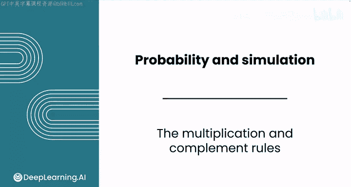
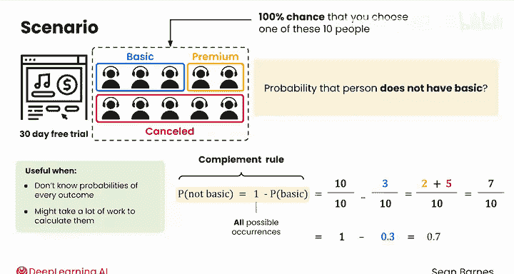

# 101：概率的乘法与补集规则 📊

在本节课中，我们将学习如何计算两个事件同时发生的概率，以及一个事件的对立事件发生的概率。概率规则将帮助我们以数学方式推理这些情况。

## 概述

上一节我们介绍了概率的基本概念和加法规则。本节中，我们将探讨两个新的重要规则：**乘法规则**和**补集规则**。这些规则能帮助我们计算更复杂的概率场景，例如两个独立事件同时发生的概率，或某个事件不发生的概率。

---

## 乘法规则

回忆之前的视频，我们处理的是获得免费试用的客户。你随机选择其中一位客户进行访谈。假设你正在与营销团队合作，他们也计划随机访谈一位用户。

那么，你和营销团队都随机选中了**高级订阅**用户的概率是多少？

你可以用一个表格来可视化这个实验。每一行代表数据团队可以选择的10个人之一（3个基础版，2个高级版，5个取消版）。每一列代表营销团队可以选择的访谈对象，拥有相同的选项。

因此，样本空间有 `10 × 10 = 100` 种可能的结果。

你感兴趣的结果是**双方选中的都是高级订阅用户**。在表格中，这样的结果有4个。

为了计算这个概率，我们使用以下符号：`P(高级, 高级)`，表示你选择高级用户**且**营销团队选择高级用户的概率。

已知你选中高级用户的概率是 `2/10`，营销团队选中高级用户的概率也是 `2/10`。你可以将这些概率相乘：
`2/10 × 2/10 = 4/100`（正如表格所示），化简为 `1/25`。

这被称为**乘法规则**，适用于估计**独立事件**的概率。其正式写法为：
**`P(A 且 B) = P(A) × P(B)`**

在这个场景中，你选择访谈对象与营销团队的选择是**完全独立**的。因此，你可以将概率相乘，来计算两个结果同时发生的概率。最终，每25次实验中，大约只有1次会同时选中两位高级订阅用户。这是合理的，因为选中高级用户本身就是一个相对罕见的结果。

---

## 非独立事件的概率

现在，假设你和营销团队的同事希望确保**不选中同一个人**。在这种情况下，你不能使用乘法规则，因为这两个事件**不再独立**。你同事的选择依赖于你的选择。

关于独立性，我们将在本课后面详细学习。现在，你可以通过表格来找到这个概率。

首先，定义样本空间，数出符合条件的结果。即你和同事**没有选择同一个人**。这包括了除对角线上10个结果（选中同一个人）之外的所有结果，所以分母是 `100 - 10 = 90`。

然后，找出有利结果。之前我们有4个有利结果（双方都选高级）。但现在，其中两个结果（双方选中同一个人）被排除了，所以只剩下2个有利结果。

因此，为访谈选择两位不同的高级用户的概率是 `2/90`，约等于 **2.2%**。

---

## 补集规则

最后，假设你想确定随机选中的访谈对象**没有基础订阅**的概率。

你可以使用**补集规则**。其核心思想是，事件“非基础”的概率等于1减去事件“基础”的概率。因为1代表了所有可能发生的情况，减去“基础”发生的概率，剩下的就是其他所有情况。

当你不清楚每个结果的概率，或者计算所有概率工作量很大时，补集规则非常有用。

以下是计算 `P(非基础)` 的示例：
*   第一个概率的分母是所有10个人（代表公式中的“1”），分子也是所有10个人。这意味着你有100%的概率选中这10人中的一位。
*   然后，你要减去选中基础用户的概率。所以第二个概率的分母同样是所有10个人（样本空间），分子是3个基础用户。
*   当你相减后，剩下的是相同的分母，但分子变成了2个高级用户加上5个取消用户，总共7人。

所以，选中非基础用户的概率是 `7/10`，即 **70%**。

用数学公式表示就是：
**`P(非基础) = 1 - P(基础) = 1 - 0.3 = 0.7`**

---

## 总结

本节课我们一起学习了两个核心的概率规则：
1.  **乘法规则**：用于计算两个**独立**事件同时发生的概率，公式为 `P(A 且 B) = P(A) × P(B)`。
2.  **补集规则**：用于计算一个事件**不发生**的概率，公式为 `P(非A) = 1 - P(A)`。

我们还通过实例看到，当事件不独立时（例如选择不重复的人），不能直接应用乘法规则，而需要回到样本空间进行计数分析。

现在你已经熟悉了加法、乘法和补集规则，在下一个视频中，我们将一起学习更深入的**条件概率**。

