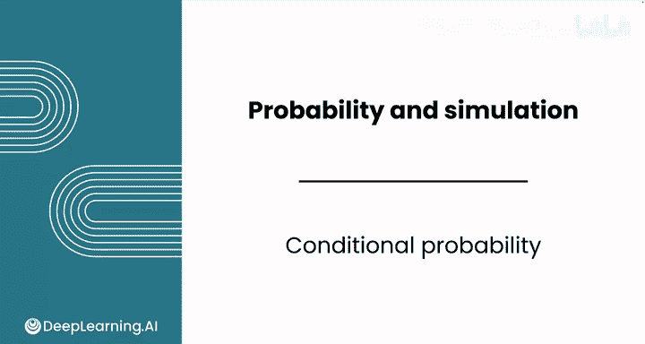
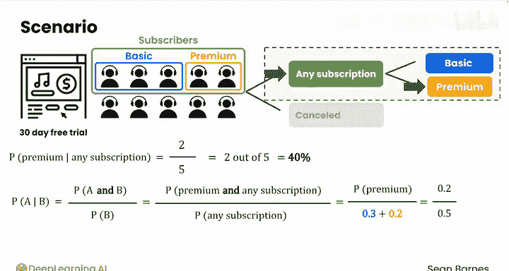
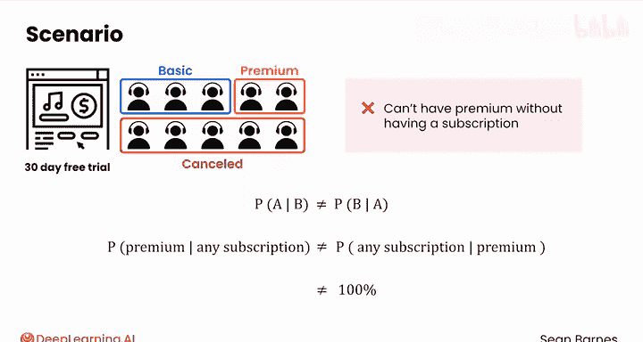
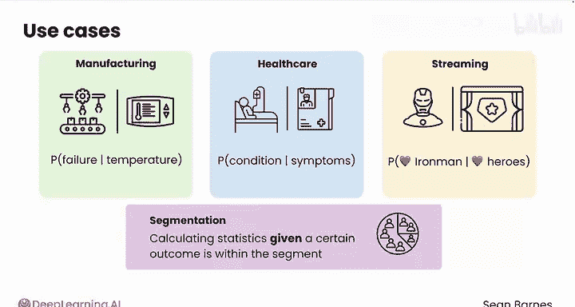

# 102：条件概率 🎲

在本节课中，我们将要学习**条件概率**的概念。条件概率用于描述在已知某个事件发生的情况下，另一个事件发生的可能性。这是数据分析中一个非常核心且实用的工具。

---

在现实世界中，两个事件通常不是完全独立的。某些事件的发生会影响其他事件发生的概率。我们可以计算在已知一个事件已经发生的条件下，另一个事件发生的概率。这就是**条件概率**。

让我们回到订阅者访谈的例子。假设你想计算一个人拥有**高级订阅**的概率，但前提是这个人**至少拥有一个订阅**（即忽略那些取消订阅的人）。

以下是这个概念的形式化表示。你可以说：**在拥有任何订阅的条件下，拥有高级订阅的概率**。这里的竖线符号（`|`）读作“在...条件下”。更一般地，条件概率表示为 **`P(A|B)`**。

一个流程图可以帮助你直观地理解这个过程。这里有两个分支事件：首先，一个人要么获得了订阅，要么取消了订阅。然后，只有在他们获得订阅的情况下，他们才可能拥有基础版或高级版订阅。条件概率所做的，就是只关注流程图的这个分支，并提问：在这个订阅者群体中，某人获得高级订阅的概率是多少？

直观地说，你已经将样本空间缩小到了仅有的五个人——订阅者。这就是你的分母。现在，你的分子是拥有高级订阅的人，共有2个。因此，**在拥有任何订阅的条件下，拥有高级订阅的概率**是 `2/5`，即 `40%`。

---

让我们形式化并推广这个计算。条件概率的通用公式是：

**`P(A|B) = P(A ∩ B) / P(B)`**

在这个例子中：
*   `P(A ∩ B)` 是同时拥有高级订阅**和**拥有订阅的概率。换句话说，就是拥有高级订阅的概率（因为必须先有订阅才能有高级订阅），即 `0.2`。
*   `P(B)` 是拥有任何订阅（包括基础版和高级版）的概率，即 `0.3 + 0.2 = 0.5`。

代入公式得到：`0.2 / 0.5 = 0.4`，化简为 `2/5` 或 `40%`。

需要注意，**`P(A|B)` 与 `P(B|A)` 是不同的**。在上面的例子中，`P(B|A)` 表示**在拥有高级订阅的条件下，拥有订阅的概率**，这个概率是 `100%`。因为你不可能在没有订阅的情况下拥有高级订阅。

---

条件概率在数据分析中应用广泛。你刚刚看到了订阅者的例子，但它还可以用于解决各种商业问题。

以下是条件概率在不同领域的应用示例：

*   **制造业**：在工厂温度为特定值的条件下，设备发生故障的概率是多少？
*   **医疗保健**：在患者表现出特定症状的条件下，其患有某种疾病的概率是多少？
*   **流媒体**：在用户经常观看其他超级英雄电影的条件下，他们会喜欢新《钢铁侠》电影的概率是多少？

条件概率也与**数据细分**密切相关。你之前学过，细分涉及在定义的数据段内计算统计量。换句话说，就是在某个条件为真的前提下进行计算。

---

世界上的一些事件是相互依赖的，一个事件的结果会影响另一个事件的概率。但也有一些事件是**独立**的，它们的概率完全互不影响。

在下一个视频中，我们将进一步学习独立事件。

---

本节课中，我们一起学习了**条件概率**。我们了解了它的定义、计算公式 **`P(A|B) = P(A ∩ B) / P(B)`**，并通过订阅者案例进行了实践。我们还探讨了条件概率与数据细分的关系，并看到了它在多个行业中的实际应用。记住，`P(A|B)` 与 `P(B|A)` 通常不相等，理解这一点对于正确应用条件概率至关重要。