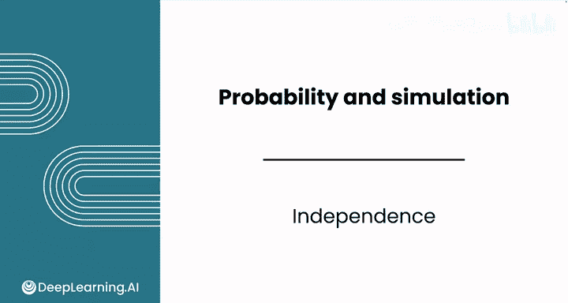
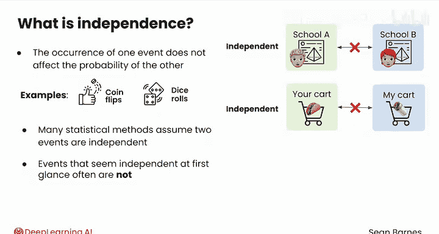
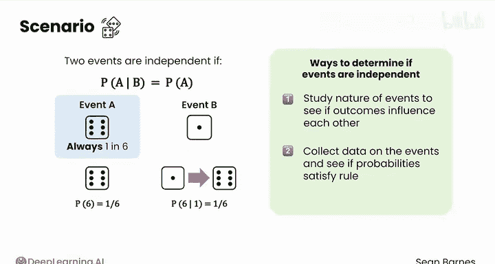
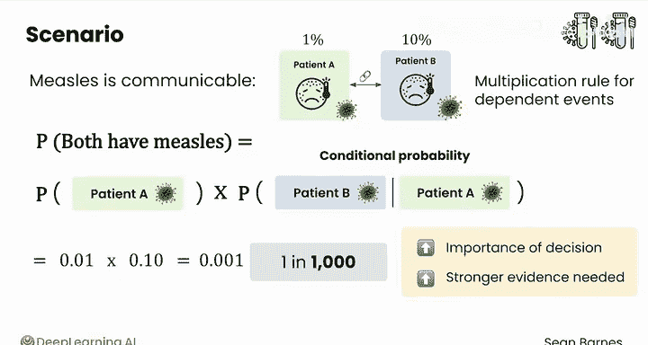

# 103：独立性 🎲

在本节课中，我们将要学习概率论中的一个核心概念——**独立性**。理解独立性对于正确应用统计方法和避免常见错误至关重要。

## 概述

独立性描述了两个事件之间互不影响的关系。我们将通过掷骰子、抛硬币等例子来理解这个概念，并学习如何判断事件是否独立，以及独立性如何影响概率计算。

## 什么是独立性？

想象你正在玩一个掷骰子游戏，并且你运气很好。

你最近四次掷出的点数都是六点。

那么你下一次掷出六点的概率是多少？概率很高，对吗？实际上，并非如此。

你掷出六点的概率始终是六分之一。这是因为每次掷骰子是**独立**的。

前四次的结果对下一次结果没有任何影响。

在统计学中，独立性意味着一个事件的发生不会影响另一个事件发生的概率。

抛硬币和掷骰子都是独立事件。一些现实世界中的事件也是独立的。例如：

两个学生在不同的高中参加几何考试，他们的成绩不会相互影响。你和我在各自的城市购买杂货，你买什么和我买什么也是独立的。我们各自做决定，收到不同的优惠券等等。

## 判断独立性的重要性

两个事件是否独立是一个关键的区分。

许多统计方法都依赖于两个事件是独立的这一假设。

即使两个事件之间可能存在微妙的联系。

有些乍看之下独立的事件，往往并非如此。例如：

假设你正在为两个不同的病人检测麻疹。起初，这两次检测似乎是独立的。毕竟是两个不同的人。

然而，麻疹是一种高度传染性的疾病。所以，如果当地诊所的一个人检测呈阳性，那么同一诊所的其他人感染麻疹的可能性也会增加。

## 独立性的数学定义

让我们再回到掷骰子的例子。在概率论中，如果两个事件满足以下规则，则被认为是独立的：

**P(A|B) = P(A)**

下面是一个例子。假设事件A是掷出六点，事件B是掷出一点。

掷出六点的概率，即P(A)，是六分之一。

现在假设你掷两次骰子，并且第一次掷出的是一点。那么你在第二次掷出六点的概率，即在已知第一次掷出一点的情况下掷出六点的概率P(A|B)，仍然是六分之一。无论你第一次掷出什么，掷出六点的概率始终是六分之一。

因此，这些事件符合上述规则，被认为是独立的。

## 如何判断事件是否独立

你可以通过几种方式来判断事件是否独立。

首先，你可以研究事件的性质，看结果是否相互影响。就骰子而言，一次掷出的结果不会提供任何信息来帮助你预测下一次的结果。

然而，在现实世界中，证明独立性很少像掷骰子那样简单。

你的另一个选择是通过收集事件的数据来检验独立性，看看概率是否满足这个规则。

## 非独立性对计算的影响

非独立性会影响许多统计计算，比如你之前学过的乘法法则。

如果两个事件是独立的，你可以将它们的概率相乘，得到两个事件同时发生的概率。

然而，如果事件不是独立的，比如在同一诊所进行的两次麻疹检测，那么乘法法则就不能直接应用。

在麻疹检测的例子中，两个人在同一诊所检测出麻疹阳性的概率是多少？

假设第一个人感染麻疹的概率是1%。如果你假设两次检测是独立的，你会得出结论认为第二个人感染麻疹的概率也是1%，将它们相乘得到：0.01 × 0.01 = 0.0001，即万分之一。

然而，麻疹是高度传染的。如果第一个人检测呈阳性，第二个人感染麻疹的概率可能会增加到，比如说10%。在这种情况下，你需要使用**依赖事件**的乘法法则。

你需要计算：P(两人都感染麻疹) = P(第一个人感染麻疹) × P(第二个人感染麻疹 | 第一个人感染麻疹)。最后一项——条件概率，量化了第一个人感染麻疹对周围其他人感染麻疹几率的影响程度。

这个等式计算如下：0.01 × 0.10 = 0.001，即千分之一。

因此，假设两次麻疹检测是独立的，会给你一个相差一个数量级（10倍）的错误估计。

请记住，决策越重要，你需要的证据就越有力。而确定两个事件是否独立，是建立严谨性的一部分。

## 总结

本节课中我们一起学习了**独立性**的概念。我们了解到独立性意味着事件之间互不影响，并通过掷骰子的例子掌握了其数学定义 **P(A|B) = P(A)**。我们探讨了判断独立性的方法，并重点学习了非独立性如何影响概率计算，特别是乘法法则的应用。记住，在现实世界的复杂情况（如传染病检测）中，错误地假设独立性可能导致严重的估计错误。

这就是关于独立性的内容。请继续学习本课的最后一个视频，了解如何使用随机变量来表示事件。