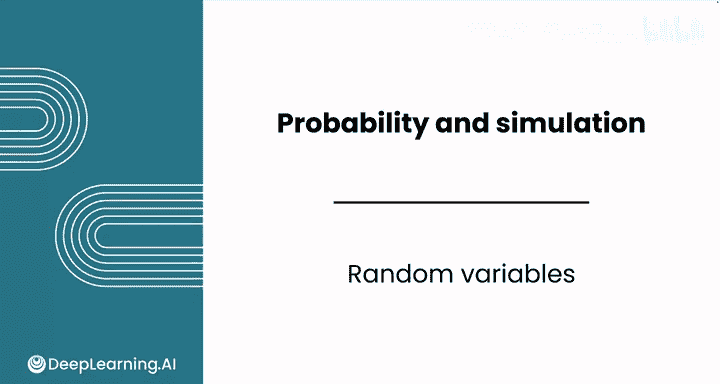
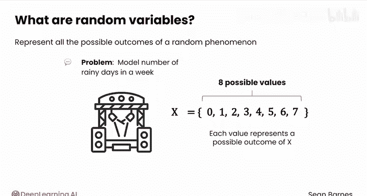
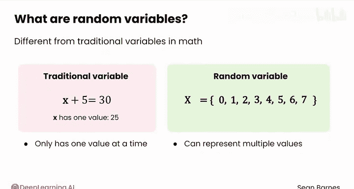
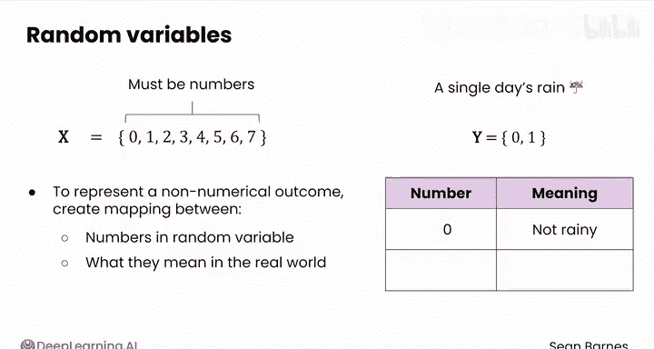
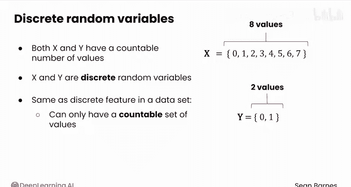
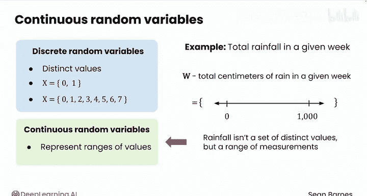
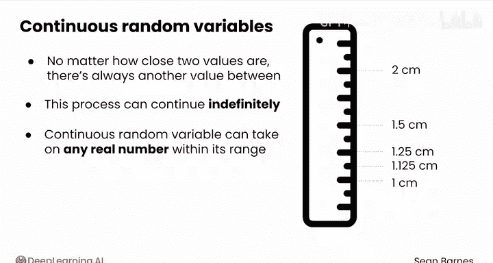
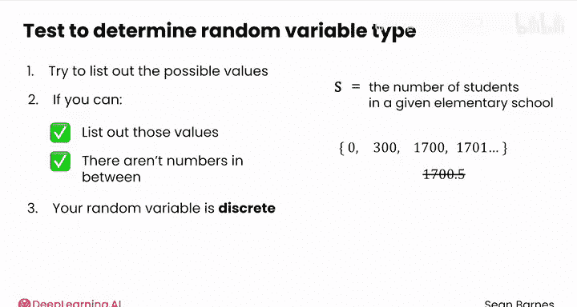
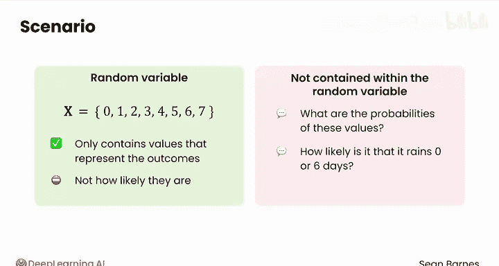

# 104：随机变量 📊

在本节课中，我们将学习如何用数学方式表示一个事件的所有可能结果。为此，数据分析师会使用一个核心工具：随机变量。

---

## 概述

随机变量是用于表示随机现象所有可能结果的数学工具。它使我们能够对不确定的、有多种可能结果的事件进行量化和数学运算。理解随机变量是学习概率论和后续统计分析的基础。

---

## 什么是随机变量？

上一节我们介绍了概率的基本概念，本节中我们来看看如何用数学语言描述随机事件的结果。

随机变量代表一个随机现象的所有可能结果。例如，假设你正在为一个户外活动场地工作，他们请你帮忙模拟一周内的下雨天数。你可以用一个随机变量来实现，我们称它为 **X**（随机变量通常用大写字母表示）。天气是不可预测的，因此在这里使用随机变量是合理的。

这个随机变量所有可能的结果是什么？可能一周内下雨0天、1天、2天，一直到7天。因此，存在8个可能的值：0到7。这些值中的每一个都代表该随机变量的一个可能结果。

你可以看到，这种类型的变量与数学中的传统变量有很大不同。传统变量在某一时刻只有一个值。例如，在方程 `x + 5 = 30` 中，`x` 只有一个值：25。而随机变量则可以代表多个值，每个值对应一个可能的结果。

---

## 随机变量的优势：简化概率表示

随机变量使你的概率表示法变得更加容易。当你想表达诸如“下雨3天的概率”时，你不必说“P(下雨3天)”，而可以说 **P(X = 3)**，即“X取值为3的概率”。

随机变量所代表的值必须是数字，否则你将无法对它们进行数学运算。然而，如果你想表示一个非数字的结果，你可以在随机变量中的数字与现实世界中的含义之间创建一个映射。

例如，你可以用随机变量 **Y** 来表示单日的下雨情况，并规定 **0** 代表“不下雨”，**1** 代表“下雨”。

---

## 离散随机变量与连续随机变量

请注意，上述例子中的 X 和 Y 都有一个可数的数值集合（X有8个值，Y有2个值）。因为它们各自都有一组不同的、可数的值，所以 X 和 Y 都被称为**离散随机变量**。

“离散”这个概念与数据中的离散特征相同，它只能取一组可数的值。

由于现实世界中的一些现象无法用不同的值来表示，因此也存在**连续随机变量**，它代表一个范围内的值。

例如，对于同一家活动公司，你可能对给定一周内的总降雨量感兴趣。你可以用一个随机变量 **W** 来代表给定一周内的降雨厘米数。在这种情况下，W 是7个独立日降雨量的总和。每一天的降雨量可以是任何数量，包括0。因此，W 可以是任何非负数，上限可能是一个非常大的数值（如果遇到极端多雨的一周）。

W 被认为是一个连续随机变量，因为降雨量不是一组不同的值，而是一个连续的测量范围。思考降雨量为何是连续的一种方式是：无论两个值多么接近，它们之间总是存在另一个值。

例如，取两个降雨量：1厘米和2厘米。它们非常接近，但在这两个值之间，你可以有1.5厘米；在1厘米和1.5厘米之间，你可以有1.25厘米；在这些值之间，你还可以有1.125厘米，依此类推。这个过程可以无限继续下去，这实际上就是“连续”一词的含义。

在实际应用中，你的测量精度可能受到工具的限制，但在理论上，连续随机变量可以在其范围内取任何实数值。

---

## 如何判断随机变量的类型？

为了判断你正在处理的随机变量是离散的还是连续的，你可以尝试列出它可以取的所有可能值。

以下是判断步骤：
1.  尝试列出随机变量所有可能的值。
2.  如果你能实际列出这些值，并且这些值之间没有其他数字（即它们是可数的、分离的），那么你的随机变量就是离散的。
3.  如果可能的值构成一个连续的范围，无法一一列举，那么它就是连续的。

让我们来看一个例子。假设有一个随机变量 **S**，代表一所给定小学的学生人数。你认为 S 是离散随机变量还是连续随机变量？

我们来尝试数一下这些值。可能有0名学生、300名学生、1700名学生，甚至1701名学生。但不可能有1700.5名学生。这些是你可以实际列出的、中间没有其他数字的独立值。这使得 S 成为一个**离散随机变量**。

---

## 重要区分：随机变量与概率

让我们回到随机变量 X（一周内的下雨天数）。你之前看到 X 可以取的值是0、1，一直到7。但是，这些值的概率是多少呢？在任何给定的一周内，下雨0天或6天的可能性有多大？

关于概率的信息**并不包含在随机变量本身之内**。这是一个常见的混淆点。随机变量只包含代表结果的值，而不包含这些结果发生的可能性。你将在下一课中学习更多与随机变量相关的概率知识。

---

## 总结

本节课我们一起学习了概率论的核心工具——随机变量。我们定义了随机变量，了解了它如何用数学方式（如 **X**、**P(X=3)**）表示现实世界中的随机现象（如下雨天数）。我们重点区分了**离散随机变量**（取值可数，如学生人数）和**连续随机变量**（取值在一个连续范围内，如降雨量）。最后，我们明确了随机变量本身只定义可能的结果，而不包含其发生的概率，为下一课学习概率分布奠定了基础。

---
*提示：本教程基于吴恩达《数据分析》课程第1-2课内容整理，旨在帮助初学者理解核心概念。*