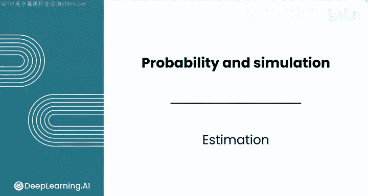
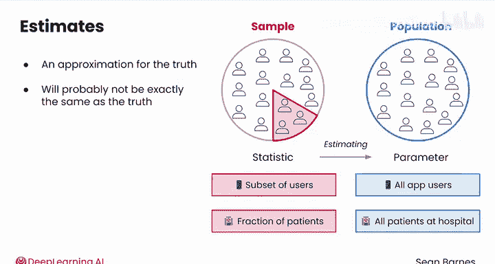
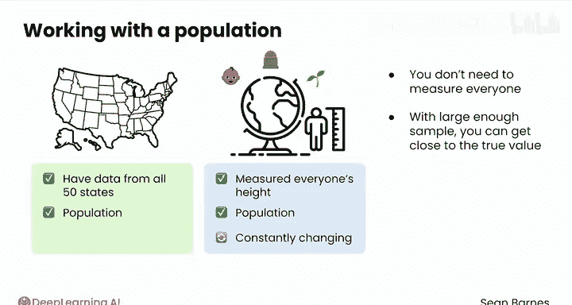
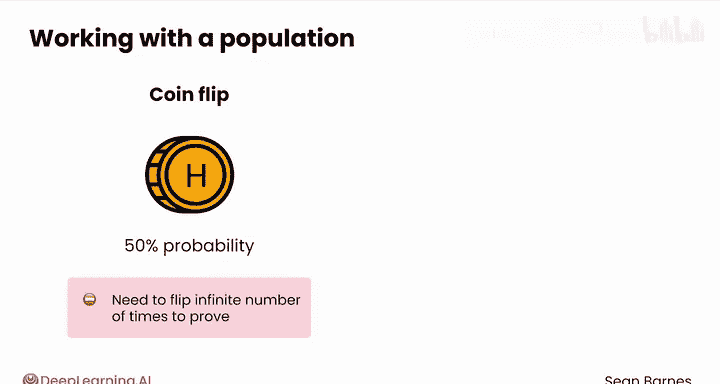
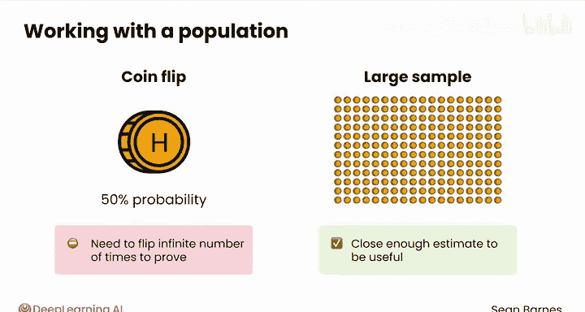
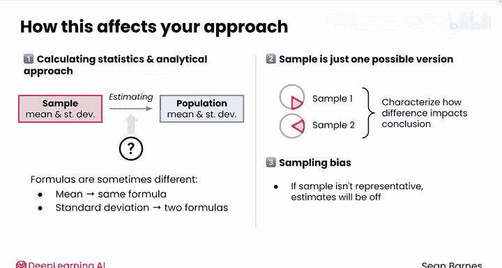

# 105：估计 📊

在本节课中，我们将要学习统计学中一个核心概念：估计。我们将探讨总体与样本的区别，理解为什么从样本中计算出的统计量是对总体参数的估计，并了解这种区别如何影响数据分析的方法。

---

随着你在统计学道路上的深入，在处理数据时，记住一个关键点将变得至关重要：你面对的是总体还是样本？正如你在上一个模块中学到的，你遇到的数据更可能是一个样本。这一点很重要，因为大多数统计量对于样本和总体都有不同的公式和解释。

当你从样本中计算一个统计量时，你实际上是在估计真实的总体值，统计学家称之为**参数**。这个估计值，即统计量，是对真实参数的一个近似。你希望你的估计是准确的，但它很可能与真实值不完全相同。

例如，你可能试图仅通过一部分用户来理解所有应用程序用户的行为，或者仅通过一小部分患者来理解医院所有患者的医疗结果。你在这些样本上计算的任何统计量，都将是真实总体参数的一个估计。

那么，你什么时候会处理总体数据呢？这里有一个例子：如果你需要关于美国所有50个州的信息，并且你拥有所有50个州的数据，那就是一个总体。你的分析中没有包含其他未被考虑的州，因此没有猜测的成分。

但实际情况通常比这更微妙。让我们考虑一个思想实验：想象测量地球上每个人的身高。暂且抛开实际操作问题，假设你做到了，你测量了每个人的身高。那是一个总体。但即使你能做到，在你完成测量时，已经有婴儿出生，有人去世，还有人长高了。你可能确切地知道那一刻的平均身高，但它会不断变化。

统计学的魅力在于，你实际上不需要测量每一个人。只要有一个足够大的样本，你就可以非常接近真实值。抛硬币的情况也是如此。理论上，一枚公平的硬币正面朝上的概率是50%，但你需要抛掷无限次才能绝对证明这一点。在实践中，一个大的样本可以给你一个足够接近、有用的估计。

那么，总体和样本之间的这种区别如何影响你作为数据分析师的方法呢？

以下是几个关键影响：

首先，它对你计算的统计量和你采用的分析方法有影响。当你从样本中计算均值或标准差时，要知道这是一个估计值。关于它能在多大程度上代表真实的总体参数，存在一些不确定性。请注意，你在上一个模块中学到的均值和标准差公式都是针对样本的。总体的公式有时会不同。

例如，总体均值（μ）和样本均值（x̄）的计算方式相同：
`μ = (Σx) / N` 和 `x̄ = (Σx) / n`
（其中 N 是总体大小，n 是样本大小）

但标准差有两个不同的公式：
*   总体标准差（σ）：`σ = √[ Σ(x - μ)² / N ]`
*   样本标准差（s）：`s = √[ Σ(x - x̄)² / (n - 1) ]`
（使用 `n - 1` 是为了进行无偏估计，这在处理样本时很重要）

其次，在处理样本时，重要的是要记住，你正在分析的数据只是该数据的一种可能版本。如果你抽取另一个样本，你会得到略有不同的结果。你的工作就是描述这种差异如何影响你的结论。

最后，你必须意识到你的抽样方法可能引入的各种偏差。如果你的样本不能代表总体，你的估计就会偏离真实情况。

作为数据分析师，你常常扮演着侦探的角色：你利用样本中的线索，拼凑出关于总体的更完整图景。

---

本节课中我们一起学习了总体与样本的根本区别，以及从样本统计量估计总体参数的核心思想。我们了解到，由于我们通常无法测量整个总体，因此样本是我们的最佳工具，但必须谨慎对待由此产生的估计不确定性、公式差异以及潜在的抽样偏差。在接下来的课程中，我们将探索样本分布如何帮助我们估计总体分布。