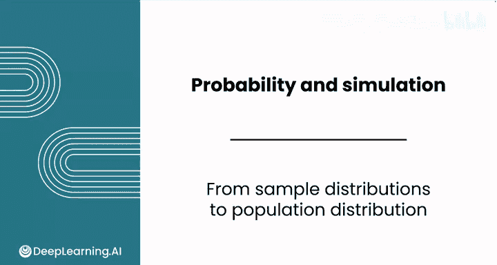
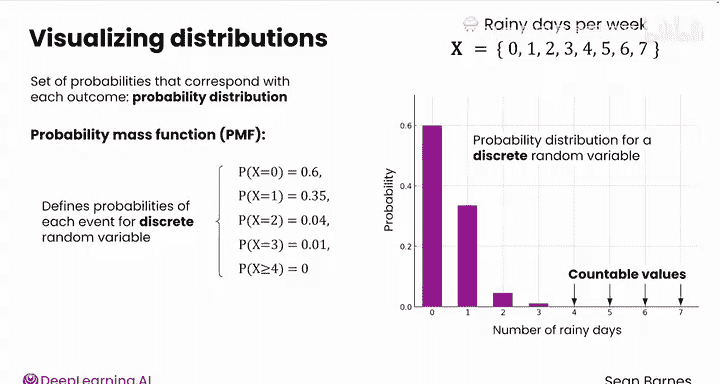
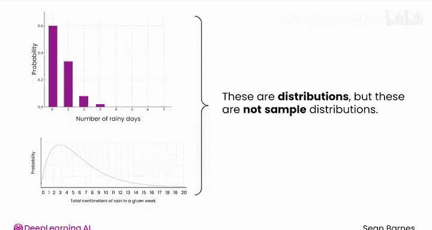
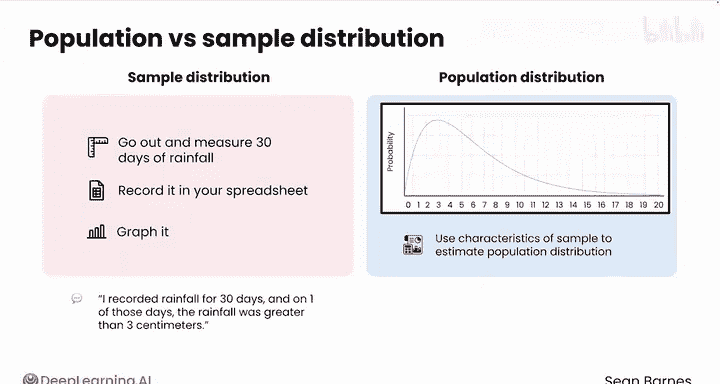
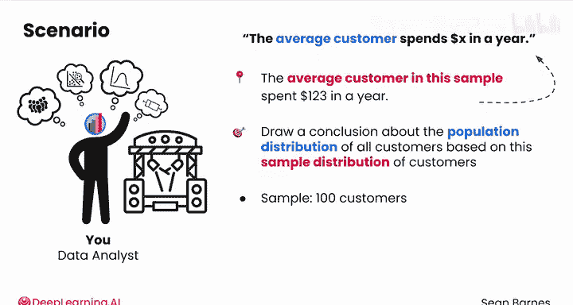

# 106：从样本分布到总体分布 📊

在本节课中，我们将学习如何从样本分布出发，推断总体分布。我们将理解概率分布的概念，区分样本分布与总体分布，并探索如何利用样本数据对总体行为进行估计。

---

在之前的模块中，我们深入学习了样本分布，并了解到分布可以告诉我们样本数据中不同值出现的频率。

那么下一步是什么？我们如何利用这些样本分布来对更广泛的总体得出结论？

假设你正在处理上一课中的随机变量 **X**（每周雨天数）。回想一下，**X** 可以取值从 0 到 7。你希望可视化一周中出现每种雨天数的常见程度。

与随机变量中每个结果相对应的概率集合被称为**概率分布**。

如果要将这个概率可视化，你会在 **x 轴**上放置随机变量的所有可能值（0 到 7），在 **y 轴**上放置每个结果的概率。

假设最常见的情况是 0 天有雨。因此，对于值 0，概率是 0.6；对于 1 天，概率是 0.35；对于 2 天，概率是 0.04；对于 3 天，概率是 0.01；而对于 4 天及以上，概率可能为 0。

这个函数——**P(X=0)=0.6**，**P(X=1)=0.35**，依此类推——被称为**概率质量函数**，简称 **PMF**。它为离散随机变量定义了每个事件发生的概率。

顺便说一下，这个图表看起来很熟悉，对吧？它只是一个 **y 轴**为概率的柱状图。这是离散随机变量概率分布的一个例子。你在 **x 轴**上有随机变量 **X** 的可数值，并在 **y 轴**上可视化这些事件的可能性。

---

上一节我们介绍了离散随机变量的概率分布，本节中我们来看看连续随机变量的情况。

这是上一课中测量降雨量的连续随机变量。你也可以将其可视化：将随机变量 **W** 的可能值放在 **x 轴**上（从 0 开始，因为降雨量不能为负，最高到 20 厘米，这是一个相当大的降雨量，超过这个值的可能性越来越低）。你能猜到 **y 轴**上会是什么吗？

与离散情况下的柱状图类似，你可以绘制一条曲线，其中较高的点表示更可能发生。这条曲线被称为**概率密度函数**，简称 **PDF**。你可以使用 **PDF** 来计算特定值范围内的概率。

在这种情况下，你不能使用单独的柱状图，因为正如上一课所见，存在无限多个可能的值。因此，你实际上使用一条曲线来表示连续随机变量的 **PDF**。

---

现在你已经看到了这两种概率分布。这里有一个关键区别，它触及了统计学的核心。

这些是分布，但它们不是**样本分布**。你并没有出去测量 30 天的降雨量，记录在电子表格中并绘制图表。这是一个描述降雨量总体行为的数学模型，即**总体分布**。

一旦你获取了一个样本，就可以利用该样本分布的特征来估计这个总体分布。这就像是说“我记录了 30 天的降雨量，其中有一天降雨量超过 3 厘米”（这是关于样本分布的陈述）与“一般来说，任何一天降雨量达到或超过 3 厘米的概率是 4%”（这是关于总体分布的陈述）之间的区别。

你利用样本数据得出了关于总体的结论。这很令人兴奋，因为这是统计学的全部目标，也是你在本课程和前一课程中一直在积累的知识所要达到的目的。

---

让我们看另一个具体例子。假设你与之前视频中的户外活动公司合作，他们要求你描述每位客户一年内在门票上的花费情况。

你抽取了 100 名客户的简单随机样本，并统计了他们一年的花费。你能够用描述性统计量来刻画你的样本分布：计算出平均花费为 **123 美元**，标准差为 **15.40 美元**，中位数花费为 **100 美元**。

那么接下来呢？你可以直接使用样本分布来传达见解，例如“该样本中的平均客户每年花费 123 美元”。这当然有用。

但你真正想说的是类似“平均客户每年花费 X 美元”这样的结论。你希望基于这个客户样本分布，对所有客户的总体分布得出结论：所有客户在花费方面的整体行为是怎样的？金额是否围绕某个中心点聚集？如果是，那个中心点是什么？这是一个严重偏斜的分布吗？它的变异性很高，还是金额彼此非常相似？

请记住，你的 100 名客户样本是你窥见真相的窗口。最终，目的是看清风景，而不是只看窗户。要记住，你永远只能估计真相，你的窗口总是至少会有一点模糊。

---

关于概率分布，有趣的一点是，无论是离散总体还是连续总体，其行为常常遵循已知的分布模式。

请跟随我进入下一个视频，来了解一种离散概率分布。

---

在本节课中，我们一起学习了概率分布的核心概念，区分了样本分布与总体分布，并理解了如何利用样本数据推断总体特征。这是进行统计推断、从数据中得出普遍结论的关键第一步。