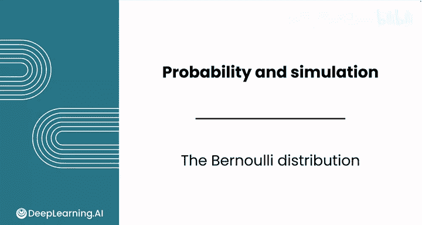
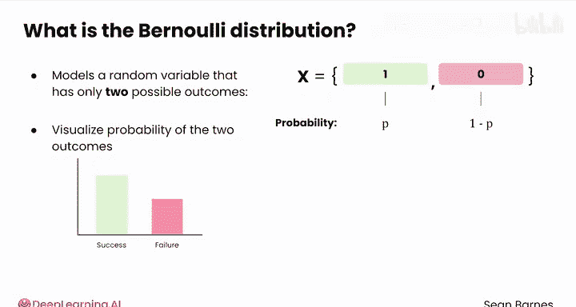
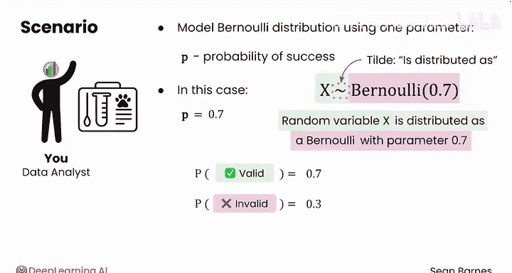
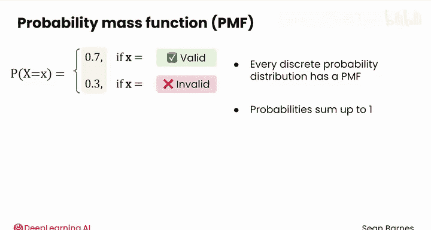
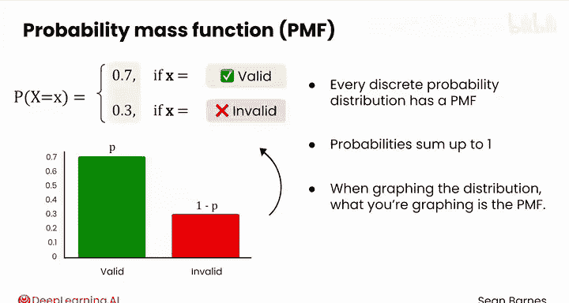
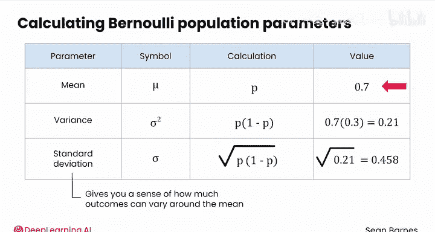

# 107：伯努利分布 📊

在本节课中，我们将学习伯努利分布。这是一种用于描述只有两种可能结果的随机变量的概率分布。我们将通过一个具体的案例来理解其定义、参数、可视化方法以及如何计算其均值、方差和标准差。

在数据分析中，目标通常是预测感兴趣群体的行为，尤其是当怀疑该群体遵循特定模式时。可以使用已知的概率分布来建模这些行为。伯努利分布用于建模只有两种可能结果的随机变量：成功（通常记为1，概率为P）和失败（通常记为0，概率为1-p）。请注意定义中两种结果概率的互补规则。

与其他离散概率分布类似，可以使用条形图或柱状图可视化两种结果的概率，并计算总体均值、总体方差和总体标准差。

## 案例引入：K9 DNA样本有效性

假设你正在处理通过家庭测试套件收集的K9 DNA样本。这些K9 DNA套件用于识别犬类的遗传倾向或品种。你正在与测试实验室合作，以了解套件中无效K9 DNA样本的分布情况：样本要么有效，要么无效（通常是由于主人收集方式不正确）。

实验室的合作伙伴告诉你，样本有效的比率是70%。实验室询问你：能否为每个样本的有效性分布建立模型？

为有效和无效样本的概率分布建模，有助于实验室为其测试过程设定现实的期望。你可以使用伯努利分布来建模此分布。

伯努利分布适用于此场景，原因有两点：首先，存在两种可能的结果（每个样本要么有效（成功），要么无效（失败））；其次，每个样本具有相同的70%的有效概率。

## 伯努利分布的参数与表示

你可以仅使用一个关键参数P（成功概率）来通过伯努利分布为数据建模。在此案例中，成功概率表示获得有效样本的概率，等于0.7。

为了表达此分布，通常会看到类似这样的符号表示：某个随机变量（例如X）服从参数为0.7的伯努利分布。更一般地，对于任何随机变量，你会看到“~”符号表示“服从于”，后面跟着分布名称及其参数。伯努利分布只有一个参数。

让我们看看此分布中每种结果的概率。P(有效) = 0.7。你能猜出P(无效)吗？根据互补规则，P(无效) = 0.3。

## 概率质量函数与可视化

回想一下，这组结果及其概率被称为**概率质量函数**。它并非伯努利分布独有，每个离散概率分布都有一个概率质量函数。请注意，所有结果的概率之和为1。

你能想象这个分布的柱状图是什么样子吗？

以下是这个伯努利分布的柱状图。它绘制了两种结果（有效/成功与无效/失败）及其对应的概率P和1-p。请注意，在绘制分布图时，实际上绘制的是概率质量函数。

## 分布的均值、方差与标准差

你也可以计算此分布的均值、方差和标准差，这些都是总体参数，其符号表示与你之前计算的样本统计量不同。

伯努利分布的均值（用符号μ表示）等于P，即成功概率。直观地思考K9 DNA样本有效性：如果样本有效的机会是0.7，那么对于长期内的许多样本，每个样本有效的概率是相同的。

伯努利分布的方差（用σ²表示）计算公式为 **p × (1-p)**。在此案例中，即0.7 × 0.3 = 0.21。

最后，你之前学过标准差（用σ表示）是方差的平方根。因此，这里σ约等于0.458。标准差让你了解结果围绕均值波动的程度。在此案例中，结果只能是0或1，因此围绕均值存在一些波动是合理的。

## 总体参数与样本统计量

总结一下，μ、σ²和σ是总体参数，而x̄、s²和s仅用于样本分布。

## 从伯努利分布到二项分布

伯努利分布的一个优点是它可以扩展到**二项分布**，后者用于建模多次试验。例如，在10个随机DNA测试套件中，所有10个都是有效样本的概率是多少？请跟随我到下一个视频一探究竟。

## 课程总结

在本节课中，我们一起学习了伯努利分布。我们了解了它适用于只有两种互斥结果的随机实验，并通过K9 DNA样本有效性的案例，掌握了其定义、参数P、概率质量函数、可视化方法以及总体均值（μ = p）、方差（σ² = p(1-p)）和标准差（σ = √[p(1-p)]）的计算。最后，我们了解到伯努利分布是构建更复杂的二项分布的基础。