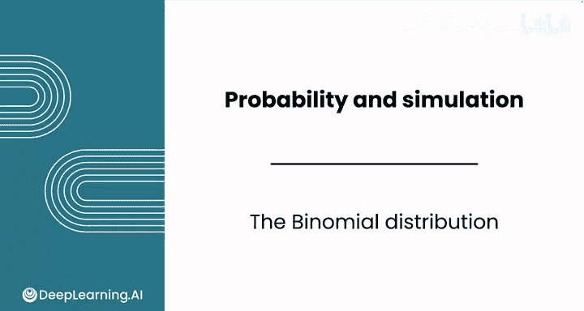
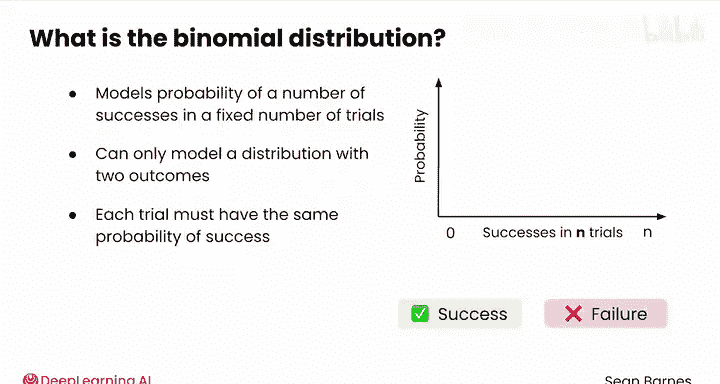
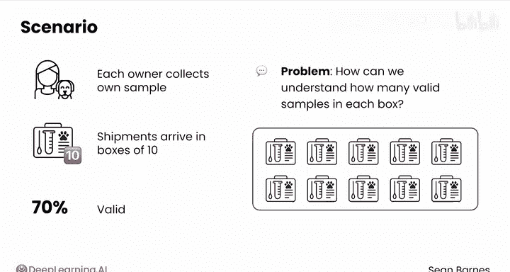
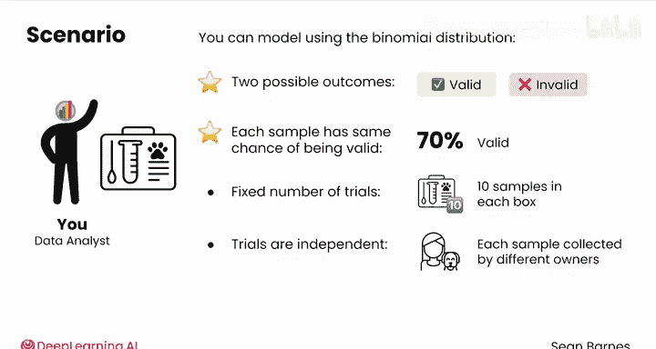
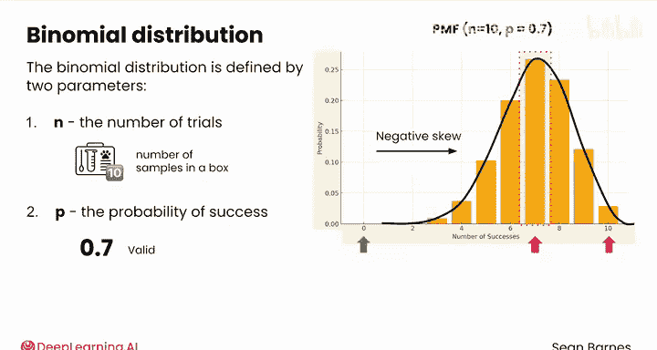
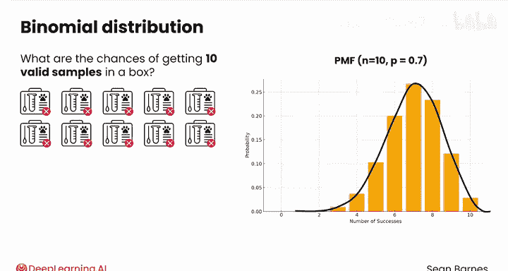
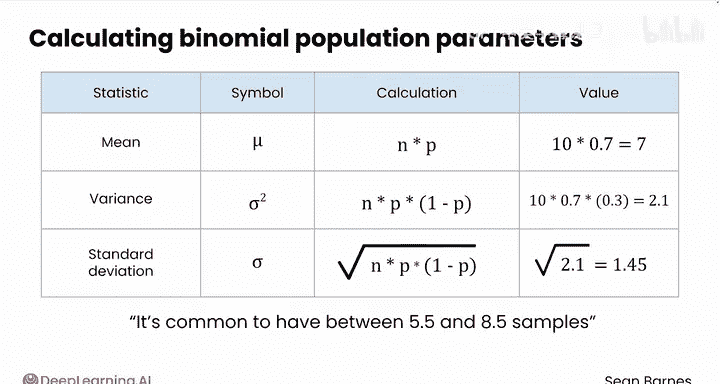
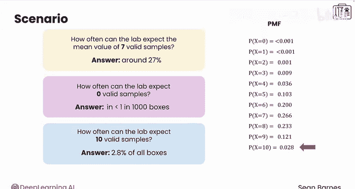
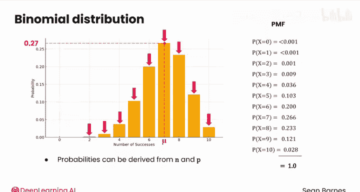

# 108：二项分布 📊

在本节课中，我们将学习如何使用二项分布来模拟多个独立试验中成功次数的概率分布。我们将通过一个具体的案例——DNA检测试剂盒的有效样本数量分析——来理解二项分布的定义、条件、参数及其应用。

---

## 概述

上一节我们介绍了单个DNA检测试剂盒样本有效性的分布模型。本节中，我们将使用二项分布来模拟多个样本的有效性分布。二项分布能够描述在固定次数的独立试验中，获得特定成功次数的概率。

## 二项分布的定义与条件

二项分布模拟的是在固定次数的独立试验中，获得特定数量成功的概率。它只能模拟具有恰好两种结果（例如成功与失败）的分布。此外，每次试验的成功概率必须相同。

二项分布是一种离散概率分布，成功次数可以从零到试验总次数之间变化。

以下是二项分布适用的四个条件：

1.  试验结果只有两种可能：成功或失败。
2.  每次试验的成功概率 `p` 是固定不变的。
3.  试验次数 `n` 是固定的。
4.  各次试验是相互独立的。

## 案例：DNA检测试剂盒

假设你的K9 DNA实验室合作伙伴告诉你，每个宠物主人自行收集样本，但样本以每箱10个的形式运送。你已知单个样本的有效率为70%。实验室希望了解每箱中可能有多少个有效样本。

使用概率分布对DNA检测试剂盒场景进行建模，将帮助实验室：
*   估算每箱平均可能获得的有效样本数量。
*   确定获得极低数量有效样本的概率。
*   为其检测流程设定现实的预期。

你可以使用二项分布来对此进行建模，原因如下：
*   首先，存在两种可能结果：每个样本要么有效（成功），要么无效（失败）。
*   每个样本具有相同的70%的有效概率。
*   试验次数是固定的，因为每箱有10个样本。
*   最后，你假设试验是独立的，因为一个样本的有效性似乎不影响其他样本。

请注意，“独立”只是一个假设，你无法100%确定样本是否真正独立。

这些条件看起来熟悉吗？其中两个条件与伯努利分布匹配：具有两种可能结果，以及具有固定的成功概率。这是因为伯努利分布是二项分布的一个特例，即只进行一次试验的情况。

## 二项分布的参数与可视化

二项分布由两个参数定义：
*   `n`：试验次数（本例中为每箱样本数，10）。
*   `p`：每次试验的成功概率（与伯努利分布相同，为0.7）。

你可以将此分布写作：`X ~ Binomial(n=10, p=0.7)`。这两个参数定义了分布的形状。

让我们可视化其概率质量函数（PMF）。下图展示了 `n=10` 且 `p=0.7` 时的PMF。

x轴表示从0到10个有效样本的所有可能结果，y轴表示任一给定箱子中包含该数量有效样本的概率。该分布以7为中心，形成一个大致对称的钟形分布。由于数值不能超过10，分布存在一些负偏斜。这个粗略的钟形分布反映了这样一个概念：获得有效样本数越来越多或越来越少的箱子的可能性越来越小。

## 概率计算

你认为一箱中获得全部10个有效样本的几率是多少？

你可以使用乘法法则计算：`0.7` 自乘10次，即 `0.7^10`。根据图表判断，概率约为0.025。那么获得0个有效样本呢？类似地，`0.3^10` 是一个极小的数字。

对于0到10之间的情况，概率计算变得复杂得多，因为必须考虑样本在箱中所有不同的排列组合方式。

## 总体参数计算

与任何其他概率分布一样，你可以计算各种总体参数，如均值、方差和标准差。

*   **均值**：在二项分布中，均值计算公式为 `μ = n * p`。本例中，`10 * 0.7 = 7`。你预计平均每箱有7个有效样本。
*   **方差**：方差计算公式为 `σ² = n * p * (1 - p)`。方差衡量分布的离散程度。本例中，`10 * 0.7 * 0.3 = 2.1`。
*   **标准差**：标准差由方差计算得出，即取其平方根：`σ = √2.1 ≈ 1.45`。

由于标准差与数据单位相同（本例中为样本数），且分布大致对称，你可以相对确信地说，每箱拥有5.5到8.5个（即均值±1个标准差范围内）有效样本是常见情况。

## 应用分析

二项分布还允许你计算箱中特定数量样本有效或无效的概率，这对应于PMF图中的每个条形。从图表近似来看，均值7对应的概率最高，约为0.27。

以下是该二项分布的完整概率质量函数值。所有这些概率值之和为1。对于二项分布，你永远不需要手动计算这些值，因为计算机会让这个过程容易得多，但要知道所有这些概率都可以仅从 `n` 和 `p` 推导出来。

让我们利用这些概率来分析DNA检测结果。请尝试回答以下问题：

1.  实验室可以多频繁地预期获得均值7个有效样本？这大约发生在27%的情况下。
2.  获得0个有效样本的情况如何？这个结果非常罕见，发生率低于千分之一。
3.  获得全部10个有效样本的情况呢？这是一个相对罕见的结果，但不像0个有效样本那么罕见，大约发生在2.8%的箱子中。

使用二项分布，你可以回答许多有趣的问题。在下一个视频中，你将看到如何利用其累积分布函数回答更多问题。

---

## 总结

本节课中，我们一起学习了二项分布。我们了解了其定义、适用条件（两种结果、固定试验次数、恒定成功概率、试验独立），并通过DNA样本案例掌握了其参数（`n`, `p`）的含义。我们学习了如何计算二项分布的均值、方差和标准差，并利用概率质量函数对实际业务问题（如预期有效样本数）进行了分析。二项分布是描述一系列独立二元试验结果的强大工具。