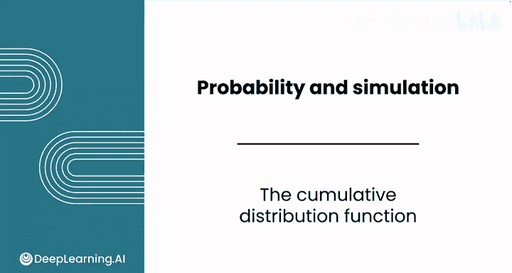
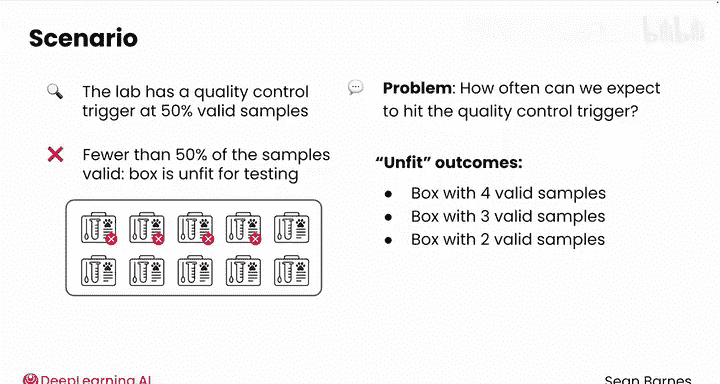
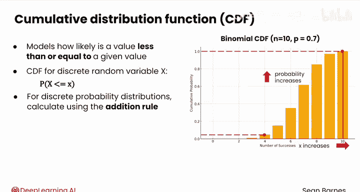
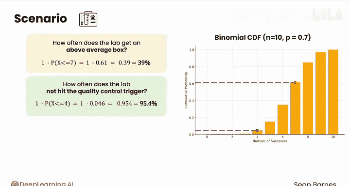
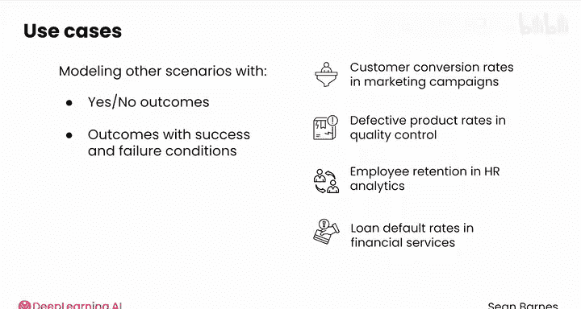

# 109：累积分布函数 📊

在本节课中，我们将要学习一个重要的新工具——**累积分布函数**。它用于计算随机变量取值小于或等于某个特定值的概率，而不仅仅是单个结果的概率。这在分析一系列结果的可能性时非常有用。

上一节我们介绍了二项分布，它适用于描述一系列独立的是/否试验。本节中我们来看看如何利用累积分布函数来回答关于结果范围的问题。

## 累积分布函数（CDF）的定义

在某些情况下，我们关心的是一个结果范围的概率，而非单一结果的概率。计算这些概率需要一个新工具。

想象一下，上一节视频中的实验室设定了一个质量控制触发点：**50%的有效样本**。如果一个盒子中有效样本少于50%，则该盒子被认为不适合测试，客户会收到一个新的试剂盒。实验室的同事可能会问你：“我们预计多久会触发这个质量控制点？”

在这种情况下，你关心的不仅仅是恰好有4个有效样本的结果。一个有3个、2个、1个或0个有效样本的盒子同样不适合测试。要回答这个问题，你可以使用二项分布的**累积分布函数**。

累积分布函数模拟了随机变量取值**小于或等于**一个给定值的可能性。形式上，对于离散随机变量 **X**，其CDF定义为：
**P(X ≤ x)**

下图展示了当 **n=10**（试验次数），**p=0.7**（单次成功概率）时，二项分布的CDF：

它与概率质量函数（PMF）使用相同的坐标轴。可以看到，随着x值增加，概率只增不减，最终在x≤10时概率达到1。CDF清晰地表明，得到一个有效样本数≤4的盒子的概率**小于5%**。

## 如何计算CDF

对于离散概率分布，你可以使用**加法法则**来计算CDF。要计算一个盒子中有效样本数≤4的概率，只需将每个符合条件的单一结果的概率相加。

以下是计算过程，忽略概率极小的0和1个有效样本的情况：
*   **P(X=2)** 约为 0.001
*   **P(X=3)** 约为 0.009
*   **P(X=4)** 约为 0.036

将它们相加：**0.001 + 0.009 + 0.036 ≈ 0.046**。这意味着大约有**4.6%** 的时间会触发质量控制点。

## 应用互补法则

通过求和概率，你还可以回答诸如“实验室多久能获得一个高于平均水平的盒子？”这样的问题。

在这种情况下，你可以使用**互补法则**。对于二项分布，平均值（期望值）为 **n * p = 10 * 0.7 = 7**。因此，“高于平均水平”意味着有效样本数 > 7。

我们可以计算其互补事件（样本数 ≤ 7）的概率，然后用1减去它：
**P(X > 7) = 1 - P(X ≤ 7)**

根据CDF，**P(X ≤ 7)** 约为0.61。因此，**P(X > 7) ≈ 1 - 0.61 = 0.39**。我们估计大约有**39%** 的时间能获得高于平均水平的盒子。

同样地，对于“实验室多久不会触发质量控制点？”这个问题，答案就是1减去触发它的概率：**1 - 0.046 = 0.954**。

## 二项分布在数据分析中的应用

由于DNA样本盒子的情况符合二项分布的建模条件，我们能够回答许多有用的问题，例如：
*   这个分布的中心在哪里？（均值）
*   变异性如何？（方差/标准差）
*   不同的结果或结果范围出现的频率如何？

除了DNA测试试剂盒，在数据分析中，二项分布在为其他具有“是/否”结果或“成功/失败”条件的场景建模时也极其有用。例如：
*   市场营销活动中的客户转化率。
*   质量控制中的缺陷产品率。
*   人力资源分析中的员工留存率。
*   金融服务中的贷款违约率。

伯努利分布和二项分布都是非常有用的离散概率分布。你如何确定从这些分布中抽样的众多可能结果呢？我们将在下一个视频中找到答案。

😊

---

本节课中我们一起学习了**累积分布函数**。我们了解到CDF用于计算随机变量取值小于等于某个值的累积概率，并通过加法法则和互补法则进行实际计算。我们还探讨了二项分布及其CDF在数据分析多个领域的广泛应用，为评估结果范围的可能性提供了强大的工具。