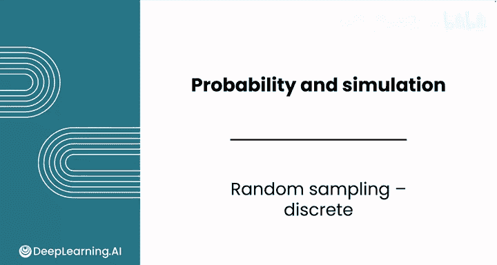
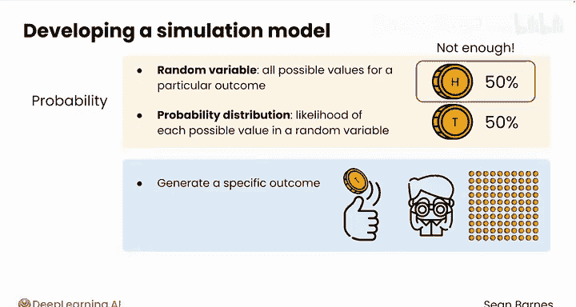
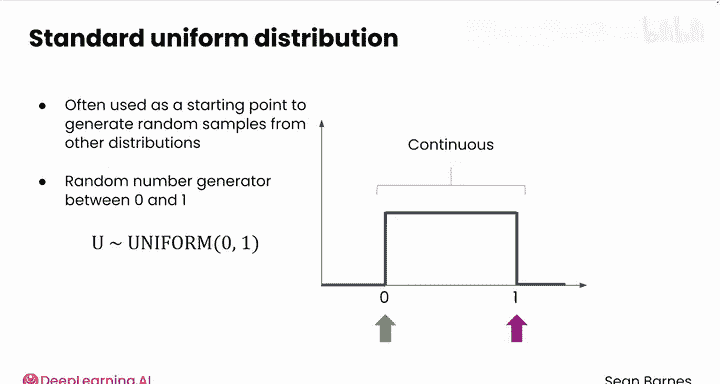
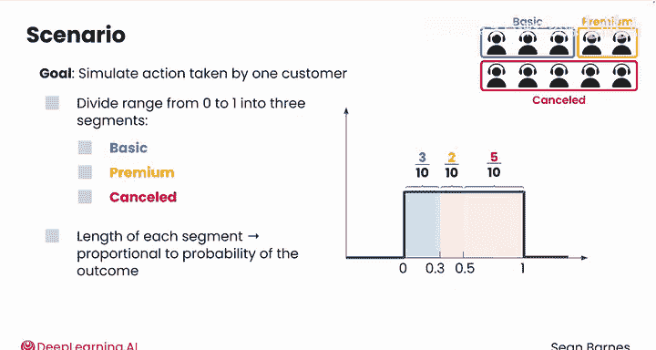
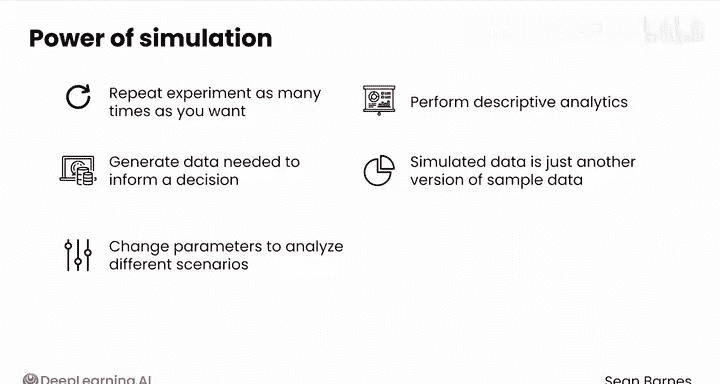

# 110：离散型随机抽样 📊

在本节课中，我们将学习如何从已知的概率分布中进行随机抽样，以生成模拟数据。这些模拟数据可用于分析并指导商业决策。

## 概述

正如可以从现实世界的总体中抽样一样，你也可以从已知的概率分布中进行抽样以生成模拟数据。随后，你可以分析这些模拟数据来为商业决策提供信息。这个过程被称为**随机抽样**。

在第一课的结尾，你学习了**随机变量**的概念，它代表了某个特定关注结果的所有可能取值。在本课中，你将把随机变量的概念扩展到**概率分布**，它代表了给定随机变量每个可能取值的发生概率。

为了建立一个模拟模型，你需要生成一个能代表你试图建模的现实世界行为的具体结果。例如，仅仅知道抛硬币正面朝上的概率是50%是不够的。你需要模拟这次抛硬币并观察实际结果：是正面还是反面？如果你模拟抛硬币10次，实际得到了多少次正面？如果没有这些具体的结果，你只能分析“可能”发生什么，而不是模拟中“实际”发生了什么。

**随机抽样**允许你模拟那些遵循特定概率分布的行为结果。因此，如果你知道某个结果服从二项分布，你就可以根据给定的成功概率 `p` 来模拟结果。

## 标准均匀分布：随机抽样的基础

标准均匀分布通常是生成其他分布随机样本的起点。“标准均匀分布”本质上是一个在0到1之间生成随机数的“高级术语”。更正式地说，标准均匀分布是连续的，其最小值为0，最大值为1（包含边界）。

你可以将一个均匀随机变量表示为：
`U ~ Uniform(0, 1)`

它在电子表格和R语言中都有对应的函数。例如，`RAND()` 函数就是一个例子，你可以看到它生成了0到1之间的值。这个函数模拟了从标准均匀分布中抽取的一个结果。

标准均匀分布可用于为许多其他分布生成随机样本。

## 应用：模拟离散事件

例如，为了模拟DNA检测试剂盒的有效性（假设有效概率为0.7），你可以首先使用 `RAND()` 生成一个0到1之间的随机样本。然后，如果这个数字小于或等于0.7，则认为检测有效；否则（数字大于0.7），检测无效。

这种方法之所以有效，是因为均匀分布在其取值范围内每个值出现的概率相等。因此，生成的随机值小于等于0.7的概率正好是0.7，这恰好是检测有效的概率。同样，数值大于0.7的概率（0.3）也等于检测无效的概率。

你可以将此原理扩展到模拟更复杂的离散场景。

## 复杂场景模拟：音乐订阅服务案例

回想一下提供免费试用的音乐订阅服务。记得客户在试用期结束时可以选择：订阅基础套餐、升级到高级套餐或取消订阅。

为了模拟一位客户采取的行动，你可以将0到1的范围划分为三个区间，每个区间代表客户可能做出的三种决定之一：基础套餐、高级套餐或取消。使这种方法有效的关键是，每个区间的长度必须与相应结果的概率成比例。

因此：
*   基础套餐区间的长度应占整个范围的十分之三（0.3）。
*   高级套餐区间的长度应占整个范围的十分之二（0.2）。
*   取消套餐区间应占剩余的五分之一（0.5）。

具体来说，你可以从标准均匀分布中抽取一个值：
*   如果该值小于等于0.3，则模拟客户选择了基础订阅。
*   如果该值在0.3到0.5之间（包含0.5），则模拟客户选择了高级订阅。
*   否则，如果该值大于0.5，则模拟客户取消了订阅。

## 模拟的力量与数据分析

模拟的强大之处在于，你可以根据需要任意多次地重复或复制单个实验。这在现实世界中是难以做到的，因为收集样本通常成本高昂且耗时。这种复制能力为你作为数据分析师提供了机会，可以生成决策所需的数据。你还可以更改模拟参数以分析不同的场景。

一旦生成了所需的样本量，你就可以应用迄今为止学到的任何描述性分析方法进行分析。你的模拟数据就变成了另一种版本的样本数据，你可以使用所有这些技术对其进行分析。

## 总结

本节课中，我们一起学习了**随机抽样**的核心概念。我们了解到，可以从**标准均匀分布** `U ~ Uniform(0, 1)` 出发，通过划分概率区间的方法，来模拟遵循任意离散概率分布的随机事件。这种方法使我们能够高效、低成本地生成大量模拟数据，用于场景分析和决策支持。

接下来，让我们在实践中看看如何操作。在下一个视频中，我将带领你在电子表格中创建伯努利和二项分布的模拟。