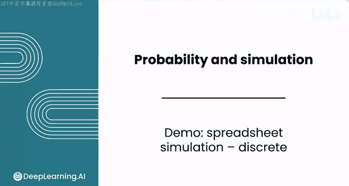
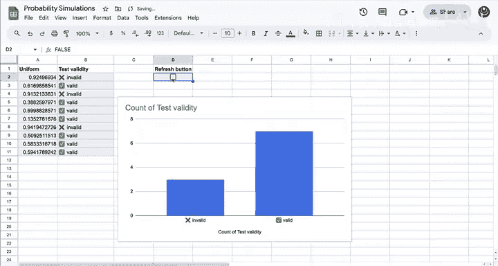
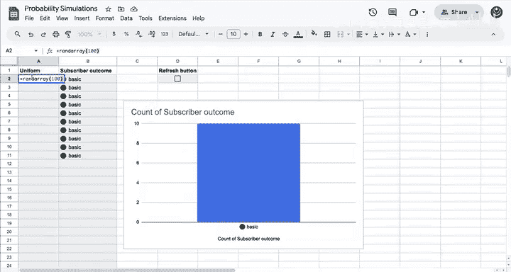

# 111：电子表格模拟离散分布 📊

在本节课中，我们将学习如何使用电子表格（如Excel或Google Sheets）来模拟离散概率分布。我们将通过两个具体场景——DNA检测试剂盒的有效性测试和音乐订阅服务的用户选择——来演示如何构建模拟模型，生成随机结果，并进行可视化分析。

---

## 概述

模拟是数据分析中一个强大的工具，它允许我们通过数学模型来预测现实世界事件的结果，而无需进行昂贵或耗时的实际测试。我们将从基础开始，使用电子表格的内置函数来生成随机数，并根据设定的概率模拟不同事件的发生。



---

## DNA检测试剂盒模拟 🧬

上一节我们介绍了模拟的基本概念，本节中我们来看看如何将其应用于一个具体场景：模拟DNA检测试剂盒的有效性。

假设一个实验室需要测试一批DNA试剂盒。每个试剂盒有70%的概率是有效的（`P(有效) = 0.7`），30%的概率是无效的。直接测试可能会破坏样本，因此我们可以通过模拟来预估结果。

以下是构建此模拟的步骤：

1.  **生成随机数**： 使用 `RAND()` 函数生成一个介于0到1之间的随机数。这个数服从标准均匀分布。
    ```excel
    =RAND()
    ```

2.  **模拟单次测试结果**： 使用 `IF` 函数，根据随机数判断测试结果。如果随机数 ≤ 0.7，则结果为“有效”，否则为“无效”。
    ```excel
    =IF(A2 <= 0.7, "有效", "无效")
    ```
    其中，`A2`是包含`RAND()`函数的单元格。

3.  **复制模拟**： 将上述公式向下拖动，即可模拟多个试剂盒的测试结果。

4.  **添加刷新控件**： 可以将一个复选框（Checkbox）链接到一个单元格。当勾选或取消勾选时，会触发工作表重新计算，从而生成一组新的随机结果。



5.  **结果可视化**： 创建一个柱状图来展示“有效”和“无效”的计数。为了在刷新时保持图表Y轴刻度稳定，建议将Y轴的最小值固定为0，最大值固定为模拟的总次数（例如10）。

通过反复刷新，你可以观察到不同批次中有效和无效试剂盒数量的变化，这有助于理解概率的波动性。

---

## 音乐订阅服务模拟 🎵

在掌握了基础模拟后，我们来看看一个更复杂的情况：模拟用户对音乐订阅服务的选择。

假设一个服务提供免费试用，试用结束后，用户有30%的概率选择基础版，20%的概率选择高级版，50%的概率取消订阅。我们需要模拟大量用户的选择以预测用户分布。

以下是模拟方法：

1.  **模拟单个用户选择**： 同样先使用`RAND()`生成随机数。然后使用嵌套的`IF`函数来模拟三种可能的结果。
    ```excel
    =IF(A2 <= 0.3, "基础版", IF(A2 <= 0.5, "高级版", "取消"))
    ```
    这个公式的逻辑是：首先检查是否≤0.3（选择基础版），如果不是，则检查是否≤0.5（选择高级版），如果还不是，则默认为“取消”。

2.  **扩展模拟规模**： 要获得更稳定的统计结果，需要模拟更多用户（例如100个）。手动拖动公式比较繁琐，可以使用 `RANDARRAY` 函数一次性生成大量随机数。
    ```excel
    =RANDARRAY(100, 1)
    ```
    此公式会在选定的单元格区域生成一个100行、1列的随机数数组。使用前需确保下方单元格是空的。

3.  **应用判断公式**： 将步骤1中的`IF`公式应用到整个`RANDARRAY`生成的数组区域。

4.  **更新图表**： 生成新数据后，记得更新图表的数据源范围和Y轴刻度，以正确显示100次模拟的结果。

5.  **使用数组公式（进阶）**： 为了更高效，你可以使用数组公式一次性完成所有计算。在输出区域的第一个单元格输入公式，然后按 `Ctrl+Shift+Enter`（在某些电子表格中只需按Enter）确认。
    ```excel
    =IF(RANDARRAY(100,1) <= 0.3, "基础版", IF(RANDARRAY(100,1) <= 0.5, "高级版", "取消"))
    ```
    这个公式会直接输出一个包含100个模拟结果的数组。

通过多次刷新模拟，你可以观察到用户选择分布的统计规律，这比采访真实用户要便捷得多。

---

## 总结



本节课中我们一起学习了如何使用电子表格模拟离散分布。我们掌握了两个核心技能：
1.  使用 `RAND()` 函数生成随机数，并结合 `IF` 语句将随机数转化为符合特定概率的离散事件结果。
2.  利用 `RANDARRAY` 函数和数组公式来高效模拟大量数据，并通过图表对结果进行可视化分析。

模拟是一个强大的工具，它能帮助我们在数据不足或实际测试成本过高时，进行有效的预测和决策分析。在接下来的课程中，我们将探索如何利用大型语言模型进行随机抽样模拟。