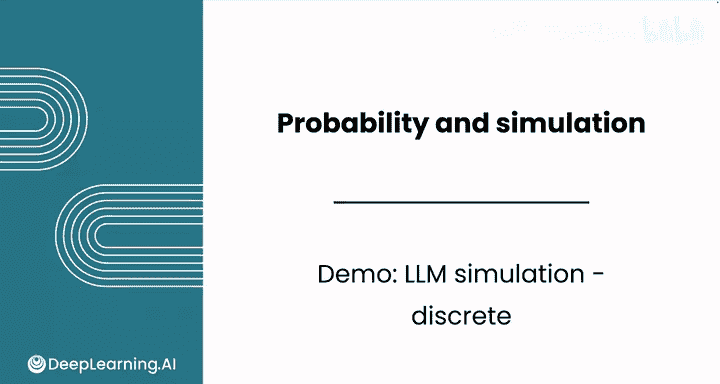
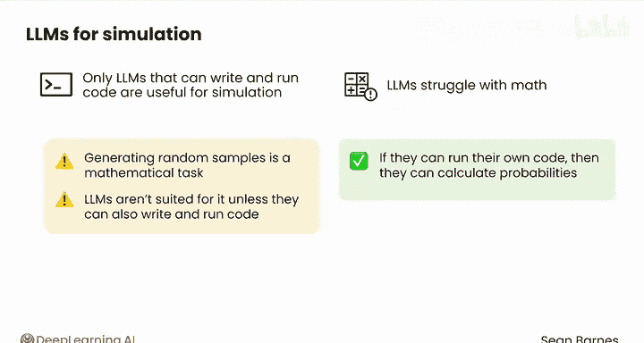
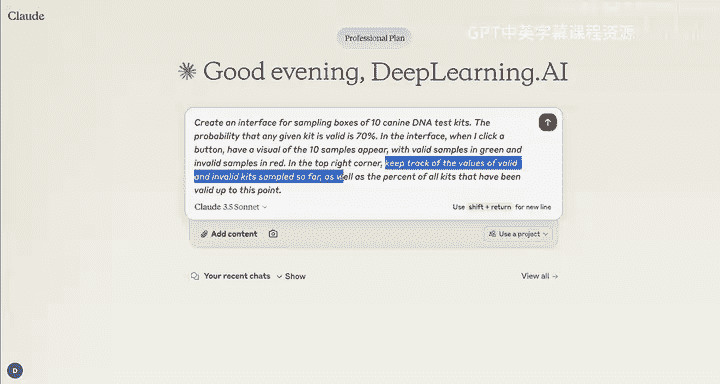
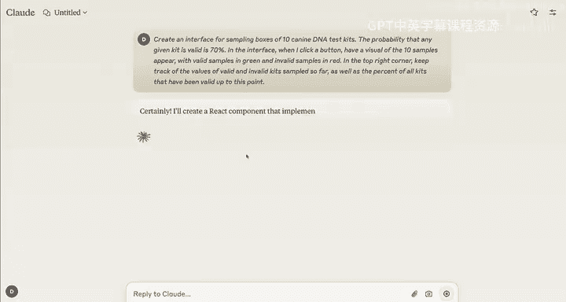
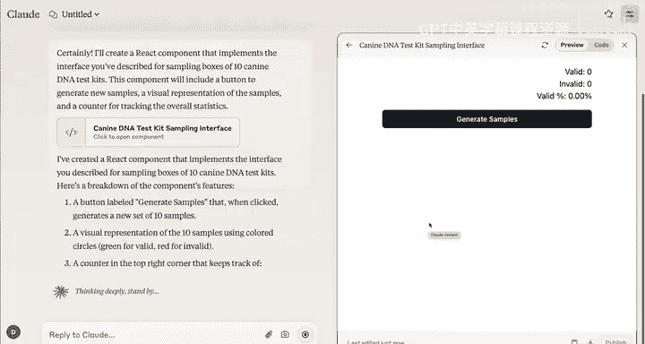
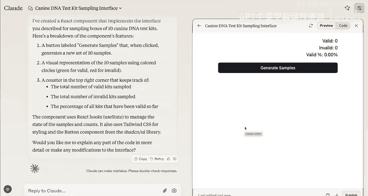

# 112：使用LLM模拟离散分布 🎲

在本节课中，我们将学习如何利用大型语言模型（LLM）进行抽样模拟。我们将重点探讨LLM在模拟离散概率分布时的能力、关键限制以及具体操作方法。

## 概述：LLM的模拟能力与限制

大型语言模型是功能强大的工具，但也存在一些关键限制。

上一节我们介绍了概率分布的基本概念，本节中我们来看看如何用工具实现模拟。

在使用LLM进行模拟之前，你需要知道一个关键点：**只有能够编写并运行代码的LLM才对模拟有用**。

你将在下一课中更深入地了解这种限制的本质，并看到实际案例。简而言之，请记住LLM在处理数学问题时存在困难，因为生成随机样本是一项数学任务。

除非LLM能够编写并运行代码，否则它们不适合进行模拟。如果它们能够运行自己的代码，那么它们就确实有能力计算这些概率。

## 实战：使用Claude进行模拟演示

让我们切换到Claude，它能够运行一些非常酷的模拟。Claude有一个名为“工件”（artifacts）的功能，允许它编写和运行代码。我们来看看它能做什么。

要开始模拟，你可以给它以下提示：

> 创建一个用于抽样10个犬类DNA检测试剂盒的界面。告知它任何试剂盒有效的概率是70%。然后，你将告诉它如何配置这个界面。

以下是配置界面的具体要求列表：
*   当你点击一个按钮时，你希望出现10个样本的可视化图像，其中有效样本显示为绿色，无效样本显示为红色。
*   你还需要它进行跟踪记录。

具体需要跟踪记录的数据包括：
*   截至目前抽样的有效和无效试剂盒的数量。
*   截至目前所有试剂盒中有效的百分比。

你将看到它生成所有这些代码。这本质上是在网站内部创建了一个网站。

Claude编写这段代码的事实告诉你，与**没有此能力的LLM（只能猜测下一个词是什么，无法保证猜测是真正随机的）**相比，它确实有一种方法可以从分布中真正随机抽样。

你可以在此处的代码中看到，这就是它实际生成随机样本的地方。你不需要理解所有这些代码的含义，但这验证了它确实可以通过编写代码来完成你要求的任务。

## 运行与观察模拟结果

如果你尝试生成一个新样本，它会完全按照你的要求执行。

它会有这张红绿相间的不同样本图像，并向你展示有多少个有效试剂盒和多少个无效试剂盒，以及有效样本的总体百分比。例如，80%有效，20%无效。

这个结果是合理的，因为你我都知道有效检测试剂盒的概率是70%。因此，你可以从这个界面生成许多样本。

这是一个有趣的例子，其中9个检测试剂盒实际上是有效的。

请注意，最初有效测试的比例是80%。现在，经过多次抽样，有效百分比已收敛到更接近70%——即有效的实际概率。

这种界面可以帮助你可视化这些不同场景的样子。你可以看到，获得包含许多有效测试的试剂盒是相对常见的。例如，这里有一个包含五个无效测试的试剂盒。

## 总结

干得漂亮！你使用大型语言模型创建了一个模拟。这标志着本节课的结束，只剩下最后一课了。

完成本课的练习评估和实践实验后，请跟随我进入下一课，继续学习连续概率分布。