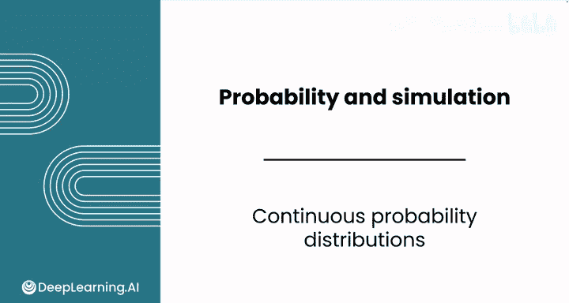
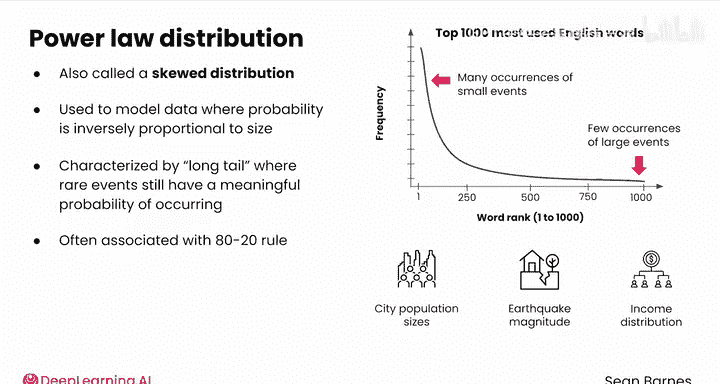

# 113：连续型概率分布 📊

在本节课中，我们将要学习连续型随机变量的概率分布。我们将探讨连续分布与离散分布的核心区别，并介绍三种重要的连续分布：均匀分布、幂律分布和正态分布。理解这些分布是进行高级数据分析和统计推断的基础。

---

## 连续分布与离散分布的主要区别

上一节我们介绍了离散概率分布（如伯努利分布和二项分布）。本节中我们来看看连续型随机变量的概率分布。

连续分布与离散概率分布的主要区别在于如何表示不同结果的概率以及如何计算统计量。

首先，连续分布没有可计数的值。由于这一区别，连续分布通常用平滑曲线可视化，而不是柱状图。平滑曲线反映了每个结果之间存在中间值，而离散分布的柱状图则显示存在不同的可计数值。

这条曲线称为**概率密度函数**（Probability Density Function，简称 **PDF**），它类似于离散概率分布中的**概率质量函数**（Probability Mass Function，简称 PMF）。

与计算离散概率分布中特定值的概率不同，对于连续分布，你需要计算一个值落在某个范围内的概率。因为在连续概率分布中，每个值之间都有无限多个值，所以任何精确值的概率都是 **0**。

连续概率分布的**累积分布函数**（Cumulative Distribution Function，简称 **CDF**）也是一条平滑曲线，与你之前看到的离散CDF柱状图不同。然而，两者相似之处在于，它们都是严格递增函数（随着x增加而增加），并且取值范围从 **0** 到 **1**。

由于PDF是一条平滑曲线，曲线上两点之间的面积就代表值落在该范围内的概率。对于离散概率分布，计算值落在某个范围内的概率很简单，只需将不同概率相加。而对于连续随机变量，概率的计算更为复杂，需要微积分来定义曲线下的面积。这里我们不会展示微积分计算，因为你几乎不需要手动计算这些值。不过，稍后你将学习这些计算的直观理解。

---

## 均匀分布 ⚖️

让我们从均匀分布开始。当指定范围内的所有结果发生的可能性均等时，你可以使用均匀分布来建模。

你在上一课中已经使用均匀分布来生成随机样本。它在定义范围内具有恒定的概率密度。

当你对随机变量的行为知之甚少，仅知道估计的最小值或最大值时，通常会使用均匀分布。否则，它对于模拟很有用，正如你之前所见。

---

## 幂律分布 📈

在大多数场景中，结果的分布并不是均匀的。例如，请看英语中最常用的前一千个单词的频率分布。

这是一个相当典型的幂律分布，有时也称为偏态分布。该分布可用于对以下数据进行建模：结果的概率与其大小成反比。换句话说，小事件发生多次，而大事件发生次数很少。

幂律分布的特征在于其长尾，即罕见事件仍然有发生的显著概率。它在自然界中相当常见，不仅可以用于模拟单词频率，还可以用于模拟城市人口规模、地震震级、收入分配等。

幂律通常与 **80/20法则** 相关联，即80%的效果来自20%的原因。例如，少数单词被非常频繁地使用，而大多数单词则很少使用。

---

## 总结与预告 🎯

本节课中我们一起学习了连续型概率分布的基础知识。我们探讨了连续分布与离散分布的核心区别，理解了概率密度函数和累积分布函数的作用。我们还介绍了两种具体的连续分布：均匀分布和幂律分布，并了解了它们的应用场景。

干得不错！接下来，请跟随我进入下一个视频，学习数据分析中最重要的连续分布：正态分布。