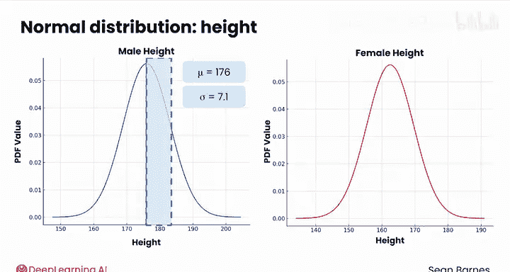
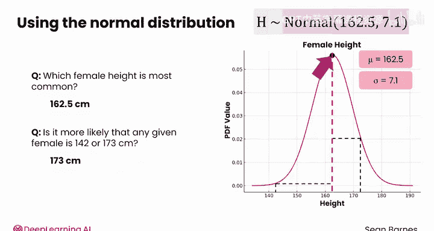
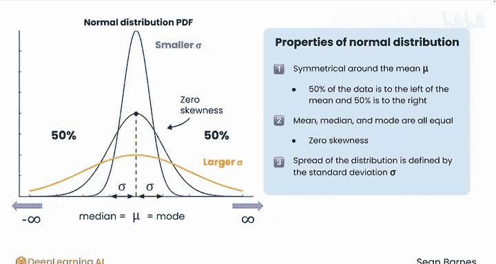
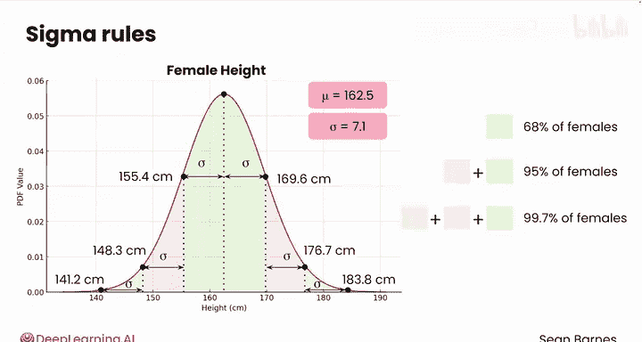
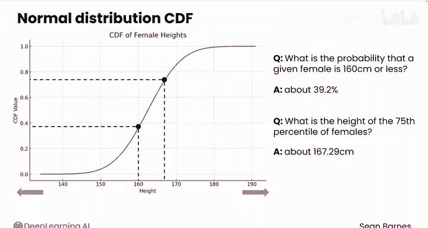

# 114：正态分布 📊

在本节课中，我们将要学习统计学中一个极其重要的概念——正态分布。我们将了解它的定义、关键特征、实际应用，以及如何利用它来理解数据。

---

## 概述

许多现实世界的现象都遵循一种特定的分布模式，其数值对称地聚集在平均值周围。离平均值越远，结果出现的可能性就越低。这种分布被称为**正态分布**。

---

## 什么是正态分布？🤔

一个遵循正态分布的现实例子是**人类身高**。下图展示了两条正态分布的概率密度函数曲线。

左侧图表展示了男性身高的分布。X轴代表身高，Y轴代表概率密度函数的值。男性身高分布的均值（μ）为176厘米（约5英尺9英寸），标准差（σ）为7.1厘米（约2.5英寸）。请注意，这里的均值和标准差是**总体参数**，而非样本统计量。

右侧图表展示了女性身高的分布，使用相同的坐标轴。其均值（μ）为162.5厘米（约5英尺4英寸），标准差（σ）与男性身高分布相同，为7.1厘米。

女性身高分布可以写作：**H ~ N(μ=162.5, σ=7.1)**。其中，H代表身高，N代表正态分布。

这两个分布都呈现出对称性，并围绕各自的均值集中。除了身高，血压读数和考试成绩也常常呈正态分布。更重要的是，许多统计方法都假设数据遵循正态分布。

---

## 正态分布的应用示例

正态分布可以帮助我们回答一些实际问题。例如：
*   **最常见的女性身高是多少？** 答案是众数。在正态分布中，众数、中位数和均值三者相等，因此最常见的女性身高就是均值162.5厘米。
*   **一位随机女性身高是142厘米或173厘米，哪种情况更可能发生？** 142厘米距离均值20.5厘米，而173厘米距离均值10.5厘米。由于173厘米更接近均值，因此其出现的可能性更高。

---

## 正态分布的关键特征 🔑

上一节我们看到了正态分布的实际例子，本节中我们来详细拆解它的核心数学特征。

以下是正态分布的关键特征：
1.  **对称性**：分布关于均值 **μ** 对称。左侧是右侧的镜像，因此有50%的数据落在均值左侧，50%落在右侧。
2.  **中心趋势相等**：均值、中位数和众数三者相等，都位于分布的中心。这意味着分布**没有偏度**（偏度为0）。
3.  **由标准差定义**：分布的离散程度由标准差 **σ** 定义。理论上，分布的两端（尾部）向正负无穷延伸。
    *   均值决定了曲线峰值的位置。
    *   标准差决定了数据的分散程度。**较大的标准差**意味着曲线更扁平、更分散；**较小的标准差**则意味着曲线更高、更狭窄。

我们一直在看的这条曲线是正态分布的**概率密度函数**。对于连续分布，PDF曲线的高度显示了某个值范围内结果的相对可能性。

---

## 西格玛法则（经验法则）📏

正态分布有一个非常实用的性质，称为**西格玛法则**，也常被称为**经验法则**或**68-95-99.7法则**。

这个法则描述了数据落在均值周围特定范围内的百分比：
*   **一倍标准差法则**：约68%的数据落在均值左右**一个标准差**（±1σ）的范围内。
*   **两倍标准差法则**：约95%的数据落在均值左右**两个标准差**（±2σ）的范围内。
*   **三倍标准差法则**：约99.7%的数据落在均值左右**三个标准差**（±3σ）的范围内。

这些统称为**西格玛法则**，能帮助我们快速理解正态分布中的概率。

让我们再次以女性身高分布（μ=162.5 cm， σ=7.1 cm）为例：
*   均值减一个标准差：162.5 - 7.1 = **155.4 cm**
*   均值加一个标准差：162.5 + 7.1 = **169.6 cm**
    *   根据一倍标准差法则，68%的女性身高介于这两个值之间。
*   均值减两个标准差：162.5 - 2*7.1 = **148.3 cm**
*   均值加两个标准差：162.5 + 2*7.1 = **176.7 cm**
    *   根据两倍标准差法则，95%的女性身高介于这两个值之间。
*   均值减三个标准差：162.5 - 3*7.1 = **141.2 cm**（约4英尺8英寸）
*   均值加三个标准差：162.5 + 3*7.1 = **183.8 cm**（略高于6英尺）
    *   根据三倍标准差法则，99.7%的女性身高介于这两个值之间。

尽管如此，全球仍有超过0.3%（即1100多万）的女性身高会落在这个“罕见”范围之外。虽然极端值出现的概率低，但由于人口基数大，绝对值仍然可观。

---

## 累积分布函数

除了概率密度函数，我们还可以通过**累积分布函数**来研究正态分布。

CDF是一条S形曲线。它表示**随机变量取值小于或等于X轴上某个给定值的概率**。
*   X轴：随机变量的值（此处为身高），中心是均值162.5。
*   Y轴：取得**至多**为该值的累积概率。

想象X轴向图像两侧无限延伸。累积概率在左侧永远不会完全达到0，在右侧也永远不会完全达到1，因为理论上总存在出现更极端值的非零概率（尽管现实中人类身高有物理限制）。

CDF可以帮助我们回答以下问题：
*   **一位随机女性身高小于等于160厘米的概率是多少？** 这对应于CDF曲线在160厘米处的高度，图中显示约为**39.2%**。
*   **女性身高的第75百分位数是多少？** 图中这条线代表了第75百分位数，对应的身高约为**167.29厘米**。

---

## 总结

本节课中，我们一起学习了**正态分布**。我们了解到它是一种对称的钟形曲线，由均值（μ）和标准差（σ）两个参数完全定义。我们探讨了它的关键特征（对称性、中心趋势相等），并通过人类身高的例子看到了它的实际应用。此外，我们还学习了实用的**西格玛法则（68-95-99.7法则）**，用于快速估算概率，并介绍了**累积分布函数**的用途。

在接下来的课程中，我们将探索正态分布的一个特殊案例。