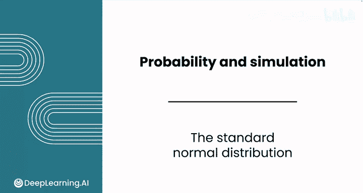
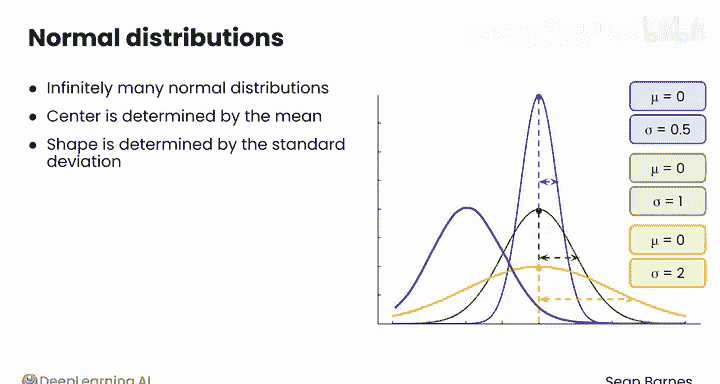
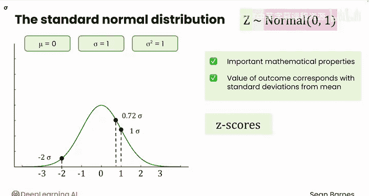
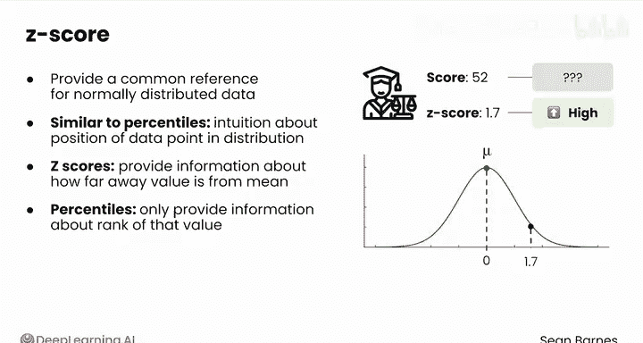
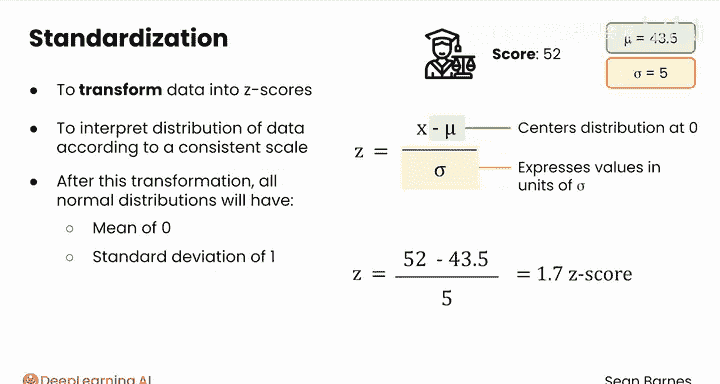
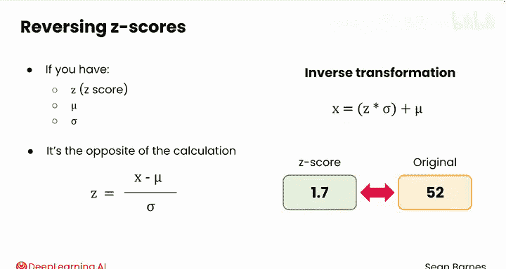

# 115：标准正态分布 📊

在本节课中，我们将要学习标准正态分布的概念、重要性及其应用。标准正态分布是统计学中的一个核心概念，它为我们提供了一个统一的尺度来理解和比较不同正态分布的数据。

## 什么是标准正态分布？ 🤔

上一节我们介绍了正态分布的基本特性，本节中我们来看看标准正态分布。标准正态分布是一种特殊的正态分布，其均值（μ）为0，标准差（σ）为1。其数学表示如下：

**公式：** `Z ~ N(μ=0, σ=1)`

尽管存在无数种正态分布（其中心由均值决定，形状由标准差决定），但标准正态分布因其独特的数学性质而显得尤为重要。

## 标准正态分布的重要性 🔑

标准正态分布之所以重要，是因为它提供了一个共同的参考框架。任何正态分布的数据都可以通过一个称为“标准化”的过程，转换到标准正态分布的尺度上。

以下是标准正态分布的几个关键特性：

*   **均值为0，标准差为1：** 这是其定义特性。
*   **遵循经验法则（Sigma规则）：** 与所有正态分布一样，约68%的数据落在均值±1个标准差内，约95%的数据落在均值±2个标准差内。
*   **Z分数的直接对应：** 在标准正态分布中，任何一个数值本身就直接代表了该数值距离均值有多少个标准差。

## 理解Z分数 📈

Z分数（或称标准分数）是标准正态分布中的一个核心概念。它表示一个数据点距离其所在分布的均值有多少个标准差。

**公式：** `z = (x - μ) / σ`

其中：
*   `x` 是原始数据值。
*   `μ` 是原始分布的均值。
*   `σ` 是原始分布的标准差。

Z分数的作用类似于百分位数，都能让你了解一个数据点在分布中的相对位置。但Z分数的优势在于，它能更精确地告诉你该点距离均值有多远，而不仅仅是排名。

## 数据标准化过程 🔄

将原始数据转换为Z分数的过程称为“标准化”。这个过程对所有正态分布的数据都适用。

标准化的步骤如下：

1.  **中心化：** 用原始值减去均值（`x - μ`），这会将分布的中心移动到0。
2.  **缩放：** 将中心化后的值除以标准差（`/ σ`），这会将所有数值的单位转换为“标准差”。

经过标准化后，**任何**正态分布的数据都会变成均值为0、标准差为1的标准正态分布。这使得来自不同均值、不同标准差的正态分布的数据可以放在同一个尺度上进行比较。

## 标准化示例与逆变换 🔁

让我们通过一个例子来理解标准化。假设法学院的一次期中考试成绩服从正态分布，均值为43.5，标准差为5。你的朋友得了52分。

要计算其Z分数：
`z = (52 - 43.5) / 5 = 1.7`

这意味着你朋友的分数比平均分高了1.7个标准差，成绩相当不错。

标准化过程是可逆的。如果你知道Z分数、原始分布的均值和标准差，可以还原出原始数值。

**逆变换公式：** `x = z * σ + μ`

## 总结 📝

本节课中我们一起学习了标准正态分布。我们了解到，标准正态分布（`N(0,1)`）是所有正态分布的一个特例和基准。通过计算Z分数（`z = (x - μ) / σ`）进行标准化，我们可以将任何正态分布的数据转换到统一的尺度上，从而方便地进行比较和分析。Z分数直观地表示了一个数值距离均值有多少个标准差。在接下来的课程中，我们将利用Z分数来构建置信区间和进行假设检验。