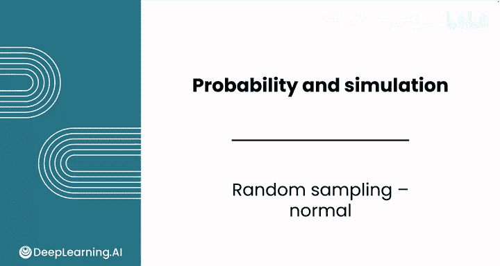
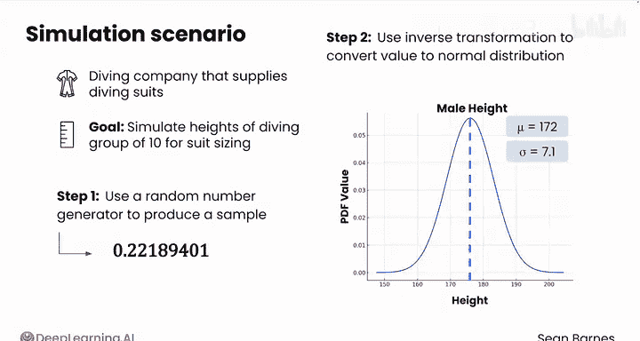
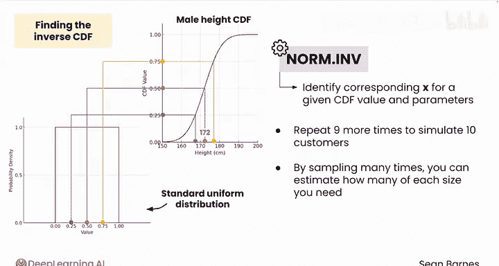

# 116：正态随机抽样 📊

在本节课中，我们将学习如何从正态分布中进行随机抽样。我们将从一个标准正态分布开始，然后运用上一节课中介绍的反向Z分数变换方法。

## 概述

我们将通过一个为潜水公司模拟客户身高的实际案例，来演示如何从正态分布中生成随机样本。这个过程涉及使用均匀分布生成随机数，并通过累积分布函数的逆变换将其映射到正态分布。

## 从正态分布中抽样

上一节我们介绍了离散分布的抽样，本节中我们来看看如何对连续的正态分布进行抽样。

假设你在一家为顾客提供潜水服的潜水公司工作。你需要为一个10人的潜水团模拟客户身高，以便确定潜水服的尺码。你想随机生成身高数据，但问题在于身高并非均匀分布。

与均匀分布中每个值被生成的概率相同不同，你需要一个更复杂的函数，将均匀分布中的随机数映射到正态分布的概率上。

以下是从正态分布中抽样的一个方法。

### 抽样步骤

以下是使用逆变换方法从正态分布中抽样的两个核心步骤。

1.  使用随机数生成器从标准均匀分布中生成一个样本。这与上一课中离散案例的做法相同。例如，你可能会得到数值 **0.2218**。
2.  使用逆变换将第一步得到的值转换为目标正态分布的值。以男性身高为例，已知其均值为 **172 cm**，标准差为 **7.1 cm**。

## 理解逆变换过程

现在让我们看看第二步是如何工作的。下图是男性身高的累积分布函数图。

累积分布函数的取值范围是0到1，代表了从负无穷到正无穷移动时的累积概率。

这很有趣。标准均匀分布的取值范围也是0到1。

假设你从标准均匀分布中生成了一个随机值，例如 **0.5**。如果你将这个随机样本放在累积分布函数的Y轴上，它会落在正中间。

现在，想象画一条水平线到累积分布函数曲线，然后垂直向下到X轴。它会对应什么身高呢？答案是平均身高 **172 cm**。观察到小于或等于172的值的概率是0.5。因为分布是关于均值对称的。

当你通过均匀分布生成随机值时，它们会投射到X轴上的不同值，这些值对应着不同的抽样身高。

这个操作被称为求累积分布函数的逆。你可以使用电子表格函数 `NORM.INV` 来根据给定的累积分布函数值以及正态分布参数 **μ（均值）** 和 **σ（标准差）** 识别出对应的X值。稍后你就会使用它。

## 应用与模拟

现在，你将把这个过程再重复九次，通过多次抽样来模拟旅行团中10位顾客的身高分布。通过多次抽样，你可以估算出通常需要每种尺码潜水服的数量。

这种方法的美妙之处在于它模拟了真实世界的变异性。正如并非每个人都有完全相同的平均身高，这些样本将在均值周围变化，为你提供潜在客户的真实情况，并帮助你订购正确的库存。

你一定很想看看这个过程是如何进行的。让我们转到电子表格中，模拟多次男性身高的随机抽样。

## 总结

本节课中，我们一起学习了如何从正态分布中进行随机抽样。我们掌握了使用均匀分布生成随机数，并通过累积分布函数的逆变换将其转换为符合特定均值和标准差的正态分布值的方法。这个过程是模拟现实世界连续变量数据的有力工具。