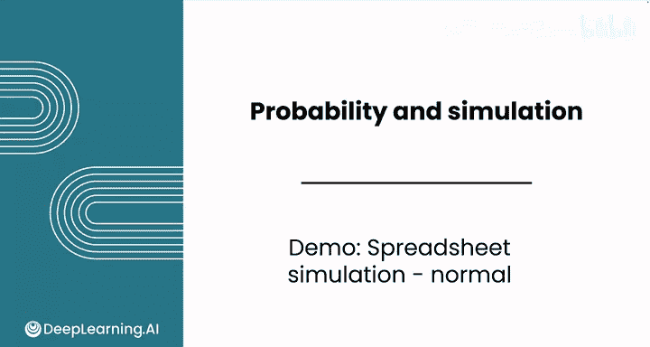

# 117：使用电子表格模拟正态分布 📊

在本节课中，我们将学习如何使用电子表格生成服从正态分布的随机样本。我们将以模拟男性身高为例，演示如何从已知均值和标准差的正态分布中进行随机抽样，并利用这些模拟数据辅助实际决策，例如为不同身高的客户准备合适数量的潜水服。

---

## 概述与目标

上一节我们介绍了均匀分布及其模拟方法。本节中，我们将看看如何模拟更常见的正态分布。正态分布广泛存在于自然界和社会数据中，例如人类的身高。掌握其模拟方法，能帮助我们在已知总体参数的情况下，生成具有代表性的随机样本，用于预测和分析。

我们将使用电子表格的 `RANDARRAY` 和 `NORM.INV` 函数来完成这一过程。

---

## 第一步：设定分布参数

首先，我们需要输入描述目标正态分布的参数。根据已知数据，男性身高大致服从正态分布，其均值（μ）为172厘米，标准差（σ）为7.1厘米。

在电子表格中，我们可以将这两个参数分别输入到两个单元格中，例如：
*   `A1` 单元格输入 `172`（均值）
*   `B1` 单元格输入 `7.1`（标准差）

**公式表示：**
身高 ~ **N(μ=172, σ=7.1)**

---

## 第二步：生成均匀分布随机数

接下来，与之前的模拟类似，我们需要先生成一组均匀分布的随机数作为基础。我们将使用 `RANDARRAY` 函数来生成100个介于0到1之间的随机数。

以下是具体操作：
1.  选中一个空白列（例如C列）的100个单元格。
2.  输入公式：`=RANDARRAY(100, 1)`
    *   这个公式会生成一个100行、1列的随机数数组。
3.  按下回车键后，你将得到100个在(0,1)区间内均匀分布的随机数。

**代码描述：**
`random_uniform = RANDARRAY(n, 1)`，其中 `n` 是样本数量。

请注意，每次重新计算工作表（例如修改任意单元格后按回车），这些随机数都会重新生成。

---

## 第三步：转换为正态分布样本

现在，我们需要将均匀分布的随机数转换为服从指定正态分布的样本。这里将使用 `NORM.INV` 函数。

该函数需要三个参数：
1.  **概率**：即我们上一步生成的均匀随机数。
2.  **均值**：目标正态分布的均值（172）。
3.  **标准差**：目标正态分布的标准差（7.1）。

以下是转换方法：
1.  在D列（与C列随机数平行）的第一个单元格（如D1）输入公式：`=NORM.INV(C1, $A$1, $B$1)`
    *   `C1` 是第一个均匀随机数。
    *   `$A$1` 和 `$B$1` 是绝对引用的均值和标准差单元格。
2.  将这个公式向下填充至第100行，为每个随机数计算对应的身高值。

**核心转换公式：**
`height = NORM.INV(random_uniform, mean, standard_deviation)`

例如，一个约0.29的随机数被转换成了约168厘米的身高。因为0.29 < 0.5，所以对应的身高值应小于均值172厘米，结果符合预期。

为了更高效，你可以使用数组公式一次性完成整个列的转换。

---

## 第四步：添加刷新控件并观察结果

为了方便地重新生成样本，我们可以插入一个复选框或按钮来触发工作表重新计算。插入后，每次勾选或点击，所有随机数和身高样本都会更新。

观察生成的身高数据，你会发现它们大致围绕均值172厘米上下波动，大部分落在均值加减几个标准差的范围内。

---

## 第五步：分析与可视化样本

生成了样本数据后，我们可以对其进行汇总分析，以验证其是否接近我们设定的总体参数。

以下是两种主要的分析方法：

**1. 绘制分布直方图**
选中身高数据所在的列（D列），插入一个直方图。在样本量为100的情况下，图表可能呈现大致钟形，但峰顶不一定非常明显或光滑。这是小样本抽样的正常现象。多次点击刷新按钮，你会看到每次生成的分布形状都有所不同。

**2. 计算样本统计量**
我们可以计算这100个身高样本的均值和标准差。
*   使用 `AVERAGE(D:D)` 计算样本均值。
*   使用 `STDEV.S(D:D)` 计算样本标准差。

你会发现，样本统计量（如均值171，标准差7.04）通常非常接近总体参数（172和7.1），但不会完全相等。通过刷新样本，你可以观察这些样本统计量的波动情况。

---

## 模拟结果的应用与解读

通过多次刷新模拟，你可能会遇到一些有趣的情况：
*   **出现极端值**：例如，某次抽样中出现了一个身高约191-195厘米（约6英尺3英寸）的个体，这是一个较高的异常值。另一次可能出现身高偏低的异常值。
*   **分布形态变化**：有时样本分布看起来更“标准”，有时则可能在某一端出现多个极端值。

这些模拟结果具有实际意义。例如，对于潜水服供应商而言，即使极端身高的客户概率较低，模拟中出现多个极端值的情况提示他们，仍需准备少量特大号或特小号的潜水服，以应对可能的需求。

---

## 总结与练习

本节课中，我们一起学习了如何使用电子表格模拟正态分布。我们回顾了从设定参数、生成均匀随机数，到利用 `NORM.INV` 函数转换为正态分布样本的完整流程，并学会了通过图表和统计量来分析模拟结果。

你可以自行尝试以下练习以巩固所学：
1.  改变均值和标准差参数，模拟女性身高（例如，均值162厘米，标准差6.5厘米）。
2.  将样本量从100增加到1000或10000，观察分布直方图和样本统计量的变化。
3.  思考如何将这种模拟方法应用于你所在领域的其他正态分布数据（如测试分数、产品尺寸等）。

尝试并探索这个模拟过程是非常有益的。接下来，请跟随下一节视频，继续学习更多关于数据模拟的知识。