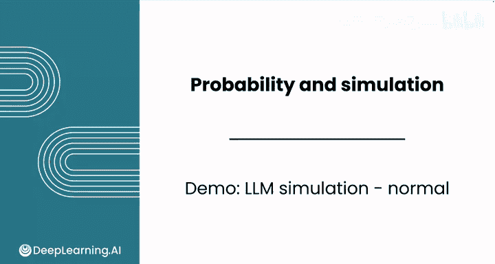
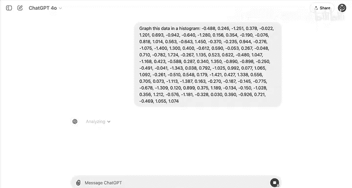
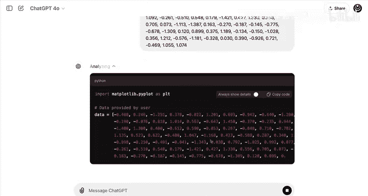
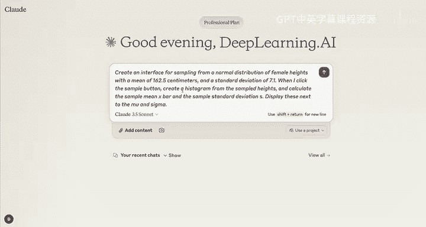

# 118：使用LLM模拟正态分布 📊



在本节课中，我们将学习如何使用大型语言模型（LLM）来模拟生成正态分布的数据样本。我们将探讨LLM在此任务中的能力与局限性，并演示如何正确利用其代码生成功能来完成模拟。

---

## 概述

上一节我们介绍了LLM作为数据分析思维伙伴的潜力。本节中，我们来看看如何具体使用LLM来模拟生成符合正态分布的随机样本。我们将重点关注一个核心限制：**LLM本身不具备生成真正随机数的能力**，必须依赖其编写和运行代码的功能才能完成有效的模拟。

---

## LLM生成随机样本的局限性

首先，我们需要明确一个关键前提：除非LLM能够**编写并运行代码**，否则不能直接用它进行抽样。让我们来仔细验证这一点。

我们从一个无法运行代码的免费版ChatGPT模型开始。这个版本与本课程中Coursera实验环境提供的工具非常相似。

假设你想生成100个来自标准正态分布的样本。你可以向ChatGPT提出请求：



**提示词示例：**
```
模拟100个来自标准正态分布的样本，并以逗号分隔的列表形式打印出来。
```



模型会输出100个数字，这些数字的均值（μ）为0，标准差（σ）为1。从表面上看，这些数据点似乎符合正态分布。

然而，要检验这些数据是否真的来自正态分布，我们需要进行可视化分析。这时，我们需要使用具备高级数据分析功能（能写并运行代码）的付费版ChatGPT。

以下是付费版ChatGPT根据上述数据生成的直方图代码与结果：


观察这个直方图，分布大致对称，但尾部并未像真正的正态分布那样平缓展开。回顾上一节的演示，仅需约100个样本就能生成一个看起来相当“正常”的分布。因此，当前的结果有些异常。

**核心结论：** LLM自身并不具备从正态分布生成真正随机样本的工具。因此，**你不应该直接使用LLM来生成样本**。对于纯粹的随机数生成，电子表格是更合适的工具。

---

## 使用能运行代码的LLM进行模拟

接下来，我们转向能够运行代码的Claude模型。记住，Claude可以通过其“Artifacts”功能编写和执行代码。



我们可以给它一个提示，要求其创建一个用于从正态分布抽样的交互界面，并生成直方图来可视化结果。

**提示词示例：**
```
创建一个用于从正态分布中抽样的应用程序界面，并生成直方图来总结结果。
```

模型会开始编写代码来构建这个应用程序：


在这个模拟中，我们设定总体均值 **μ** 和总体标准差 **σ**。这个模拟可以帮助你看到，如果你随机测量100名女性的身高，可能会遇到的所有不同情况。

应用程序界面通常包含以下元素：
*   **X轴**：身高值。
*   **Y轴**：频率。
*   **顶部**：显示的总体参数（μ, σ）。
*   **右侧**：显示的样本统计量（如样本均值 `x̄`，样本标准差 `s`）。

即使只抽取100个样本，样本均值 `x̄` 也非常接近总体均值 **μ**。从视觉上看，分布非常接近正态分布。

点击“生成样本”按钮可以生成更多分布。每次生成，分布都会略有变化，但总体而言，样本统计量与总体参数吻合得很好。这主要是因为**1000个样本足以让你非常接近总体参数**。

当然，偶尔也会出现一些看起来不太寻常的样本，例如分布的峰值不如通常那样圆润。但在简单随机抽样中，出现这种结果是可能的。

---

## 关键要点与最佳实践

以下是使用LLM进行模拟时需要牢记的要点：

*   **LLM的角色**：任何LLM都可以帮助你设计模拟实验并沟通结果。
*   **执行模拟的条件**：**只有当LLM能够编写和运行代码时**，才应该用它来运行模拟。
*   **代码是核心**：真正的随机抽样依赖于编程语言（如Python的`numpy.random.normal`）中的随机数生成器。
*   **可视化验证**：始终通过直方图等可视化手段来检查生成的数据分布是否符合预期。

---

## 总结

本节课中，我们一起学习了如何利用LLM模拟正态分布。我们认识到LLM本身不能直接生成随机数，但可以通过驱动代码执行来成为强大的模拟工具。关键在于区分LLM的“构思”能力和“执行”能力——前者所有LLM都具备，后者则需要特定的代码运行功能。


接下来，在下一节视频中，我们将综合运用这些知识，学习如何利用分布来做出数据驱动的决策。