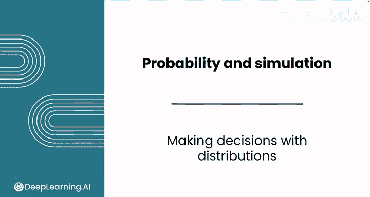
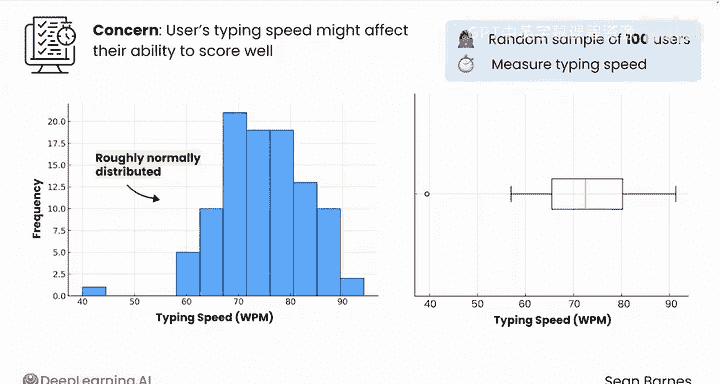
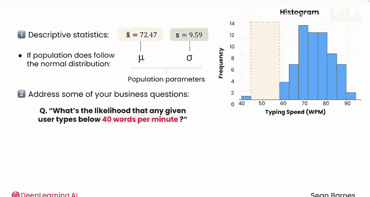
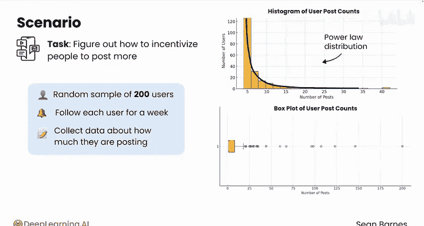
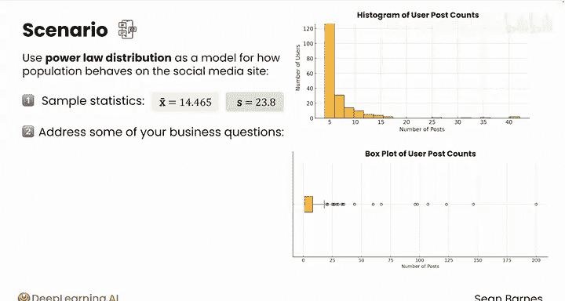

# 119：基于分布进行决策 📊

在本节课中，我们将学习如何利用数据分布和描述性统计来为商业决策提供依据。我们将通过两个具体的商业场景，演示如何从数据可视化开始，识别分布类型，计算关键统计量，并最终运用概率模型来解答实际的业务问题。

---

## 第一步：可视化与识别分布 📈

上一节我们介绍了概率分布的基本概念，本节中我们来看看如何将其应用于实际数据分析。第一步总是从可视化数据开始，以识别其潜在的分布形态。

以下是进行分析的标准初始步骤：
1.  收集一个简单随机样本。
2.  创建直方图和箱线图来可视化数据分布。
3.  根据图形特征，初步判断数据可能遵循的分布类型（如正态分布、幂律分布）。

---

## 场景一：在线测试公司的打字速度分析 ⌨️

想象你在一家提供在线标准化测试的数字考试公司工作。公司担心用户的打字速度会影响其测试成绩，即使他们掌握了相关知识。你决定抽取100名用户的简单随机样本，并测量他们的打字速度。

你创建了直方图和箱线图。数据看起来大致服从正态分布。由于样本量仅为100，图形与典型的钟形曲线存在一些差异，但你有初步证据表明总体数据可能大致遵循正态分布。

在做出这个假设后，你可以继续为数据创建描述性统计量，并尝试解答业务问题。

首先，计算样本均值 `X_bar` 和样本标准差 `S`。它们的值分别为每分钟72.47个单词和9.59个单词。如果你假设的总体正态分布成立，你可以用 `X_bar` 和 `S` 作为总体参数 `μ` 和 `σ` 的近似值。

正态分布模型可以帮助你估计数据中未观测到情况的概率。例如，在42到55之间的数据缺口，或者在总体中可能出现比样本更极端的值。

利用这个总体模型，你可以回答诸如“任意给定用户打字速度低于每分钟40个单词（这是能否按时完成测试的临界阈值）的可能性是多少？”这样的问题。即使你的样本中没有人的打字速度那么低，正态分布也可以帮助你估计在给定参数下观察到该用户的概率。

你计算出任意给定用户打字速度低于每分钟40词的概率约为0.035%，即大约每2800名用户中有1名。这个概率可以帮助你评估在当前时间限制下测试是否公平有效。

假设一名用户向考试公司投诉，称由于其打字速度导致测试时间不公平。如果他们说自己的打字速度是每分钟80个单词，你可以利用正态分布找到该个体打字速度的百分位数。

你计算出这名用户处于第78百分位数，这意味着他们的打字速度比78%的用户快。这可能是驳回该用户投诉的依据。

相反，如果另一名用户投诉，且其测试打字速度为每分钟51个单词，你可以估计他们处于第1百分位数，速度相当慢，这可能使他们有资格获得延长时间。

---

## 场景二：社交媒体公司的用户发帖激励分析 📱

上一节我们通过正态分布解决了测试公司的难题，本节中我们来看看另一种常见分布的应用。假设你在一家社交媒体公司工作，任务是找出激励人们更频繁发帖的方法。

你生成了200名用户的简单随机样本，跟踪每位用户一周，并收集他们发帖数量的样本数据。你的第一步是可视化分布，因此你创建了数据的直方图和箱线图。

图形显示数据可能遵循幂律分布，因为大量用户集中在零附近，而正方向有一条长尾，表明存在严重的正偏态。你可以使用幂律分布作为模型来描述总体在社交媒体网站上的行为。虽然需要进一步步骤验证这一假设，但假设你已确认样本遵循此分布。

首先，你可以计算样本统计量。幂律分布的参数与正态分布不同，但你仍然可以计算样本均值 `X_bar`（14.465）和样本标准差 `S`（23.8）。需要注意的是，由于该分布不是正态分布，你不能直接应用之前学过的经验法则。

在假设总体行为符合此概率分布模型的前提下，你可以开始处理一些业务问题。

假设市场团队告知，一项特定的激励措施能促使活跃度处于后50%的用户每周多发一个帖子。利用你的幂律分布模型，你注意到发帖数量的中位数将从3增加到4，增长了33%。发帖数量的均值将增加0.5（因为你在所有用户的一半上增加了一个帖子），因此将从10.47增加到10.97，增长约5%。这种差异是合理的，因为与中位数相比，均值受分布尾部值的严重影响。发帖总数也将以与均值相同的百分比增加。这种变化有助于你描述该激励措施若在整个群体中实施可能产生的效果。

---

## 总结与回顾 🎯

本节课中我们一起学习了如何将数据分布知识应用于实际的商业决策。我们通过两个案例，演示了从数据可视化、分布识别、统计量计算到最终运用概率模型解答具体业务问题的完整流程。关键在于根据数据特征选择合适的分布模型，并理解其假设和局限性，从而做出有数据支撑的推断和决策。

接下来，你将完成本模块的评分评估和实验。在实验中，你将扩展对森林防火数据集的分析，以帮助估计野火发生的位置。完成实验和评估后，我们将在下一个关于置信区间的模块中再见。