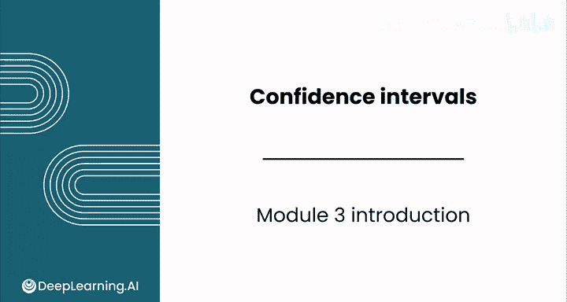
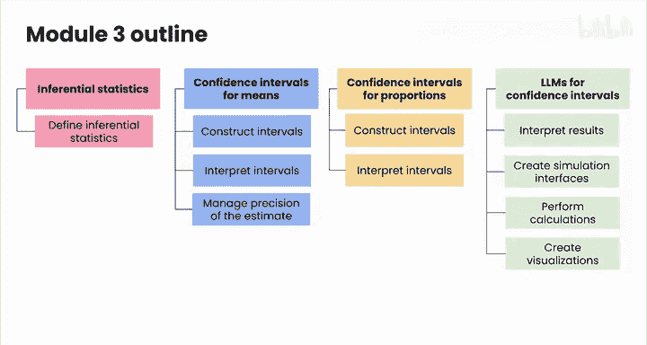

# 120：置信区间模块简介 📊

在本节课中，我们将学习吴恩达数据分析课程中关于“置信区间”的模块。我们将了解如何基于样本数据对总体参数进行推断，并掌握构建与解释置信区间的基本方法。

---

## 概述

欢迎来到新的模块——置信区间。在本模块中，你将学习两种基于样本对总体进行推断的强大技术中的第一种。置信区间的目的是帮助你处理许多商业问题中固有的不确定性。

上一节我们介绍了数据分析的整体框架，本节中我们来看看推断统计学的具体起点。

## 推断统计学的定义

你将首先定义推断统计学，包括它与描述统计学的区别。

推断统计学旨在利用样本数据对总体特征（参数）进行预测或推断。这与描述统计学不同，后者仅专注于总结和描述已收集数据本身的特征。

## 置信区间的构建与目的

然后，你将构建置信区间。这是一种以一定的确定性度量来估计总体参数（如均值和比例）的方法。

以下是构建置信区间的核心目标：
*   估计未知的总体参数。
*   提供估计的精确度或可靠性的度量。

## 置信区间的解释与精度控制

你将学习如何解释这些区间（这可能相当棘手），以及如何控制估计精度的不同杠杆。

解释置信区间时，关键在于理解其概率含义。同时，我们可以通过调整一些因素来控制区间的宽度（即精度）。

以下是影响置信区间宽度的主要因素：
*   **样本大小 (n)**：样本量越大，区间通常越窄，估计越精确。
*   **置信水平 (1-α)**：置信水平越高（如95%对比90%），区间越宽。
*   **数据的变异性 (σ 或 s)**：数据波动越大，区间越宽。

## 大语言模型作为思考伙伴

最后，你将把大语言模型作为推断统计学的思考伙伴。你将看到人工智能如何帮助你解释结果、创建模拟界面，甚至为置信区间执行计算和创建可视化。

## 实践与应用

你的辛勤工作将在实验课中达到高潮，在那里你将探索钻石的定价机制。我相信到本模块结束时，你会乐在其中。

---

## 总结

在本节课中，我们一起学习了置信区间模块的核心内容。学完本模块后，你将能够构建和解释置信区间，从而能够从数据中得出严谨的结论。

请跟随我进入下一个视频，以了解更多关于推断统计学的知识。😊