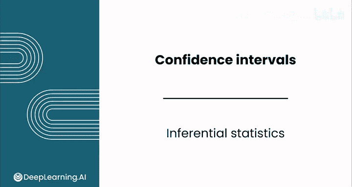
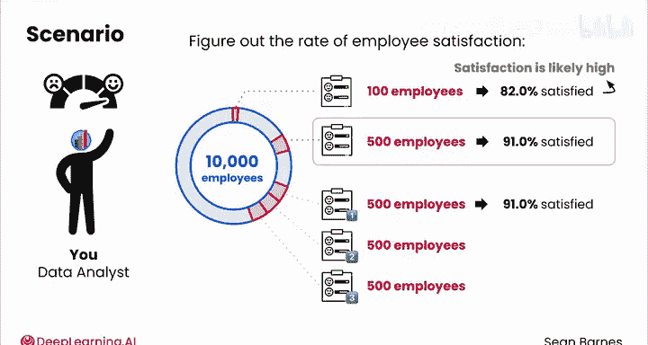
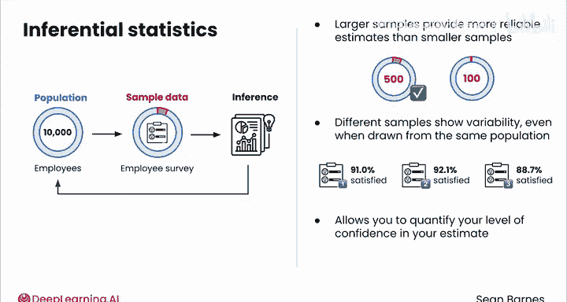
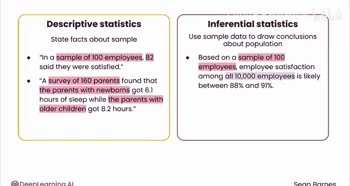
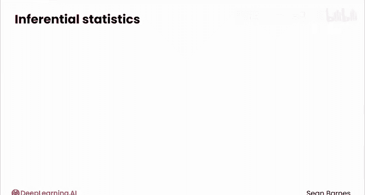
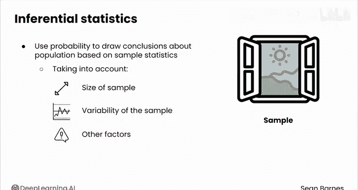
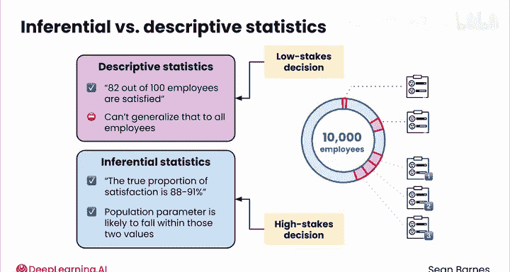

# 121：推断统计学 🧠

在本节课中，我们将要学习推断统计学的基本概念。我们将了解如何利用样本数据来对总体做出更可靠的结论，并比较描述性统计与推断性统计的区别。

---

## 从描述性统计到推断性统计

到目前为止，你一直在使用描述性统计。描述性统计用于描述样本数据的行为。

现在，通过推断性统计，你将利用样本来对总体得出更有力的结论，从而显著提升分析的严谨性。

---

## 一个关于信心的思考实验

让我们从一个关于信心的问题开始。假设你试图了解一家公司的员工满意度。公司有10000名员工。你采访了其中的100人，其中82%的人表示满意。

基于这个信息，你对所有员工的满意度有何直觉？你可能会说满意度相当高。但你有多大信心认为你的样本能代表整个公司？你会放心地向你的老板报告这个结果吗？

也许你决定收集更多数据，于是你将调查范围扩大到随机选择的500名员工。你发现其中有455人满意，即91%。这个更大的样本如何影响你的信心？如果你现在必须向CEO提供一个数值范围，你会怎么说？

最后一组问题：假设你对500名随机选择的员工进行了三次独立调查，你得到的满意度百分比分别是：第一次调查91.0%，第二次92.1%，第三次88.7%。基于这三个不同的样本，你现在会如何估计真实的满意度？

---

## 推断统计学的核心思想

这正是推断统计学背后的核心理念。

你有一些样本数据（如你的员工调查），并试图对总体（所有10000名员工）做出推断。

以下是几个关键点：

*   **大样本提供更可靠的估计**：询问500名员工比询问100名更可靠。
*   **不同样本存在变异性**：即使从同一总体中抽取，不同的样本也会显示出差异。在每次独立调查中，满意度比率都不同，尽管潜在的总体满意度是相同的。
*   **量化信心水平**：推断统计学允许你量化对估计值的信心水平。从数学上判断某个估计值比另一个更有可能，是可行的。

---

## 描述性统计 vs. 推断性统计

为了更好地理解两者的区别，请看以下对比：

**描述性统计**陈述关于样本数据的事实。例如：
*   在100名员工的样本中，82人说他们满意。
*   一项对160名家长的调查发现，新生儿父母平均每晚睡6.1小时，而年长孩子的父母每晚睡8.2小时。

**推断性统计**则利用样本数据来对整个总体得出结论。例如：
*   基于100名员工的样本，**所有10000名员工**的满意度很可能在88%到91%之间。
*   一项对家长的调查得出结论，**年长孩子的父母**比新生儿父母每晚多睡两小时。

前两个例子描述了样本的特征，而后两个例子则利用样本的特征来对总体的行为方式做出结论（所有员工、所有父母）。

你之前学到，样本是窥见真相的一扇窗。当你透过这扇窗观察时，不一定能看到全部真相。推断统计学就是利用概率，基于你的样本统计量（同时考虑样本大小和变异性等因素）来对总体得出结论。本质上，你使用推断统计学来看到整个图景，即使它超出了你当前的视野。

---

## 推断统计学的价值与严谨性

与描述性统计相比，推断统计学提供了更高层次的分析严谨性。

在员工满意度的例子中，使用描述性统计，你只能陈述“接受调查的100名员工中有82人满意”。但你无法将其推广到所有员工。

使用推断性统计，你或许可以很有信心地推断，真实的满意度比例在88%到91%之间。尽管你对实际值不那么确定，但你能够得出结论：真实的总体参数很可能落在这个区间内。

如果你在做低风险的决策，比如了解一名运动员的表现，那么描述性统计可能完全适合你的用例。

然而，如果你在做更高风险的决策，比如是否向某个产品投资数百万美元，推断性统计则为决策提供了更坚实的基础。它允许你量化估计中的不确定性。

---

## 两种常见的估计类型

在实践中，你会经常使用两种不同类型的估计：**点估计**和**区间估计**。

在接下来的视频中，我们将进一步了解它们之间的区别。

---

## 总结

本节课中，我们一起学习了推断统计学的基本概念。我们了解到，推断统计学使我们能够利用样本数据对总体进行推断，量化估计的不确定性，并为决策提供比单纯描述样本更严谨、更可靠的基础。它特别适用于需要从有限数据中得出广泛结论或进行高风险决策的场景。