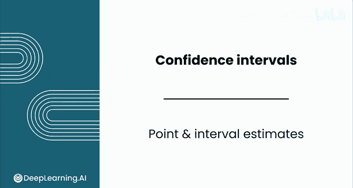
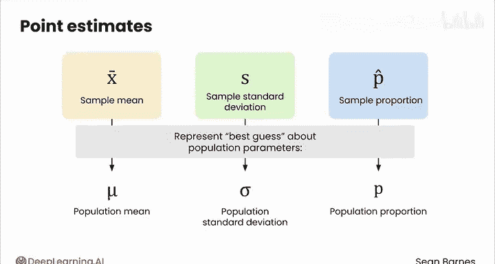
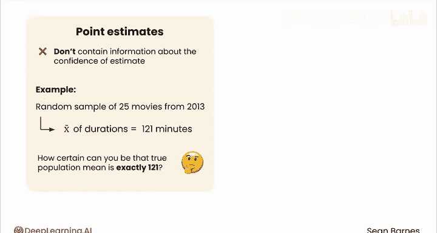
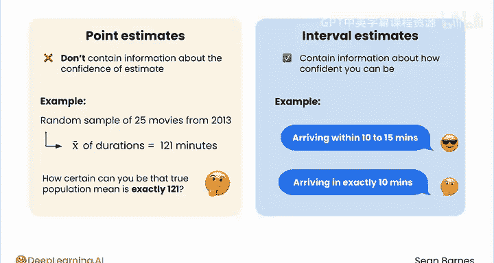
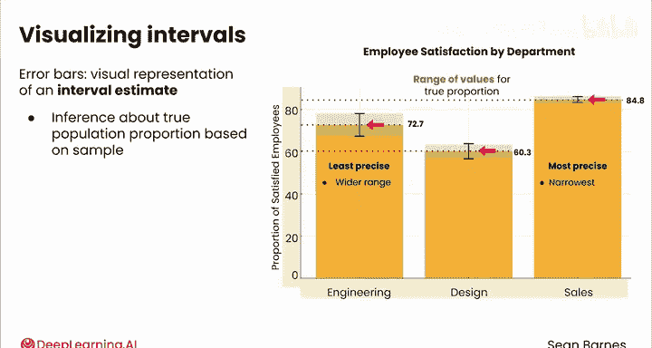

# 122：点估计与区间估计 📊

在本节课中，我们将学习统计学中两种重要的估计方法：点估计和区间估计。我们将了解它们各自的含义、区别以及在实际数据分析中的应用。

---

## 概述

点估计和区间估计是统计学中用于推断总体参数的两种基本方法。点估计提供一个单一的“最佳猜测”值，而区间估计则提供一个可能包含总体参数的范围，并附带我们对这个范围的信心程度。

---

## 点估计：单一的最佳猜测

上一节我们介绍了样本统计量的概念，本节中我们来看看点估计的具体应用。

点估计是使用样本数据计算出的单个数值，用以估计未知的总体参数。你已经在前面的模块中见过两个点估计量：

*   **样本均值**：公式为 `X̄`，用于估计总体均值 `μ`。
*   **样本标准差**：公式为 `S`，用于估计总体标准差 `σ`。

在本模块稍后部分，你将探索另一个点估计量 **`P̂`**（样本比例）。例如，`P̂` 可能是 0.82，代表对工作满意的员工比例，它用于估计总体比例 `P`。

点估计很有用，但它不包含关于该估计值可信度的任何信息。假设你有一个2013年的25部电影的随机样本，其样本平均时长为121分钟。你有多大的把握能确定真实的总体均值 `μ` 恰好就是121分钟？

---

## 区间估计：包含置信度的范围

与点估计不同，区间估计确实包含了关于你有多大把握的信息。

这类似于你告诉朋友到达时间。说“10到15分钟到”比只说“10分钟到”能让你更有把握估计正确。通过扩大估计范围，你增加了估计正确的可能性。

以下是区间估计在统计学中的体现：

你可能见过包含误差线的图表。下图展示了公司三个不同团队的情况：X轴是团队，Y轴是表示满意的员工比例。

这张图没有使用点估计（那将只是在工程团队的72.7、设计团队的60.3等处画一条平面柱状图），而是显示了一个区间。该区间代表了基于样本数据，估计真实比例可能落入的数值范围。

根据这些区间，你认为哪个估计最精确？

答案是销售团队的估计。它的区间最窄。这可能是因为销售团队的样本量更大，或者其样本内部的变异性更小。相比之下，工程团队的区间最宽，表明真实比例的可能取值范围更大。

这些误差线只是区间估计的视觉化表示，是基于样本对真实总体比例的一种推断。如果你多次重复这个抽样过程，你会期望真实总体值在大多数时候都落在这个范围内。

---

## 核心复杂性：抽样变异性

区间估计处理的是统计学的核心复杂性：如果你从总体中抽取多个样本，你得到的样本统计量值会不同。

例如，观察这个分布。如果我翻转高尔顿板，现在我会得到一个不同的分布。

这种样本统计量之间的差异，正是我们需要区间估计来量化不确定性的原因。

---

## 总结

本节课中我们一起学习了点估计与区间估计。点估计（如 `X̄`， `S`， `P̂`）为我们提供了总体参数的单一最佳猜测值。而区间估计则提供了一个数值范围，并表达了我们对总体参数落在此范围内的信心程度，这通常通过像误差线这样的可视化工具来呈现。理解抽样变异性是理解为何需要区间估计的关键。

在下一个视频中，我们将通过模拟来亲眼看看这种复杂性是如何在实际中体现的。