# 123：抽样分布与中心极限定理 📊

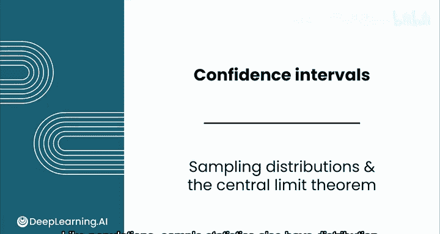

在本节课中，我们将要学习抽样分布的概念以及一个非常重要的统计学定理——中心极限定理。我们将通过具体的例子来理解样本统计量（如样本均值）的分布规律，并探讨这些规律如何帮助我们进行统计推断。

---

## 抽样分布简介

上一节我们介绍了总体和样本的基本概念。本节中我们来看看样本统计量自身的分布特性。

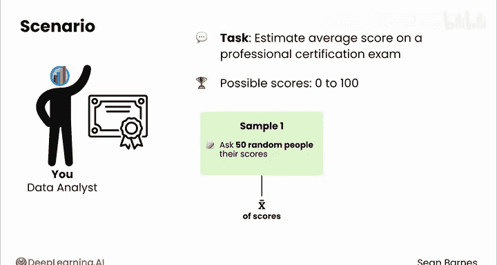

与总体类似，样本统计量也有其分布。这意味着它们可以取一系列可能的值，并且每个值都有其对应的概率。

让我们通过一个例子来理解。假设你的任务是估计一项专业认证考试的平均分数。可能的分数范围是0到100。如果你抽取一个样本，例如随机询问50个人的分数，你会得到一个样本均值。但如果你抽取另一个样本，你还会得到相同的值吗？

---

## 一个模拟实验

让我们运行一个快速的模拟。我们生成一个新的样本。这模拟了随机询问50个人他们在认证考试中的分数。

在上方，你可以看到已经抽取的一些值，以及样本均值76.76。这里的每一个值都代表认证考试的一个分数。在下一部分，你将看到一些统计量，用于总结迄今为止生成的所有样本均值（目前只有一个）。在右侧，你会看到所有样本均值的直方图。

对于第一个样本，样本均值是76.76。但如果你生成一个新样本，你会得到一个不同的样本均值，在这个例子中是80.40。

你刚刚生成了另一个包含50个认证考试分数的样本。现在，就好像你抽取了两个不同的50人分数样本。如果你再生成一个样本，你会得到80.02。

随着你生成越来越多的样本，你将开始看到越来越多的值出现。所有这些值都是你从该分布中抽样时可能得到的样本均值。

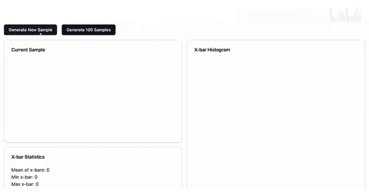

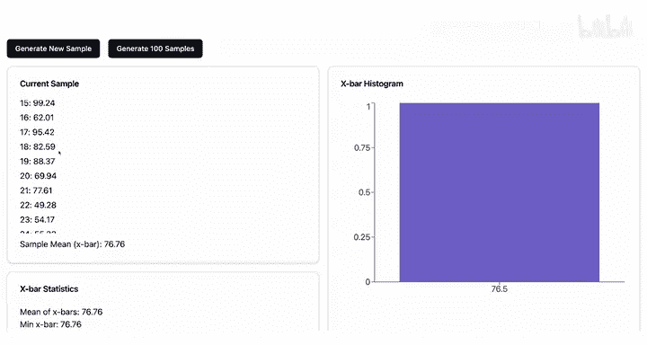

假设你抽取了超过2000个分数样本。

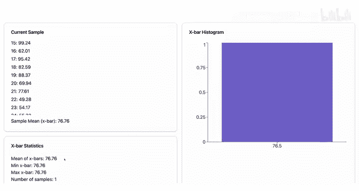

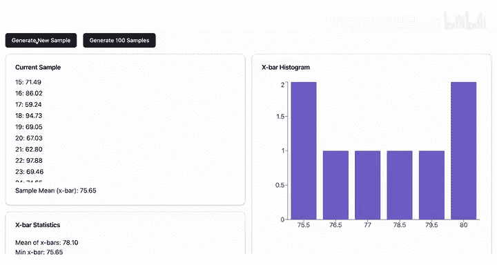

每个样本包含50个人，你计算了每个样本的均值，因此你拥有超过2000个样本均值。你将那些均值的分布绘制在右侧的直方图中。

你猜这个分布遵循什么规律？

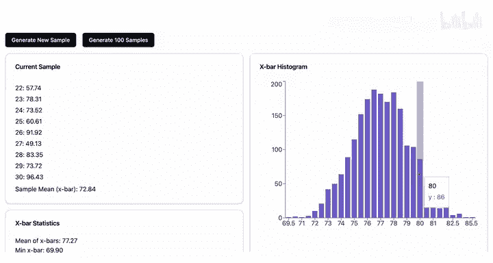

---

## 抽样分布的形状

这条曲线表明样本均值是正态分布的。

你能猜出总体均值μ吗？在76到78之间可能是一个不错的猜测。在这个例子中，真实的总体均值是77.2。

这就是一个**抽样分布**。它是样本均值X̄可以取到的可能值范围，以及每个值对应的概率。

抽样分布背后的思想是，你更有可能得到一个接近真实总体均值的样本均值（本例中是77.2）。随着数值离真实总体均值越来越远，其出现的可能性就越小。

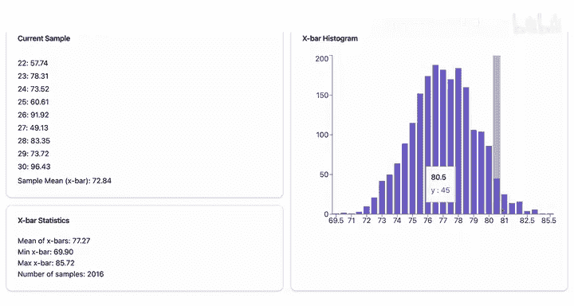

如果这项认证考试的真实平均分数是77.2，那么当你询问50个人的分数时，一个接近真实均值的样本均值更可能出现，而一个非常低或非常高的样本均值则更为罕见。

---

## 中心极限定理

事实证明，这些样本均值确实是正态分布的。这种趋势由**中心极限定理**解释。

中心极限定理指出：如果你从**任何分布**中抽取足够大的样本并计算它们的均值，那些样本均值将呈正态分布。这里“足够大的样本”通常指**n > 30**。

此外，该分布的均值将等于μ，即你所抽取样本的那个总体的均值。这很好，这意味着样本均值的集中趋势围绕在总体均值附近。

需要澄清这里发生的情况，因为这是一个常见的混淆点。你抽取许多大小为N的样本，计算样本均值，然后将这些均值绘制在直方图上。所以，你抽取的样本数量与每个独立样本的大小是不同的。

这个抽样分布的标准差表现略有不同，因为随着你增加样本量，你的估计会变得更精确。这类似于提高射箭水平：随着你射出越来越多的箭，靶心不会改变，但你的箭会越来越紧密地聚集在它周围。

样本均值的标准差被称为**均值的标准误**。

---

## 均值的标准误

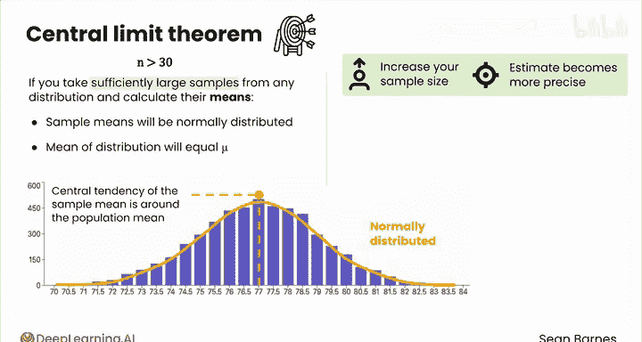

均值的标准误等于真实的总体标准差除以样本大小的平方根。

**公式：**
`标准误 = σ / √n`

请注意，随着n变大，√n也会变大，但速度较慢。

下图展示了这种关系：对于小样本量，随着N增大，√n增长很快，这反映了增加几个值就能在精确度上获得巨大收益。但随着n变得越来越大，√n的增长趋于平缓，这表明随着样本量增大，估计精确度的回报是递减的。

中心极限定理也适用于样本比例P̂，在某些情况下也适用于样本方差和样本标准差。

此外，即使你的样本数据不是正态分布的，只要你的样本量足够大，你的样本均值也将是正态分布的。

例如，降雨量可能遵循像这样的分布（你在上一个模块中见过）。但样本均值的分布仍将是正态分布的。

因此，即使你不确定总体的基础分布，你仍然可以对这些样本统计量进行推断。

---

## 非正态数据的模拟

这里有一个关于中心极限定理如何应用于非正态分布数据的快速模拟。这个模拟器允许你从均匀分布生成样本。

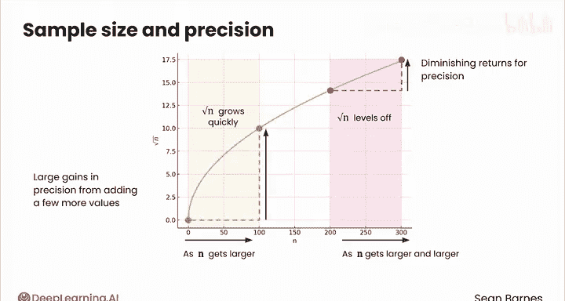
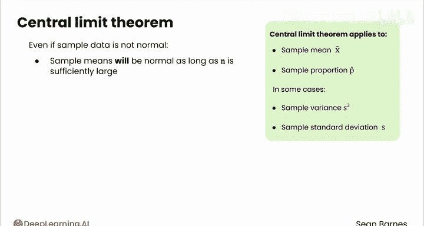

它只是一个随机数生成器，生成0到10之间的数字，每个数字被生成的机会均等。已知该分布的总体均值为5（即中点）。

你可以看到第一个样本看起来相对均匀，样本均值为4.58，你可以在下方看到样本中的所有值。现在，如果你生成一个新样本，你会得到这样一个分布，其X̄为5.13。如果你再生成，比如10个样本...

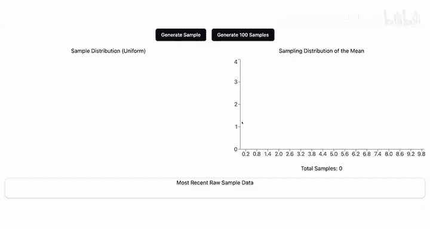

现在看看均值的抽样分布。你认为如何？它看起来是正态分布的。

因此，即使你是从均匀分布中抽样，样本均值都围绕真实均值5呈正态分布。

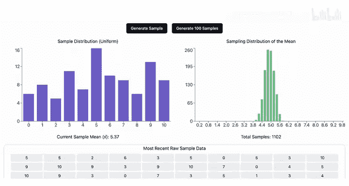

---

## 总结与过渡

中心极限定理是一个相当高级的概念，如果你现在感觉还不是特别理解，这完全没关系。这里的主要思路是：尽管样本具有变异性，但你可以使用一个区间来估计总体参数，即使你不知道基础分布是什么。

到目前为止，你在本模块中做得很好。完成本课的练习评估后，请跟随我进入下一课，开始构建置信区间。

---

**本节课中我们一起学习了：**
1.  **抽样分布**：样本统计量（如均值）自身的概率分布。
2.  **中心极限定理**：无论总体分布形状如何，只要样本量足够大（通常n>30），样本均值的分布就近似正态分布，且其均值等于总体均值μ。
3.  **均值的标准误**：衡量样本均值变异性的指标，计算公式为 **σ / √n**。它随着样本量n的增加而减小，意味着更大的样本能提供更精确的估计。
4.  中心极限定理的强大之处在于，它允许我们在不知道总体具体分布的情况下，对样本统计量进行推断。