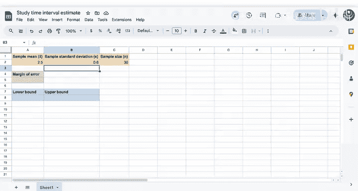

# 124：置信区间实战演示 🎯

在本节课中，我们将通过一个具体的例子，直观地理解置信区间的概念和应用。我们将看到如何利用样本数据，构建一个能够估计总体参数范围的区间。

---

在深入探讨置信区间的工作原理之前，我们先来看一个简单的例子，以便你能从整体上把握其角度。

假设在过去几年里，无论是上学期间还是工作期间，你每天都坚持学习。为了更清晰地了解自己长期的学习习惯，你决定收集30天的数据。你细致地记录了每天的学习时间。

这为你提供了近期学习习惯的一个快照，你可以用它来估计更长期的平均水平。经过30天，你得到了一个样本量为30的数据集，样本均值为每天2.5小时，样本标准差为0.6小时。

你可以说你的日均学习时间是2.5小时。这是一个点估计。

虽然这个统计量有用，但它没有告诉你这个估计有多精确，也没有告诉你你的学习时间通常有多大变化。为了理解你多年来真实日均学习时间的可能范围，你可以构建一个置信区间。

接下来你会看到一些数值和计算，它们现在可能不太容易理解，但你将在后续视频中详细学习每一个步骤。

---

现在，让我们聚焦于整体概念。

首先，你需要计算误差范围。

你可以看到，误差范围涉及你的样本标准差、样本大小，以及一个接近2的数字。你将在接下来的视频中仔细研究每一个组成部分。

这个数字代表了你为估计平均学习时间而构建的区间的不确定性。一般来说，数值越小意味着你对所估计的总体参数越有把握，数值越大则意味着不确定性越高。

你将使用误差范围来计算区间的下限和上限。

对于下限，你将用样本均值减去误差范围。对于上限，你将再次使用样本均值，但这次是加上误差范围。

误差范围的字面意思，就是你在点估计两侧所估计的误差范围。

---

你刚刚构建了一个95%的置信区间。

因此，你有95%的把握认为，你的平均学习时间在2.29小时到2.71小时之间。

如果你重复这个实验很多很多次，每天都记录你的学习时间，那么大约有95%的次数，你找到的区间会包含你真实的日均学习时间。

---

看到你仅用30天的样本，就能为过去几年的平均学习时间创建一个合理的估计范围，这很酷。

这个演示展示了置信区间有用的一种方式。

请跟随我进入下一个视频，学习如何自己计算置信区间。

---

**本节课总结**

在本节课中，我们一起学习了置信区间的初步应用。我们通过一个记录学习时间的例子，了解了如何从样本数据（均值、标准差）出发，计算误差范围，并最终构建一个95%的置信区间。这个区间为我们估计长期的平均学习时间提供了一个包含不确定性的范围，使我们认识到点估计的局限性以及区间估计的价值。