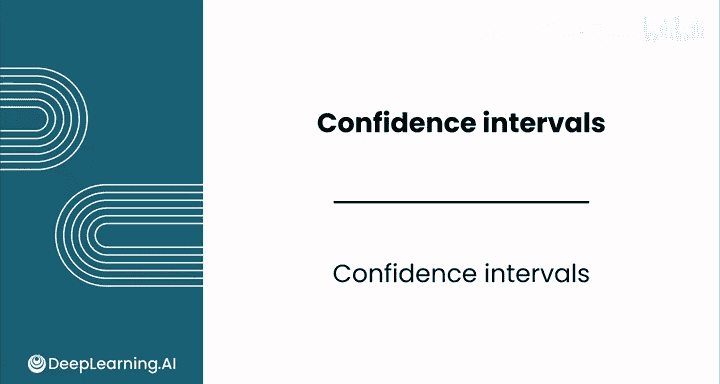
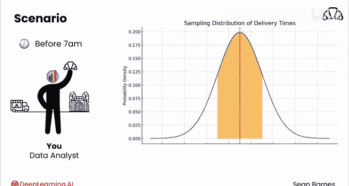
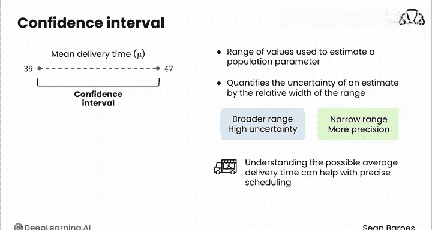

# 125：置信区间 📊

在本节课中，我们将学习如何构建和解释置信区间。置信区间是一种强大的统计工具，它允许我们基于样本数据，对未知的总体参数（如总体均值）做出一个带有置信水平的区间估计。

上一节我们介绍了点估计的概念，本节中我们来看看如何通过区间估计来量化估计的不确定性。

---

## 从一个例子开始 🍞

假设你是一家面包店的数据分析师，负责向当地动物园配送新鲜糕点。糕点必须在动物园每天上午7点开门前送达。你的任务是弄清楚配送需要多长时间，以便安排日程。

首先，你需要收集一些样本数据。你监测了配送卡车30天，每天记录从面包店到动物园的配送时间。根据你的样本，你计算出样本均值为**43分钟**，样本标准差为**11分钟**。

你可以就此停止，说平均配送时间是43分钟，这是一个点估计。但为了进行更严谨的分析，你可以创建一个区间估计，这个估计会考虑到你样本中的变异性。可能仅仅由于随机性，你那30天的配送时间异常地快或异常地慢。

但你只有一个样本。那么，你如何估计真实的平均配送时间，以帮助理解这个估计中包含的不确定性，以及它与真实总体均值的关系呢？

---

## 理解抽样分布 📈

让我们想象一下，如果你抽取了成千上万个样本，而不仅仅是一个，情况会怎样。你会得到一个像这样的均值抽样分布。

根据中心极限定理，这个分布将是正态分布，并以真实的总体均值为中心。

如果你加上标准差，这些是所有在均值上下一个标准差、两个标准差和三个标准差范围内的样本均值。

你那个包含30次配送时间、计算出样本均值为43分钟的样本，只是这成千上万个可能样本中的一个。也许43分钟落在这里，它是一组比平均时间更长的样本。记住正态分布的一个特性是，50%的值在均值以上，50%在均值以下。所以有50%的几率43分钟是一个高于平均水平的样本均值。

或者，也许43分钟在这里，它比真实的平均配送时间快得多。毕竟，它有50%的几率是一个低于平均水平的样本。

---

## 置信区间的核心思想 💡

有一种思考方式：你的样本均值43分钟，落在真实均值两个标准差范围内的概率是多少？

根据你在上一个模块学到的**两西格玛法则**，这个概率是**95%**。

另一种说法是，如果你从这个分布中随机选择一个值，它有95%的几率落在真实均值的两个标准差范围内。

棘手的地方在于，你并不知道真实的总体均值是多少。这正是你想要估计的。置信区间可以帮助你量化估计的不确定性，因为你不知道你的样本均值在这个分布中的位置。

---

## 计算置信区间的步骤 🧮

你的目标是估计所有配送（而不仅仅是样本中的配送）的平均时间。你对平均配送时间的最佳猜测是你的样本均值43分钟。然而，你知道这个估计不太可能与总体均值完全相同。因此，你想创建一个区间估计来量化你的不确定性。

现在，你可以构建你的置信区间了。从你的样本均值43分钟开始。然后，你可以加上和减去一个特定的量来创建你的区间估计。这个量基于三个因素：样本中的变异性、样本大小以及你希望估计的置信度。

在构建区间时，你将使用**均值的标准误**来同时考虑变异性和样本大小。标准误是这个抽样分布的标准差，公式是 **σ / √n**。

由于你不知道真实的总体参数，所以你不知道σ。你必须使用你的最佳估计：**样本标准差s**。

所以现在你有 **s / √n**。这等于 **11分钟 / √30**，结果大约是**2**。

接下来，你需要决定你希望有多大的置信度。一个常见的阈值是**95%置信度**，这反映了5%的出错几率。

你计算**样本均值减去2倍标准误**作为下限，计算**样本均值加上2倍标准误**作为上限。

你使用2倍标准误，因为根据两西格玛法则，你知道95%的可能均值落在均值上下两个标准误的范围内。你还有其他选择，但95%置信度非常有用。

简化计算：样本均值是43。下限是 43 - 2 * 2 = **39**。上限是 43 + 2 * 2 = **47**。

---

## 解释结果 📋

综合起来，你可以说有**95%的置信度**，真实的平均配送时间在**39到47分钟**之间。

这就是一个置信区间。它是一个用于估计总体参数的值范围。它也通过区间的相对宽度来量化估计的不确定性：宽范围与相对较高的不确定性相关，而窄范围则提供了更精确的估计。

你可以将这个置信区间带回面包店给你的同事，以帮助决策。了解可能的平均配送时间有助于制定更精确的日程安排。

---

## 总结 ✨

本节课中我们一起学习了置信区间。你刚刚计算了一个95%的置信区间。尽管你无法确定你的样本有多么不寻常，但你的置信区间帮助你做出了一个知情的估计。

置信区间的解释可能有些微妙。请跟随我到下一个视频，了解更多关于它们所代表含义的知识。