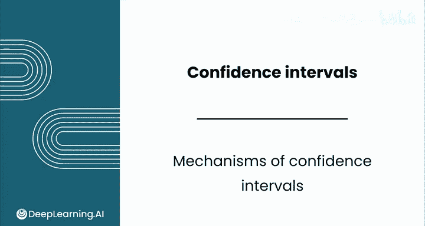
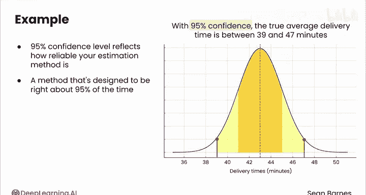
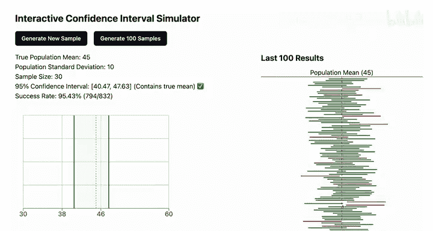
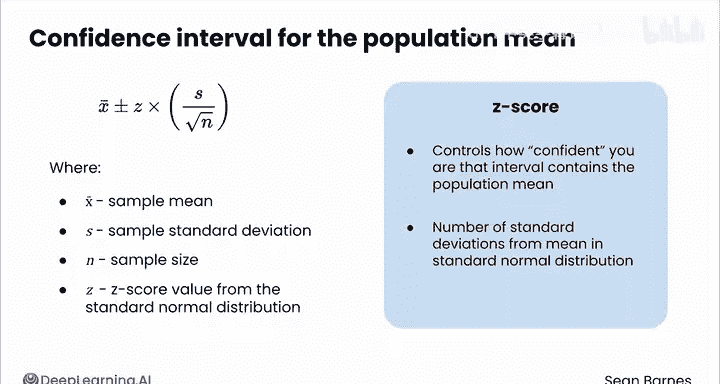
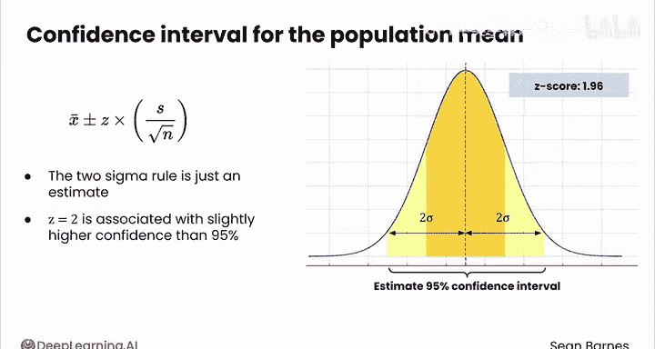
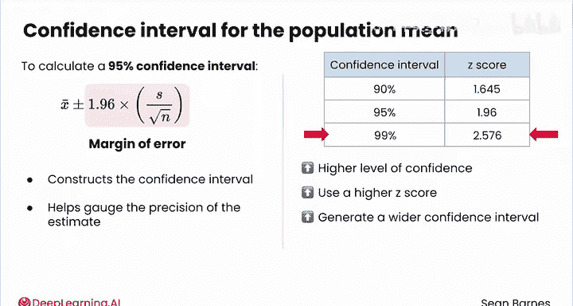
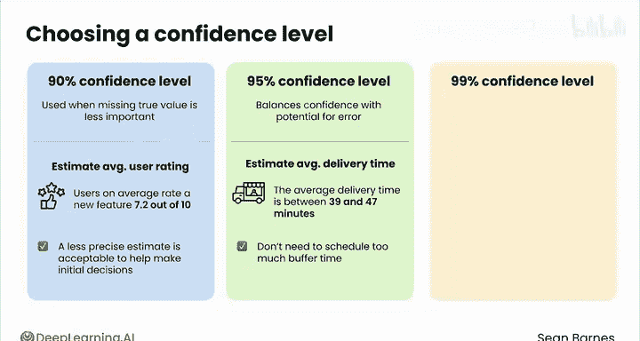

# 126：置信区间机制

在本节课中，我们将学习置信区间的核心含义、计算方式及其实际应用。我们将通过模拟演示和公式解析，帮助你理解“95%置信”这一概念的真实意义。

---

## 概述：什么是置信区间？

你已经计算出一个95%置信区间，但它的具体含义是什么？本节将揭示置信区间中“95%”部分的真实意义及其来源。

让我们回顾这个陈述：“我们有95%的置信度认为，真实的平均配送时间在39至47分钟之间。”这里的95%置信水平反映了你估计方法的可靠性。你使用的方法在长期运行中，被设计为有95%的概率是正确的。

需要记住，总体参数是固定但未知的。因此，对于任何一个具体的置信区间，总体参数要么在其中，要么不在。接下来，我将通过模拟演示来阐明这一点。

---

## 置信区间的模拟演示

这个模拟器从一个均值为45、标准差为10的正态分布中，随机抽取30个样本。然后，它将基于该样本计算一个置信区间。

让我们生成一个新样本。在这个图的x轴上，是所有可能的总体均值取值。红线代表真实的总体均值45。置信区间是两条绿线之间的灰色区域，代表估计包含真实均值的数值范围。在本例中，该置信区间在43.10到50.26之间，确实包含了真实的总体均值。

此时你的成功率是100%，但你可以生成更多样本。下一个样本的置信区间也包含了总体均值，再下一个也是如此。

随着你生成更多样本，可以观察右侧的汇总图表。该图表展示了每个生成的置信区间与真实总体均值（再次用红色虚线表示）的关系。每当绿色条与红色虚线重叠时，就表示该区间包含了真实的总体均值。你可以看到这里有一个例子，其置信区间刚好与红色虚线重叠。

最终，你生成了一个不包含真实总体均值的置信区间。整个置信区间实际上低于真实总体均值的位置，这在左侧的图表中也能看到。

如果你生成100个样本，会发现得到一个不包含真实均值的置信区间是相对罕见的事件。在本例中，生成的100个样本中只有2个不包含真实总体均值。如果生成更多样本，你会发现成功率最终稳定在预期的95%左右。

这个模拟向你展示的是：当你基于一个样本计算均值的置信区间时，你有95%的概率该置信区间确实包含真实均值。这就是置信区间的全部目的。

你的样本存在不确定性，你不知道计算出的样本均值距离真实的总体均值究竟有多远或多近。但利用推断统计学，你可以计算出一个数值范围，如果你多次重复这个过程，该范围有95%的次数会包含真实值。

我们并非直接看到真相，而是得到了一个对真相的有力估计。

---

## 置信区间的计算公式

现在你已经对置信区间有了一些直观理解，以下是计算总体均值置信区间的公式：

**公式：**
`置信区间 = X̄ ± Z * (S / √n)`

你之前已经见过所有这些值。`X̄` 和 `S` 是你的样本统计量（均值和标准差），`n` 是你的样本大小。

`Z` 代表标准正态分布中的一个Z分数值，它控制着你对于置信区间包含总体均值的信心程度。回想一下，Z分数等同于标准正态分布中距离均值的标准差个数。

在之前的视频中，你使用均值上下两个标准差来估计95%置信区间。实际上代表这一置信水平的精确值是 **1.96**。这是因为“两西格玛法则”只是一个近似值——样本均值上下两个标准差实际上关联着略高于95%的置信度。因此，在实践中，为了更精确，你会使用Z分数1.96。

所以，综合起来，计算95%置信区间的公式是：

**公式：**
`95% 置信区间 = X̄ ± 1.96 * (S / √n)`

公式右边的项被称为 **边际误差**。它是构建置信区间的部分，帮助你衡量样本估计的精确度。

---

## 不同置信水平的区间

你也可以计算不同置信水平的置信区间。你认为哪些置信水平可能有用？

以下是三种最常见的置信水平及其对应的Z分数：

*   **90% 置信区间**：Z分数为 **1.645**
*   **95% 置信区间**：Z分数为 **1.96**（你刚刚看到的）
*   **99% 置信区间**：Z分数为 **2.576**

需要注意的是，更高的置信水平意味着使用更高的Z分数，因此会生成更宽的置信区间。所以，为了增加你的区间包含真实均值的信心，你需要扩大区间估计的范围。

---

## 如何选择置信水平？

为特定估计选择置信水平取决于几个因素。

**95%** 是最常用的置信水平，因为它平衡了置信度与潜在误差。例如，“平均配送时间在39到47分钟之间”。准时到达对于维持与你的合同很重要，因此你试图在关于平均配送时间的确定性和估计的精确度之间取得平衡。8分钟的范围意味着你不需要在计划出发时间中安排过多的缓冲时间。

**90%** 的置信水平可能用于初步研究，或者当错过真实值不那么重要时。例如，如果你与产品研究团队合作，在开发的早期阶段，你可能使用90%的置信区间来估计用户对新功能的平均评分为7.2分（满分10分）。此时，一个不那么精确的估计是可以接受的，以帮助做出初步决策。

**99%** 的置信水平用于当你想最小化错误风险时。例如，如果你与科学家团队合作估算河流污染，为了通过监管测试，拥有高置信水平可能很重要。以99%的置信度计算河流中的污染物浓度，可以帮助你的团队降低对环境造成有害影响的风险。

请记住，所有这些估计，即使是99%的置信区间，也带有一定的错误几率。

---

## 总结与过渡

在过去的几个视频中，我们出色地完成了置信区间的模拟和通用公式的学习。你已经看到，置信区间取决于你的样本大小和置信水平。

那么，这些术语是如何相互作用的呢？在下一节视频中，我们将进一步探讨它们之间的关系。