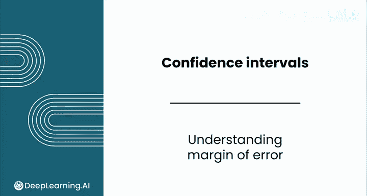
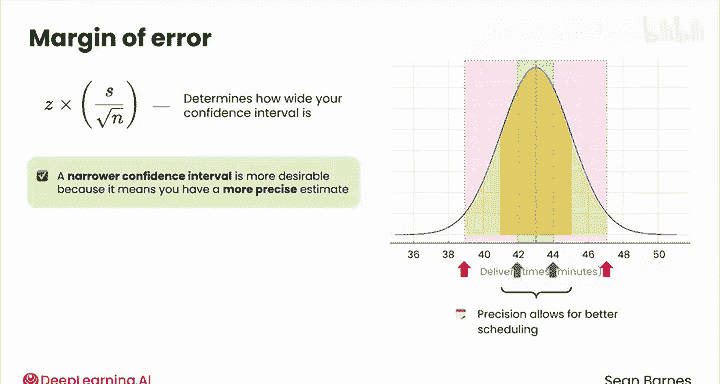
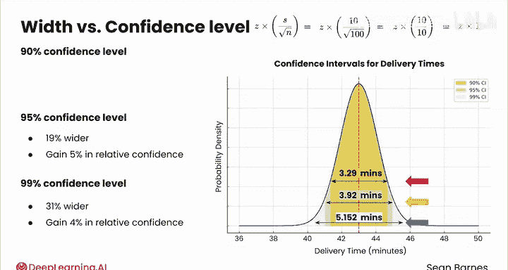
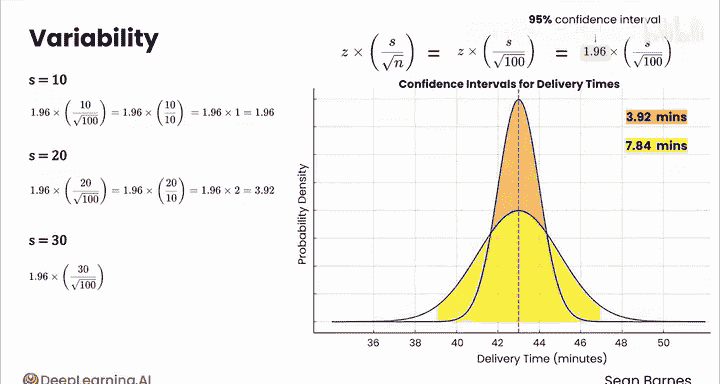
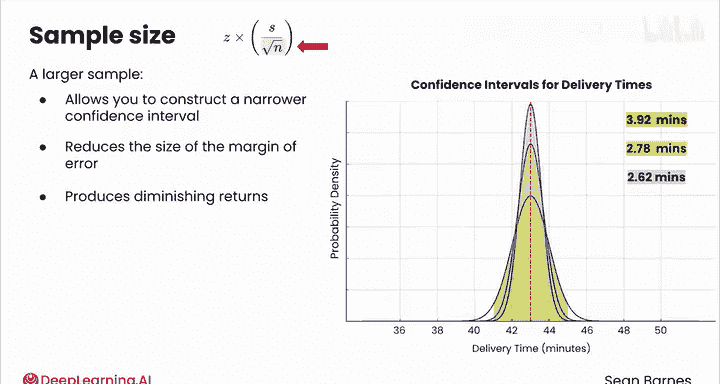
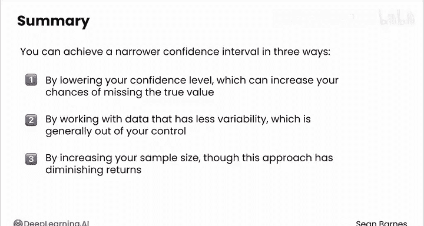

# 127：理解边际误差 📊

在本节课中，我们将要学习置信区间宽窄的决定因素，并深入探讨边际误差的计算及其影响因素。我们将通过公式和具体例子，理解如何控制置信区间的精度。

---

## 概述

置信区间的宽度由边际误差决定。一个更窄的区间意味着对总体参数（如平均值）的估计更精确。边际误差的大小主要取决于三个因素：**置信水平**、**数据的标准差**和**样本量**。我们将逐一分析这些因素如何影响边际误差，从而影响置信区间的宽度。

---

## 边际误差的构成

上一节我们介绍了置信区间的基本概念，本节中我们来看看决定其宽度的核心——边际误差。边际误差的通用公式为：

**边际误差 = Z * (S / √n)**

其中：
*   **Z** 是与所选置信水平对应的Z分数。
*   **S** 是样本数据的标准差，用于估计总体标准差。
*   **n** 是样本量。

这个公式揭示了影响区间宽度的三个关键变量。

---

## 因素一：置信水平

首先，我们探讨置信水平的影响。常见的置信水平有90%、95%和99%，其对应的Z分数分别为1.645、1.96和2.576。

假设我们有一个送餐时间的例子，样本标准差 `S=10`，样本量 `n=100`。那么 `S/√n = 10/10 = 1`。

以下是不同置信水平下的计算：

*   **90% 置信水平**：边际误差 = 1.645 * 1 = **1.645**。整个区间的宽度是其两倍，即 **3.29分钟**。
*   **95% 置信水平**：边际误差 = 1.96 * 1 = **1.96**。区间宽度 = 2 * 1.96 = **3.92分钟**。
*   **99% 置信水平**：边际误差 = 2.576 * 1 = **2.576**。区间宽度 = 2 * 2.576 = **5.152分钟**。

这个例子说明了**置信水平与区间宽度之间的权衡**。更高的置信水平意味着更宽的区间。值得注意的是，宽度的增加与置信度的提升并非成比例。例如，95%的区间比90%的区间宽约19%，但置信度只提高了约5%。这是因为正态分布曲线尾部的概率密度较低，为了捕捉额外的置信百分比，需要覆盖更广的范围。

---

## 因素二：数据变异性（标准差）

接下来，我们分析数据变异性（标准差S）的影响。保持 `n=100` 和 `Z=1.96`（95%置信水平）不变。

以下是不同标准差下的计算：

*   **当 S=10**：边际误差 = 1.96 * (10/10) = **1.96**。区间宽度 = 2 * 1.96 = **3.92分钟**。
*   **当 S=20**：边际误差 = 1.96 * (20/10) = **3.92**。区间宽度 = 2 * 3.92 = **7.84分钟**。
*   **当 S=30**：边际误差 = 1.96 * (30/10) = **5.88**。区间宽度 = 2 * 5.88 = **11.76分钟**。

可以看出，**标准差与边际误差呈线性关系**。标准差翻倍，边际误差和区间宽度也翻倍。在商业应用中，这意味着数据变异性越大，估计的精确度就越低。例如，城市公交系统的到站时间通常比郊区公交系统更可靠、变异性更小，因此对其平均到站时间的估计会更精确（区间更窄）。

---

## 因素三：样本量

最后，我们考察样本量（n）的影响。样本量与边际误差的关系稍复杂，因为公式中需要除以 `√n`。保持 `Z=1.96` 和 `S=10` 不变。

以下是不同样本量下的计算：

*   **当 n=100**：边际误差 = 1.96 * (10/√100) = 1.96 * 1 = **1.96**。区间宽度 = **3.92分钟**。
*   **当 n=200**：√200 ≈ 14.1。边际误差 = 1.96 * (10/14.1) ≈ 1.96 * 0.71 = **1.39**。区间宽度 ≈ **2.78分钟**。
*   **当 n=300**：√300 ≈ 17.3。边际误差 = 1.96 * (10/17.3) ≈ 1.96 * 0.58 = **1.14**。区间宽度 ≈ **2.28分钟**。

这些数字表明，**更大的样本量可以在相同的变异性和置信水平下，构建出更窄的置信区间**。然而，**增加样本量会带来收益递减**。例如，将样本量从100增加到200（增加100%），区间宽度从3.92分钟缩减到2.78分钟，缩减了约29%。再将样本量从200增加到300（增加50%），区间宽度仅从2.78分钟缩减到2.28分钟，缩减了约18%。

下图展示了样本量与边际误差的关系：

关系是负相关的（样本量越大，误差越小），但在高端部分，曲线斜率趋于平缓，收益递减效应明显。从图中可以估计，大约在样本量100到200之间，收益增长的拐点开始出现。这解释了为何即使估计像法国全国人口这样庞大的总体，也往往只需要一个相对较小的样本量。

---

## 总结

本节课中我们一起学习了影响置信区间宽度的三个核心因素。为了获得更窄、更精确的置信区间，你可以通过以下三种方式实现：

1.  **降低置信水平**：但这会增加错过真实值的风险。
2.  **使用变异性更小的数据**：但这通常不受研究者控制。
3.  **增加样本量**：这是最常用的方法，但需要注意其收益递减的特性。

理解这些关系，有助于你在实际工作中更好地设计和解释统计推断。在接下来的视频中，我们将学习如何亲自计算置信区间。