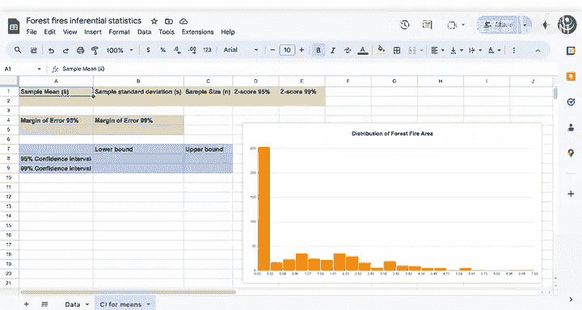

# 128：均值置信区间演示 🌲📊

在本节课中，我们将通过一个实际案例，学习如何为均值构建置信区间。我们将使用葡萄牙国家公园的森林火灾数据集，演示从计算样本统计量到最终解释置信区间的完整流程。

## 概述：置信区间的应用场景

上一节我们介绍了置信区间的基本概念。本节中，我们来看看如何在实际数据分析中应用它。

葡萄牙国家公园管理局希望根据样本数据，对森林火灾的平均过火面积建立一个更严谨的估计。他们计划利用这个估计来储备消防物资，并希望确保物资储备足以应对潜在的估计误差。

## 数据背景与理论基础

回顾一下，森林火灾的过火面积数据是**右偏**的，即大部分火灾面积较小，但存在少数面积巨大的火灾。

尽管数据本身的分布是偏态的，但**中心极限定理**指出，其**样本均值的抽样分布**将近似服从正态分布。因此，我们可以为总体均值构建一个置信区间。

## 计算置信区间的组件

要计算均值的置信区间，你需要以下几个核心组件：

以下是计算所需的具体要素：
*   样本均值
*   样本标准差
*   样本数量
*   对应置信水平的Z分数

## 逐步计算95%置信区间

现在，让我们开始计算这些值。

首先，我们需要区间的中心，即**样本均值**。

计算得出，平均面积约为 **12.85** 公顷。

接下来，计算**样本标准差**。

样本标准差约为 **63.66**。这个非常大的标准差表明数据中存在强烈的变异性。

然后，确定**样本数量**。

现在，你需要做一个决定：选择**置信水平**。通常从 **95%** 开始是一个好主意，这通常是默认选择，能在置信度和精确度之间取得良好平衡。对应95%置信水平的Z分数是 **1.96**。

接着，计算**边际误差**。其公式为：

`边际误差 = Z分数 * (样本标准差 / √样本数量)`

代入我们的数值，边际误差约为 **5.49**。

最后，确定置信区间的上下界：
*   **下界** = 样本均值 - 边际误差
*   **上界** = 样本均值 + 边际误差

## 结果解读

这样，你就计算出了你的第一个（严格来说是第二个）置信区间。

对这个结果的解读是：我们有 **95%的置信度** 认为，真实的总体平均过火面积将落在 **7.36 公顷到 18.33 公顷** 之间。

## 构建更高置信度的区间

现在，假设公园管理局对你说：“我们需要对防火准备计划更有把握。你能给我们一个置信度更高、即使范围更宽泛的估计吗？我们希望为这些火灾做好万全准备。”

你接下来的步骤可以是创建一个 **99%的置信区间**。样本统计量（均值、标准差、样本量）保持不变，你只需要将Z分数更改为 **2.576**，然后重新计算边际误差和置信区间边界。

与95%置信区间的边际误差相比，你预计这个新的边际误差会如何变化？

计算新的边际误差：

`新边际误差 = 2.576 * (63.66 / √样本数量)`

你可以看到，由于选择了更高的置信水平，**边际误差变大了**，约为 **7.21**。随后，通过从样本均值中减去和加上这个新的边际误差，再次计算上下界。

## 对比不同置信水平的区间

区间的长度发生了什么变化？边际误差从5.49增加到了约7.21。因此，**99%置信区间的宽度更大**。

我们有 **99%的置信度** 认为，真实的平均过火面积在 **5.64 公顷到 20.06 公顷** 之间。

## 总结

本节课中，我们一起学习了为均值构建置信区间的完整过程。你做得很好！电子表格让这个任务比手工计算容易得多。

通过这个演示，我们了解到：
1.  即使原始数据分布非正态，只要样本量足够，我们仍可利用中心极限定理为均值构建置信区间。
2.  置信水平的选择是一个权衡：更高的置信度（如99%）会导致更宽的区间（更不精确），而更低的置信度（如95%）则给出更窄的区间（更精确）。
3.  所有计算都基于几个核心公式和样本统计量。

完成本课的练习评估和实践实验后，请跟随我进入下一课，学习如何为**比例**构建置信区间。