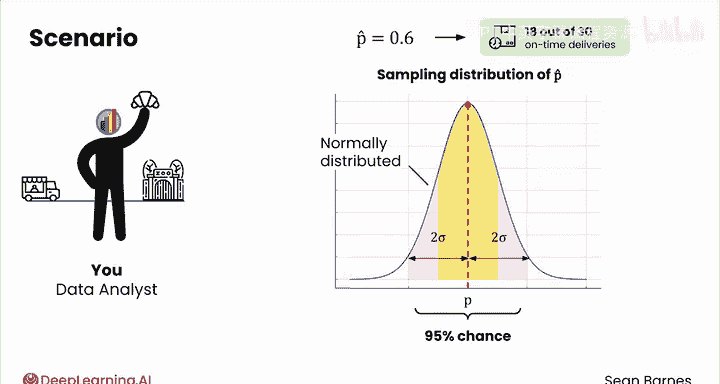
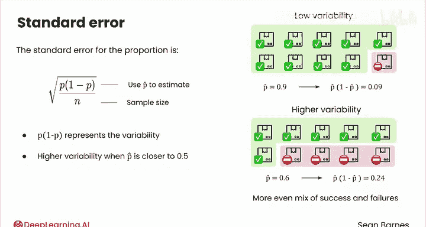
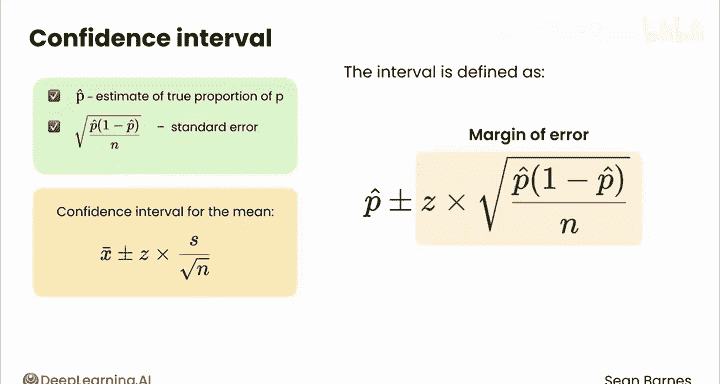
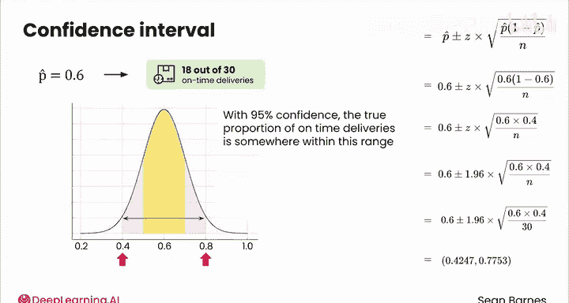

# 129：比例置信区间 📊

在本节课中，我们将学习如何估计一个总体的比例，并构建其置信区间。我们将从一个面包店配送时间的例子出发，理解比例估计的核心概念、标准误差的计算以及置信区间的构建方法。

---

## 概述

估计总体均值很有用，但均值并非统计推断的全部。我们通常还会对总体的其他方面感兴趣，例如总体比例。

让我们重新考虑分析面包店配送时间的例子。虽然估计平均配送时间很有用，但你可能也有兴趣调查准时送达率。你可能会问：有多少比例的配送是准时的？这里的“准时”指的是在早上7点前送达动物园。这个比例可以用 **P** 来表示，即真实的准时送达比例。

---

## 从样本到估计

假设你收集了30次配送的样本，并记录它们是否准时。样本中的准时送达比例用 **P̂** 表示，这是你对真实比例 **P** 的估计。“hat”只是一个表示估计值的术语。

想象一下，你测得样本中的准时送达比例为 **0.6**，这意味着30次配送中有18次准时，这个比例还有提升空间。

与样本均值类似，**P̂** 的抽样分布也服从正态分布。其均值等于真实比例 **P**。也就是说，如果你抽取许多个包含30次配送的样本，并为每个样本计算准时送达比例，这些比例值将呈正态分布。你的 **P̂ = 0.6** 就落在这个分布中的某个位置。

---

## 标准误差与变异性

你认为 **P̂** 落在真实比例 **P** 的两个标准差范围内的概率是多少？与均值的情况一样，根据**两西格玛法则**，**P̂** 有95%的概率落在 **P** 的两个标准差范围内。

现在，我们来讨论标准误差。比例的标准误差公式为：

**标准误差 = √[ P × (1 - P) / n ]**

由于你不知道真实比例 **P**，你可以使用样本比例 **P̂** 来估计它。

让我们分解这个公式。就像标准差一样，**P × (1 - P)** 代表了数据的变异性。

我们可以通过一个包含10次配送的场景来可视化 **P × (1 - P)** 如何量化变异性：
*   假设你观察到9次准时送达和1次迟到。这个样本数据的变异性较低，因为10个结果中只有1个与其他不同。
*   对比另一个样本，其中有6次准时和4次迟到。这个数据的变异性更高，因为成功（准时）和失败（迟到）的混合更均匀。

在第一个场景中，**P̂ = 0.9**，所以 **P̂ × (1 - P̂) = 0.09**。
在第二个场景中，**P̂ = 0.6**，所以 **P̂ × (1 - P̂) = 0.24**。

因此，从数学上讲，当 **P̂** 接近 **0.5** 时，数据的变异性更高。

接下来，你将这个量除以样本大小 **n**。这再次体现了样本量越大，估计越精确的思想。
最后，取平方根以确保这个量与数据的原始尺度相匹配。

---

## 构建比例置信区间

现在你有了 **P̂** 和标准误差，就可以为这个比例构建置信区间了，其方法与为均值构建置信区间类似。

区间定义为：**P̂ ± Z × 标准误差**，即 **P̂ ± Z × √[ P̂ × (1 - P̂) / n ]**。

你还记得右边这项叫什么吗？它被称为**边际误差**。与均值的置信区间一样，它代表了估计中的不确定性。

以下是你的样本场景中准时送达比例的95%置信区间计算：
*   **P̂ = 0.6**
*   **1 - P̂ = 0.4**
*   对于95%置信区间，**Z = 1.96**
*   **n = 30**

计算得到的置信区间范围是 **0.4247 到 0.7753**。这意味着我们有95%的信心认为，真实的准时送达比例落在这个范围内。

这个较宽的区间反映了数据的高变异性以及相对较小的样本量。通常，为了计算更精确的比例区间，你需要更大的样本量。

---

## 总结

本节课中，我们一起学习了如何为比例构建置信区间。我们首先定义了总体比例 **P** 和其样本估计 **P̂**，然后解释了 **P̂** 的抽样分布。接着，我们深入探讨了比例标准误差的公式 **√[ P̂ × (1 - P̂) / n ]**，并理解了其组成部分如何反映数据的变异性与样本量的影响。最后，我们应用公式 **P̂ ± Z × √[ P̂ × (1 - P̂) / n ]** 计算了一个具体的95%置信区间。

现在，你已经掌握了为均值和比例计算置信区间的方法，这为你解决广泛的商业问题提供了估计工具。