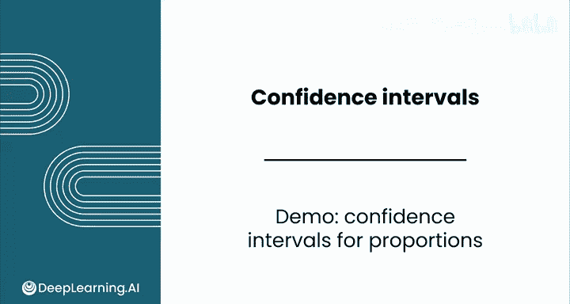
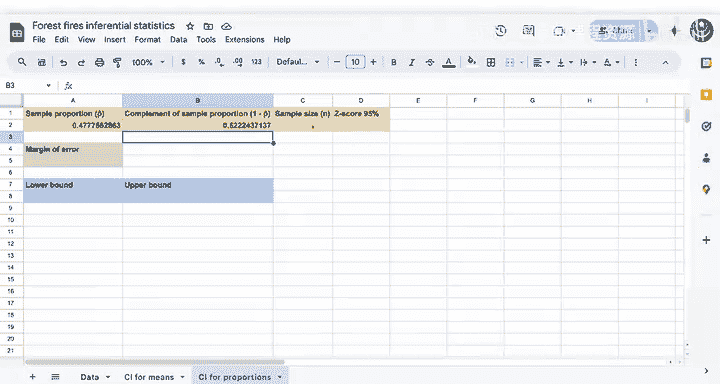

# 130：比例置信区间计算演示 🔢



在本节课中，我们将学习如何为比例数据计算置信区间。我们将使用森林火灾数据集，演示如何估计“小型火灾”所占比例，并理解这一统计工具如何帮助公园管理部门做出更有效的资源规划决策。

## 概述

上一节我们介绍了均值的置信区间，本节中我们来看看如何为比例数据构建置信区间。其核心步骤与均值类似，但计算公式有所不同。我们将通过一个具体案例，逐步计算“小型火灾”比例的95%置信区间。

## 数据背景与问题定义

假设公园管理部门希望通过区分火灾规模来优化成本。对于小型火灾，他们可以配备更少的人员和手动工具，而非动力工具。

因此，管理部门需要估算被归类为“小型火灾”的真实比例。我们可以使用数据集中的 `is_small` 列来解决这个问题，该列用0和1标识火灾是否属于小型。

## 探索数据分布

首先，我们可以通过快速图表来探索“小型”与“非小型”火灾的分布情况，以了解两者的大致平衡。

图表显示，“小型”与“非小型”火灾的分布大致相等。由于比例接近0.5，我们可以预期该分布的变异性会较高。

## 计算样本统计量

以下是计算比例置信区间所需的核心步骤：

**第一步：计算样本比例 P̂**
由于 `is_small` 列包含0和1值，我们可以使用平均值函数来计算这个比例。
```excel
=AVERAGE(数据范围)
```
计算结果约为 **0.48**。

**第二步：计算 1 - P̂**
只需计算左侧单元格值的补数。
```excel
=1 - P̂_cell
```
计算结果约为 **0.52**。

**第三步：计算样本大小 n**
再次使用计数函数获取数据总数。
```excel
=COUNT(数据范围)
```

## 计算置信区间

现在，让我们来计算Z分数、误差幅度以及置信区间的上下界。

假设我们要计算比例P的95%置信区间。



**第四步：确定Z分数**
对于95%的置信水平，Z分数值为 **1.96**。

**第五步：计算误差幅度**
公式与均值有所不同，标准误现在变为 √[P̂(1-P̂)/n]。
因此，误差幅度的计算公式为：
```excel
= Z_score * SQRT( (P̂ * (1-P̂)) / n )
```

**第六步：计算置信区间上下界**
-   下界 = P̂ - 误差幅度
-   上界 = P̂ + 误差幅度

计算结果可以简化以便阅读。最终得到的95%置信区间为 **0.4347 到 0.5208**。

## 结果解读与应用

这意味着，我们有95%的把握认为，小型火灾的真实总体比例介于43.47%和52.08%之间。

值得注意的是，0.5（即恰好一半的火灾是小型火灾）这个值也包含在此置信区间内。因此，这可能是总体参数的一个合理值。

基于此，公园管理部门或许可以利用更小的资源配置来应对这部分数量相对可观的小型火灾。

## 决策意义分析

这个置信区间如何帮助消防部门做出更好的决策？

假设他们按照样本比例约47.8%的小型火灾来制定计划。但如果真实的总体比例更接近下界，约为43.4%。在这种情况下，消防部门就会低估“非小型火灾”的比例，从而导致资源配置不足，无法有效缓解问题。

## 总结

本节课中我们一起学习了为比例数据计算置信区间的完整流程。你出色地完成了这个置信区间的计算。尽管统计量不同，但其背后的基本原理是相同的。

完成练习评估和实践实验后，请跟随我进入下一节课，学习如何将大语言模型应用于置信区间的分析中。