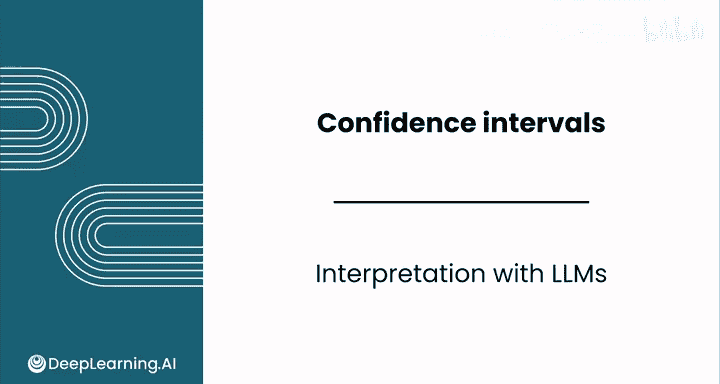
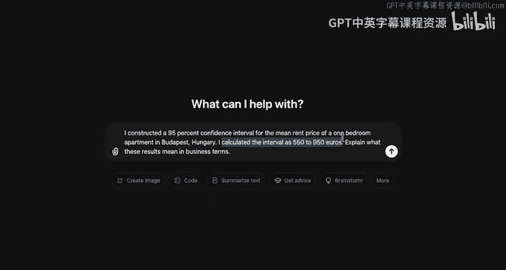
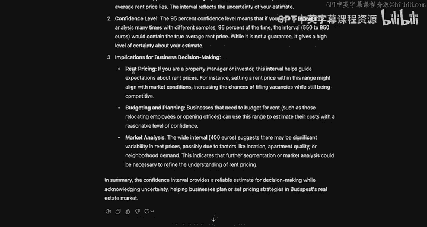
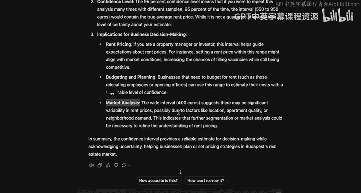
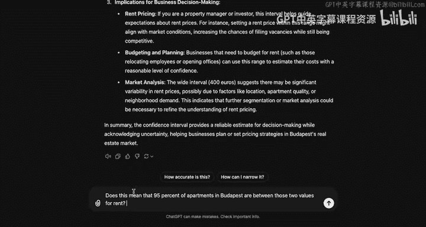
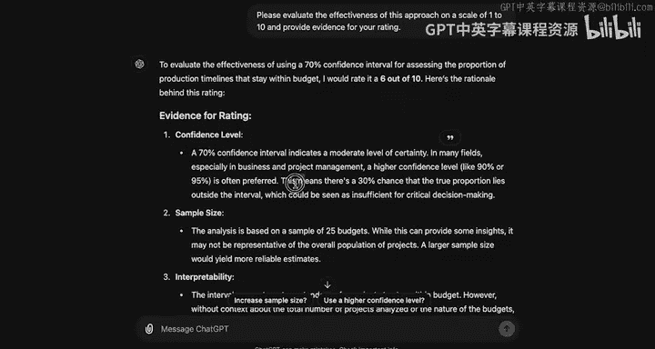
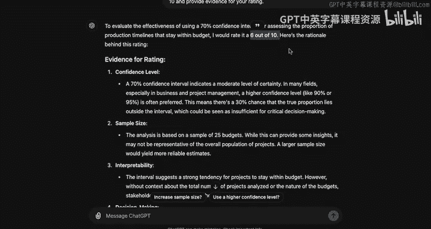
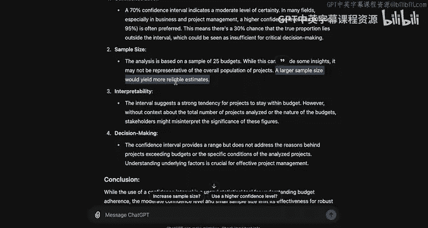

# 131：使用LLM解释置信区间 📊

在本节课中，我们将学习如何利用大型语言模型（LLM）来帮助我们解释统计学中的置信区间。我们将通过具体场景，了解LLM如何将复杂的统计结果转化为通俗易懂的商业语言，并探讨如何利用LLM来评估和改进我们自己的分析方法。

---

## 概述：LLM在解释统计结果中的作用

在前面的课程中，我们已经学习了如何为均值和比例构建置信区间。现在，你可能会想知道大型语言模型如何协助我们完成这些任务。

本节我们将通过一个与ChatGPT的对话场景，展示LLM如何解释置信区间的含义，并探讨其在商业决策中的应用。

---

## 场景一：解释均值的置信区间

假设你为匈牙利布达佩斯一居室公寓的平均租金价格构建了一个95%的置信区间，计算结果为550到950。你需要向业务方解释这个结果的含义。

以下是你可以向LLM提出的请求：“我构建了一个关于匈牙利布达佩斯一居室公寓平均租金的95%置信区间，计算结果为550到950。请用商业术语解释这些结果意味着什么。”

### LLM的回应与解读

LLM的回应通常包含以下几个核心部分：

**1. 不确定性与估计**
它首先会说明，你是在估计平均租金价格。但由于租金价格存在变异性，你无法确定一个精确的数字，因此使用一个范围来估计真实的平均租金。

**2. 置信水平的含义**
它会解释，95%的置信水平意味着：如果你用不同的样本多次重复这个分析，那么有95%的次数，计算出的区间会包含真实的平均租金。这并非一个绝对的保证，但为你的估计提供了很高的确定性。

**3. 对商业决策的启示**
LLM会进一步阐述这个信息在商业上的应用：
*   **定价策略**：如果你是物业经理，可以利用这个区间来设定租金。
*   **预算与规划**：对于需要租赁办公空间的企业，这个信息有助于制定预算和规划。
*   **市场分析**：这个数据可以用来分析特定区域内租金价格的波动情况。

---

## 澄清常见的误解

在得到初步解释后，你可能会产生一个常见的疑问。你可以继续向LLM提问：“这是否意味着布达佩斯有95%的公寓租金落在这个区间内？”

LLM会明确回答：**不，这并不意味着**。

它会指出这是一个常见的误解，并重申置信区间的正确定义：这是一个对**一居室公寓平均租金**的估计范围，而不是**单个公寓价格**的分布范围。这一点对于正确理解统计结果至关重要。

---

## 场景二：利用LLM评估分析方法

除了解释结果，LLM还可以帮助你检查和分析自己的工作方法，但你需要意识到它也可能出错。

让我们开始一个新的对话。假设你的产品负责人要求你调查生产时间表保持在预算内的比例。你调查了25个预算，并计算出一个70%的置信区间，结果为91%到94.5%。你需要向老板简洁地解释这个结果。

### 请求LLM进行简洁解释

你可以请求LLM：“请帮我简洁地向老板解释这个结果。”

LLM可能会提供如下回应：“您计算的区间意味着，您有70%的把握认为，生产时间表保持在预算内的真实比例落在91%到94.5%之间。这表明绝大多数项目很可能保持在预算内。”

在这个案例中，你使用的70%置信区间并不常见。LLM按照你的要求完成了任务，但它没有评估你方法的合理性。

---

### 请求LLM评估你的方法

为了获得更深入的反馈，你可以提出一个后续问题，要求LLM评估你方法的有效性。让LLM以1到10分进行评分是一个有用的方法，可以帮助你快速理解其反馈。

例如，你可以问：“请从1到10分评价我这个分析方法的有效性。”

LLM的反馈可能包括：
*   **评价置信水平**：它会评论你选择的70%置信区间，指出这只提供了中等程度的确定性。在许多情况下，90%或95%的置信水平更受青睐。70%的置信区间意味着有30%的可能性真实比例落在区间之外，这对于关键决策来说可能不够充分。
*   **总体评分**：LLM可能将你的整体方法评为6分（满分10分），这表明它持有保留意见。
*   **评论样本量**：虽然它认可你使用了25个预算作为样本，但会建议更大的样本量能产生更可靠的估计。

---

## 总结与展望

本节课中，我们一起学习了如何利用大型语言模型来辅助数据分析和解释。

我们看到了LLM如何将统计学术语（如置信区间）转化为清晰的商业洞察，帮助我们向非技术背景的同事传达结果。同时，我们也学会了通过提出后续问题，引导LLM对我们的分析方法本身进行评估和反馈，从而发现潜在的问题（如置信水平选择不当或样本量不足）。

在下一节视频中，我们将进一步探索如何利用能够编写和运行代码的LLM，来为我们创建抽样模拟，从而更直观地理解统计概念。