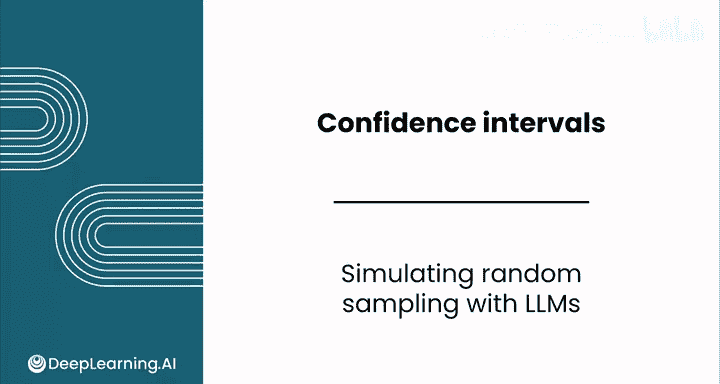
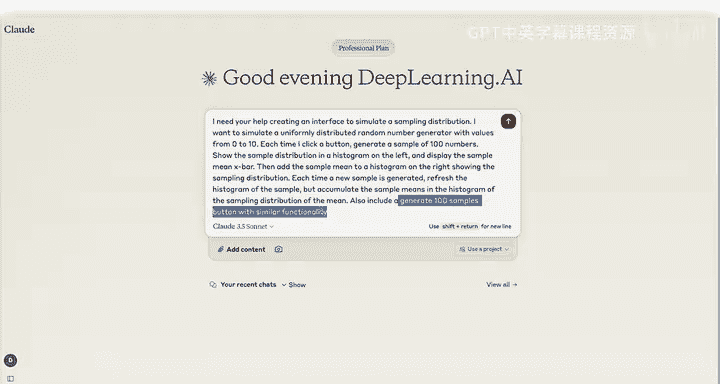
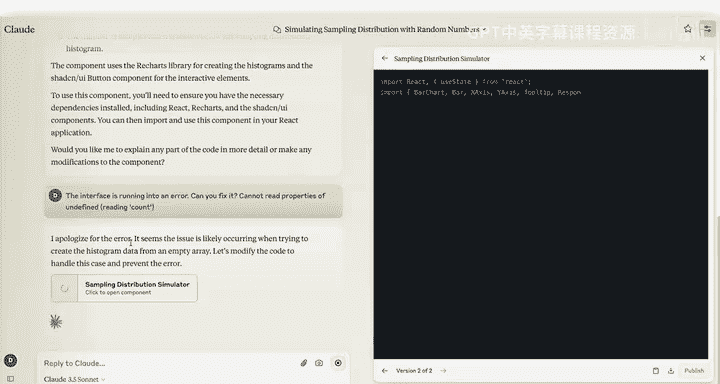
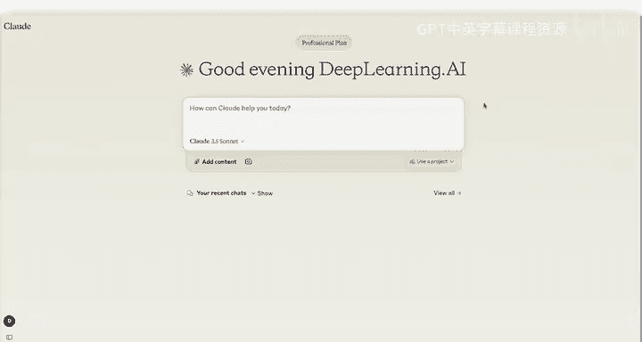

# 132：使用LLM进行随机抽样模拟 📊



在本节课中，我们将学习如何利用大型语言模型（LLM）来编写代码，以创建一个用于模拟抽样分布的交互式界面。即使你不熟悉编程，LLM也能帮助你快速完成这项任务。

## 概述：LLM在编码任务中的优势

大型语言模型擅长处理编码任务，即使你不熟悉编码，它们也能帮助你快速完成工作。一项它们能协助完成的酷炫编码任务是创建一个用于模拟抽样的界面。

你在本模块早些时候看到的抽样分布模拟实际上就是用Quad创建的。这个过程有时可能需要与LLM进行更多来回沟通，稍后你就会明白原因。

## 构建模拟界面：详细的提示词

上一节我们介绍了LLM的能力，本节中我们来看看如何具体地向它提出请求。你会注意到，提示词相当长且详细，这是提示词最佳实践的一部分。你需要确保LLM有足够的信息来精确构建你想要的东西。



以下是提示词的内容。你告诉LLM，你需要它帮助创建一个界面来模拟抽样分布。你想模拟一个在0到10之间均匀分布的随机数生成器，每次点击按钮时，生成一个包含100个数字的样本。你希望它在左侧的直方图中可视化样本分布，并显示样本均值 `X_bar`。你还希望将样本均值添加到右侧的直方图中，以展示抽样分布。每次生成新样本时，刷新样本的直方图，但在均值的抽样分布直方图中累积样本均值。你还想要一个能生成100个样本并具有类似功能的按钮。

```python
# 提示词核心要求示例（非实际代码）：
# 1. 生成0到10之间的均匀分布随机数。
# 2. 创建按钮，点击后生成100个数的样本。
# 3. 左侧直方图显示当前样本分布。
# 4. 显示当前样本的均值。
# 5. 右侧直方图累积所有样本的均值，形成抽样分布。
# 6. 另一个按钮可一次性生成100个样本。
```

## 初次尝试与错误处理

LLM表示乐意帮忙。你可以在右侧看到它正在编写的所有代码，以生成你要求的这个界面。这段代码是模型响应的一部分，而且相当长。每当你要求它重新生成部分内容时，它实际上必须在我们网站内重写整个网站来测试LLM创建的网站。

你可以先尝试生成一个新样本来测试它是否正常工作。在这种情况下，你收到了一个错误——运行创建的工件时出现了问题。它提示了一些关于错误的信息，但很难理解“rating count”到底是什么意思。

因此，你可以将此错误信息复制到新的提示词中，告诉LLM你遇到了这个错误消息，并询问能否修复它。LLM为错误道歉，它感觉非常抱歉。问题似乎发生在你试图从空数组创建直方图数据时，“空数组”只是指没有任何数据可供对应。你可以看到它开始编写新代码来生成应用程序的新版本。你不需要理解这个错误意味着什么，或者这段代码在做什么，就能创建这个应用程序。



## 迭代调试与重新生成

现在新的应用程序已经创建，你可以继续生成一个新样本来看看它现在是否正常工作。但它返回了相同的错误，所以这次似乎没有修复。

一个好的技巧就是直接再试一次。有时模型会陷入一种思维模式。记住，模型中存在一些随机性，所以重新开始会给你一个干净的起点，并可能让你摆脱之前对话中产生的错误。因此，你可以刷新页面，重新提交原始问题，然后看看事情是否正常进行。



## 验证功能与观察结果

这是新版本。你可以看到它有一个样本均值和下方的样本数量。让我们生成一个新样本来看看事情是否正常进行。

这看起来更有希望了。左侧是样本分布。这个分布看起来大致均匀，其下方的样本均值约为5.41，这与你之前视频中看到的类似。然后，在右侧的直方图中，你可以看到数字5的计数为1。这代表你到目前为止生成的唯一一个样本。让我们再生成一个样本。

这看起来工作正常，这很棒。现在让我们尝试生成100个样本。思考一下你期望发生什么。你应该在左侧看到相同类型的图表，它可能只显示最近的分布。但在右侧，你应该看到一个均值直方图，它呈正态分布并以5为中心。😊

这正是你在这里看到的。所以，让我们再生成几百个样本，看看抽样分布是什么样子。

## 优化可视化效果

你可能会注意到X轴标签有点奇怪。你可以回复Claude，告诉它在左侧创建柱状图，并且不要将数字分组到箱中。

你可能还注意到，在右侧，直方图中的箱没有太多分辨率。鉴于你知道真实的总体均值在5左右，你可以告诉它将X轴值的范围缩小到3到7，并使用更小的箱宽。这样你应该能更清楚地看到分布的整体形状。你还可以告诉它保持其他一切不变，以免在应用程序中引入任何新的错误。

再次注意，每次你提示它时，它都必须为整个应用程序重写代码，这引入了它可能创建新错误的可能性。

新的应用程序已经生成，你可以在右侧看到它将X轴的范围限制缩小到了3到7之间，但它在箱宽方面仍然做得有点奇怪。你可以生成一个新样本来看看效果如何。

你可以看到这个应用程序仍然不完美，这恰恰反映了Claude尝试完成的任务的复杂性。

## 总结

在本节课中，我们一起学习了如何利用LLM通过迭代的方法来构建一个随机抽样模拟界面。我们看到了如何通过详细的提示词提出请求，如何处理和调试LLM生成的代码中的错误，以及如何通过多次迭代和优化提示词来改进最终结果。这个过程展示了即使没有深厚的编程知识，也能借助AI工具完成复杂的数据模拟和可视化任务。在下一个视频中，我们将看到如何让一个能编写和运行代码的LLM来帮助你构建和可视化置信区间。再见。😊