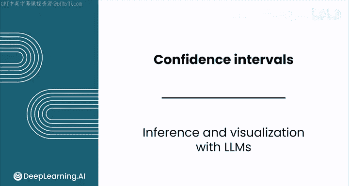
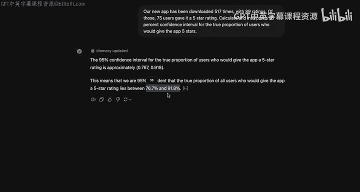
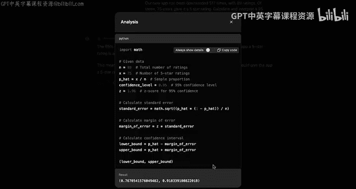
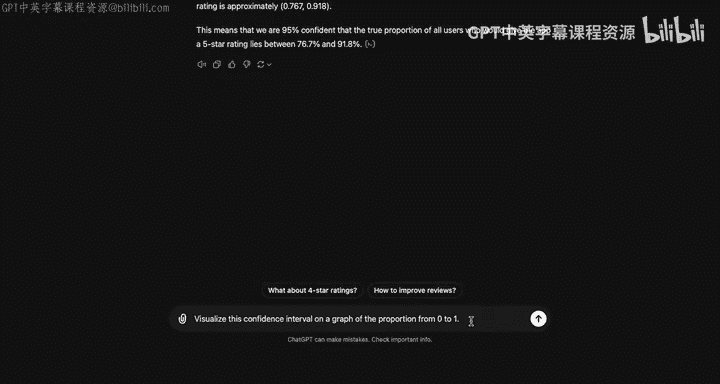
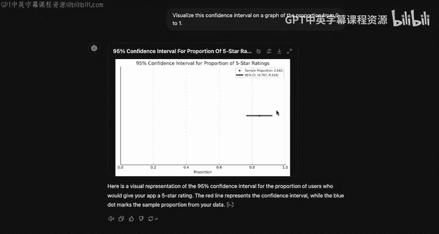
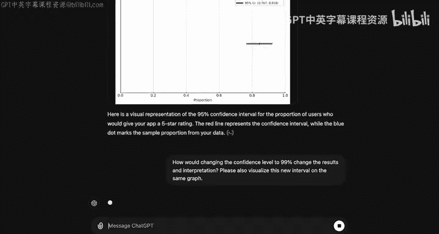
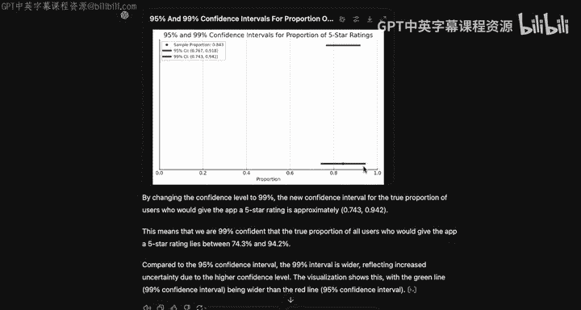

# 133：使用LLM进行推断与可视化 📊



在本节课中，我们将学习如何利用大型语言模型（LLM）来构建和可视化置信区间。我们将通过一个具体的应用评分案例，演示如何让LLM执行计算、解释结果并生成图表。

---

## 概述

我们将引导一个具备高级数据分析功能的LLM（例如ChatGPT-4），根据给定的样本数据，计算并解释一个关于应用五星好评率的95%置信区间。随后，我们会要求它可视化这个区间，并探讨当置信水平改变时，结果将如何变化。

---

## 让LLM计算置信区间

首先，我们需要向LLM提供一个具体的任务。假设一款新应用被下载了517次，收到了89条评分，其中75位用户给出了五星好评。我们的目标是计算并解释“真实五星好评率”的95%置信区间。

**核心提示词示例：**
```
一款新应用被下载了517次，收到89条评分。其中，75位用户给出了五星好评。请计算并解释真实五星好评率的95%置信区间。
```

上一节我们介绍了任务背景，本节中我们来看看LLM如何处理这个请求。

### LLM的计算过程

当使用具备代码执行能力的LLM（如ChatGPT-4的“高级数据分析”功能）时，它会自动编写并运行代码来完成计算。以下是它可能遵循的核心步骤：

1.  **定义变量**：
    *   总评分数量 `n = 89`
    *   五星好评数量 `x = 75`
2.  **计算样本比例**：
    *   `p_hat = x / n`
3.  **确定置信水平与Z分数**：
    *   对于95%的置信水平，`z = 1.96`
4.  **计算标准误差**：
    *   `SE = sqrt( p_hat * (1 - p_hat) / n )`
5.  **计算边际误差**：
    *   `ME = z * SE`
6.  **计算置信区间上下限**：
    *   `lower_bound = p_hat - ME`
    *   `upper_bound = p_hat + ME`

运行这些计算后，LLM会返回类似以下的结果：
> 95%置信区间约为 (0.767, 0.918)。这意味着我们有95%的把握认为，所有用户中会给应用打五星好评的真实比例介于76.7%和91.8%之间。

**重要提示**：使用传统LLM时，它可能只会列出计算步骤，需要你自行完成运算。因此，务必确认你使用的LLM模型支持代码执行，并可以通过点击类似“查看代码”的按钮来核验其计算过程。



---

## 可视化置信区间

在得到数值结果后，我们可以进一步要求LLM将置信区间可视化，这有助于更直观地理解数据的范围。

以下是请求可视化的提示词示例：
```
请将这个置信区间在0到1的比例图上可视化出来。
```

### 解读可视化图表

LLM生成的图表通常包含以下元素：
*   **蓝色圆点**：代表样本比例 `p_hat`，即置信区间的中心点。
*   **红色误差条**：代表置信区间范围，其长度等于 **边际误差（Margin of Error）**，向两侧延伸。

通过图表可以清晰地看到，尽管区间有一定宽度，但整体比例很高，真实比例可能低于80%或高于90%。

---

## 探索不同置信水平的影响







为了深入理解置信区间的性质，我们可以提出一个后续问题：如果改变置信水平，结果会如何变化？



以下是相应的提示词示例：
```
如果将置信水平改为99%，结果和解释会如何变化？请将新的区间可视化在同一张图上。
```

### 对比95%与99%置信区间

LLM会计算新的99%置信区间。你会发现：
*   **区间变宽**：99%的置信区间比95%的区间更宽。
*   **中心不变**：两个区间的中心点（样本比例 `p_hat`）完全相同。
*   **原因**：更高的置信水平要求一个更宽的范围，以确保真实参数值被包含在内的概率更大。

可视化图表会清晰地展示出，代表99%置信区间的误差条（可能是另一种颜色）完全覆盖了95%的区间，且向两端延伸得更远。



---

## 总结

本节课中我们一起学习了如何利用大型语言模型进行统计推断：
1.  **计算置信区间**：我们学会了如何通过提供样本数据，让LLM自动完成置信区间的计算和解释。
2.  **可视化结果**：我们了解了如何请求LLM生成图表，直观展示置信区间及其中心点。
3.  **比较不同置信水平**：我们探索了提高置信水平会使置信区间变宽的关键概念，并通过可视化进行了验证。

请记住，在使用LLM进行此类分析时，务必仔细检查其输出和运行的代码，以确保结果的准确性。接下来，你可以在相关的实验环境中尝试这些技巧，并在后续关于钻石价格的置信区间构建的练习中巩固所学知识。