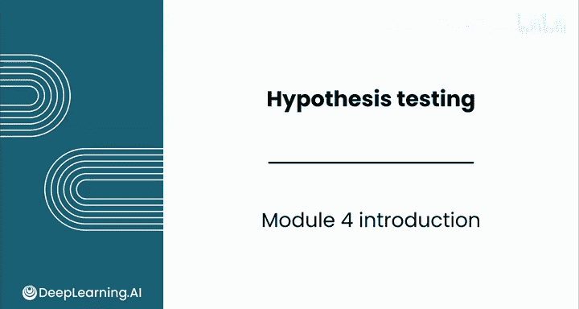
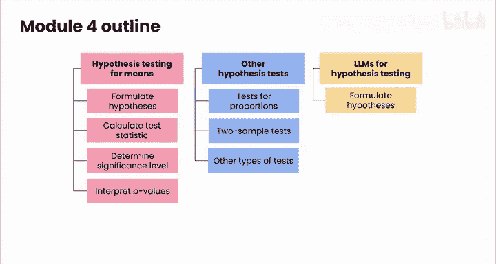

# 134：假设检验简介 🧪

在本模块中，我们将学习假设检验这一强大的统计推断工具。假设检验能帮助我们基于数据做出决策，回答现实中的商业问题。

## 概述

假设检验是数据分析的核心方法之一。它允许我们评估关于总体参数的假设是否得到样本数据的支持。通过本模块的学习，你将掌握如何设计、执行并解释假设检验，从而为商业决策提供数据依据。

## 假设检验的核心概念

上一节我们概述了本模块的目标，本节中我们来看看假设检验的基本框架。你将学习如何为均值问题构建假设检验。

假设检验始于两个对立的假设：
*   **零假设 (H₀)**：通常代表现状或没有效果的假设。
*   **备择假设 (H₁ 或 Hₐ)**：代表我们希望证明的效应或差异。

检验过程涉及计算一个**检验统计量**，并将其与理论分布进行比较，以计算**P值**。P值是在零假设为真的前提下，观察到当前样本数据或更极端数据的概率。

以下是执行假设检验的关键步骤：
1.  **提出假设**：明确零假设和备择假设。
2.  **选择显著性水平 (α)**：通常设为0.05，这是拒绝零假设的阈值。
3.  **计算检验统计量**：例如，对于样本均值，使用公式 `z = (x̄ - μ) / (σ/√n)`。
4.  **确定P值**：根据检验统计量计算P值。
5.  **做出决策**：如果P值 ≤ α，则拒绝零假设；否则，无法拒绝零假设。

## 假设检验的应用扩展

掌握了均值检验的基础后，我们将扩展你的工具箱。本节将介绍比例检验和双样本检验。

你将学习如何比较不同群体，并评估观察到的差异是否具有统计显著性。例如，比较两个用户群体的转化率，或评估新流程是否真的缩短了处理时间。

## 其他检验类型与AI辅助

在数据分析工作中，你可能会遇到更多类型的假设检验。本节将简要介绍你可能接触到的其他检验方法。

此外，在最后的课程中，你将探索大型语言模型如何协助假设检验过程。你将学习利用AI来帮助提出假设、解释结果，甚至为你运行检验。

## 总结

本节课中我们一起学习了假设检验的引入和基本框架。我们了解到假设检验是用于根据样本数据对总体参数做出推论的强大统计工具。本模块后续课程将带你进行实际操作，在电子表格中执行各种检验，并学习解读结果以回答重要的商业问题。最后，我们还将探索AI如何在这一过程中提供辅助。

---

接下来，请跟随我进入下一个视频，我们将通过一个实际例子正式开始假设检验的学习。