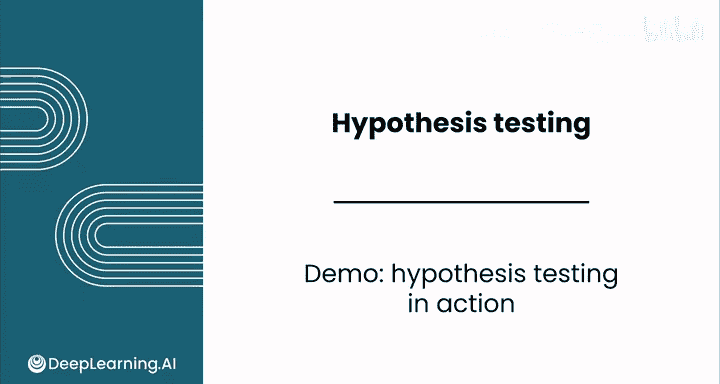
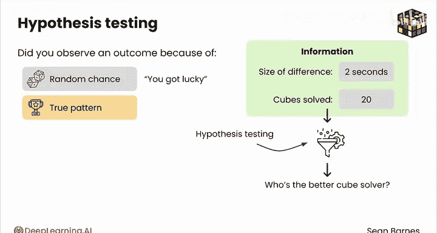

# 135：假设检验实战演示 🧩



在本节课中，我们将通过一个生动的例子，学习假设检验的基本思想和应用。我们将看到如何利用假设检验，判断一个观察到的结果究竟是随机波动导致的，还是反映了真实的差异。

---

你的大学室友向你发起挑战，看谁能更快地解出魔方。你认为你们实力相当，于是接受了挑战。第一局，你用了92秒，而他用了71秒。你输掉了第一局，但这并不意味着你是失败者。你们决定继续比赛，最终各自解了20次魔方。你的手指都酸了，但你取得了平均80秒的成绩，而你的朋友平均成绩是82秒。

你的朋友说你只是运气好。他说这不算什么，他的魔方打乱得更复杂，下次一定能赢你。但你在想，嘿，我平均比他快了两秒，这是公平竞争的结果。那么，谁是对的呢？

假设检验可以帮助你回答这类问题：你观察到的特定结果，是随机因素导致的（正如你朋友所说，你只是运气好），还是这里存在某种真实的模式（事实上，你就是更快的解魔方者）？差异的幅度相当小，你只快了两秒，而且你们只解了20次魔方。假设检验可以综合考虑所有这些信息，帮助你以较高的置信度得出结论：谁才是更快的解魔方者？

让我们在这个例子上看看假设检验的实际操作，以便你感受它是如何工作的。

## 计算平均差异

以下是前20次解魔方的数据，橙色部分是你的时间，以及你与朋友解魔方时间的差值。正值意味着你解魔方比朋友更快。


在下面的单元格中，你可以计算平均差值。




这就是你刚才看到的平均差值：在前20次解魔方中，你平均快了两秒。

## 进行假设检验

现在，假设你们实际上实力相当。那么，你观察到这些结果（即你比朋友平均快两秒）的概率是多少？我们可以使用假设检验来计算这个概率，你将在接下来的视频中学习具体操作方法。

这涉及到使用 **Z 检验函数**，你将会学到更多关于它的知识。选择你数据中的观测值，然后输入你的假设均值 `0`。`0` 代表没有差异，即你和朋友技能相等的假设。

```python
# 伪代码示例：Z检验
p_value = z_test(sample_data, hypothesized_mean=0)
```

结果显示，如果你们实力相当，观察到如此大或更大差异的概率是 **24.6%**。这意味着，如果你们实力相当，这类结果会相当常见。数据中存在很大的变异性，而且只有20次尝试，两秒的差异也相当小。所以，虽然看起来你解得更快，但你并没有非常强有力的证据。

## 扩大样本量

假设在得到这些结果后，你想一劳永逸地解决这个问题。你们继续进行，总共解了100次魔方并记录结果。这里你可以看到全部100次解魔方的数据。在某些情况下，你解魔方快了24秒，而在其他情况下，你的朋友解得比你快得多。

同样，你可以计算平均差值。这次，你的平均速度快了 **三秒**。鉴于这个结果是基于更多尝试得出的，这能否证明你实际上更快呢？

你可以再次使用 **Z 检验函数**，计算如果你们实力相当，观察到三秒或更大差异的概率。

```python
# 伪代码示例：使用更大样本进行Z检验
p_value_larger_sample = z_test(larger_sample_data, hypothesized_mean=0)
```

现在你得到的结果仅为 **0.37%**。这意味着，如果你们实力确实相当，出现这种差异的情况将非常罕见。这种稀有性反映出，在100次解魔方中，你能够保持平均领先朋友三秒的优势。面对现实吧，在100次机会之后，如果你的朋友还没有开始解得比你快，那么他真正比你强的可能性似乎不大。

你刚刚进行的假设检验，让你有理由相信你实际上比朋友更快，即使平均只快了三秒。

---

## 总结

本节课中，我们一起学习了假设检验的基本应用。通过一个解魔方比赛的例子，我们看到了如何利用假设检验来评估某个事件发生的可能性。我们了解到：

*   **核心问题**：假设检验帮助区分观察到的差异是源于随机波动，还是反映了真实效应。
*   **关键因素**：检验结果（p值）的大小，结合**差异幅度**和**样本量**，共同决定了证据的强弱。
*   **流程**：从提出假设（如“实力相等，平均差为0”），到计算在假设成立下观察到当前数据的概率（p值），最后根据p值大小做出推断。

现在你已经看到了假设检验如何评估特定事件的可能性，接下来请跟随我到下一个视频，深入了解其背后的原理。