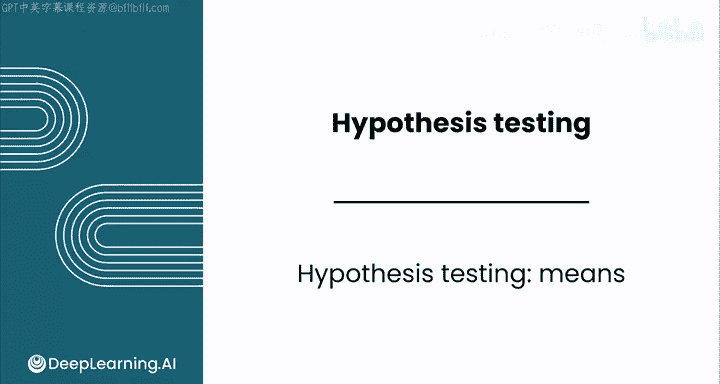
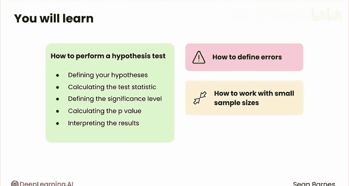

# 136：均值假设检验 🧪

在本节课中，我们将要学习数据分析中的一个核心工具——均值假设检验。这是一种严谨的方法，用于评估样本均值是否与某个特定值存在显著差异。我们将通过一个音乐流媒体服务的实际案例，一步步理解其原理、前提条件和基本步骤。

---

## 概述：假设检验的用武之地

在数据分析基础中，你已经了解到数据分析与科学等其他调查领域有许多共通之处。均值假设检验就是你拥有的一个强大的调查工具，它允许你严格评估样本均值是否与某个特定值存在显著差异。

让我们回到你正在为音乐流媒体服务工作的例子。你的团队已经向更多用户推出了免费试用服务，你正在开展一个新项目，以弄清楚提供免费试用是否能提高用户留存率。你决定调查获得免费试用的用户，其平均订阅时长是否更长。先前的分析表明，未获得免费试用的用户平均订阅时长约为10个月。你收集了100名获得免费试用的用户样本，并计算出以下描述性统计量：样本均值为10.4个月，样本标准差为2个月。

这个差异很接近。你认为0.4个月的差异是否足以让你确信免费试用是有效的？仅凭这些描述性统计量，你还不能确定。你不知道这个10.4的均值在你的抽样分布中处于什么位置。根据中心极限定理，你知道均值的抽样分布是正态分布的。

## 理解抽样分布的可能性

存在无限多种可能的情况，但这里为你考虑三种：
1.  真实总体均值 μ 是10个月，因此10.4个月落在抽样分布的这个位置。
2.  μ 是9.6个月，10.4个月落在抽样分布的这个位置。
3.  μ 是9个月，10.4个月落在抽样分布的这个位置。

根据你对正态分布的了解，哪种结果最有可能？第一种结果比其他两种更有可能。

回忆一下，标准误的计算公式是 **S / √n**。在这里，它是 **2 / √100**，即 **2 / 10** 或 **0.2**。请记住，标准误是抽样分布标准差的专用术语。

*   在第一种情况下，样本均值 `x̄` 距离均值有2个标准误。
*   在第二种情况下，`x̄` 距离均值有4个标准误。
*   在最后一种情况下，`x̄` 距离均值有7个标准误。

根据三西格玛法则，你知道99.7%的数据位于均值周围三个标准误的范围内。因此，得到一个比均值高出整整7个标准误的结果是极不可能的。

## 假设检验的核心思想

棘手之处在于，你永远无法知道真实的总体均值来进行比较。但你可以做的是：计算如果总体均值确实是你怀疑的那个值，你观察到所计算的样本均值的可能性有多大。

这里的思路是，如果你的真实总体均值实际上是9个月，那么你抽取100名用户的样本并发现样本均值是10.4个月，是极其、极其不可能的。而如果真实总体均值是10个月，则可能性要大得多。

现在，在这种情况下，很容易直接说10.4更高，然后就此了事。但这些数字很接近。完全有可能真实均值实际上是10，那么免费试用既花了钱又没带来好处；或者可能是9.6，免费试用对留存率反而略差一些。这种精确度对你的结论很重要。

## 统计显著性的意义

假设检验允许你评估的是：考虑到数据的变异性和样本量，免费试用用户的样本均值（10.4个月）是否与已知的现有用户均值（10个月）存在显著差异。

它区分两种可能的情况：
1.  免费试用用户的样本均值与现有用户均值之间的观察到的差异是由于随机机会造成的。这些值太接近了，你无法判断它们是否真的不同。
2.  观察到的差异反映了免费试用用户的真实总体均值与现有用户均值之间的真实差异。

这种区分被称为**统计显著性**。如果差异是由于随机机会造成的，则不具有统计显著性，它无助于你得出任何有意义的结论。另一方面，如果观察到的差异反映了假设均值与样本值之间的真实差异，则具有统计显著性。这种差异很可能是真实的，可以为你的假设提供证据。

## 假设检验的前提条件

你收集样本并计算出一个与真实总体均值不同的均值，这很常见。例如，多次掷两个骰子时，它们点数和的总均值是7，这也是最常见的点数。但如果你抽取一个样本，比如10次投掷，并计算均值，你不太可能恰好得到7。你会得到围绕7波动的值。因此，仅仅观察到两个值不同，并不足以得出结论认为差异是有意义的。有时事情就是如此。

假设检验只有在特定条件下才能有效工作。你的数据必须是一个有代表性的样本，理想情况下是随机样本。大多数统计检验都假设随机抽样，因为如果你的样本不是随机的，你就无法知道你的抽样方法引入了什么偏差。数据中的观察值也必须是独立的。

此外，你的数据必须满足以下两个条件之一：要么数据本身是正态分布的，要么你的样本量必须足够大。通常，“大”意味着30，但50或以上更理想。这是因为中心极限定理指出，随着样本量的增加，均值的抽样分布趋近于正态分布。你在之前的模块中已经看到了这一点。

## 假设检验的基本步骤

在接下来的几个视频中，你将看到如何进行均值的假设检验。你将涵盖以下步骤：
1.  定义你的假设。
2.  计算检验统计量。
3.  定义显著性水平。
4.  计算P值。
5.  解释结果。

你还将学习如何定义错误以及处理小样本量。现在不用担心所有的术语。到本课结束时，你将成为假设检验的专家。

---

## 总结

本节课中，我们一起学习了均值假设检验的基本概念。我们了解到，它用于判断样本均值与某个特定值的差异是否具有统计显著性，而不仅仅是随机波动的结果。我们探讨了其核心思想、统计显著性的含义，以及进行有效检验所需的前提条件（如随机抽样、独立性、大样本或正态分布）。最后，我们预览了假设检验将遵循的五个关键步骤。在下一节中，我们将深入第一步：如何正确定义假设。