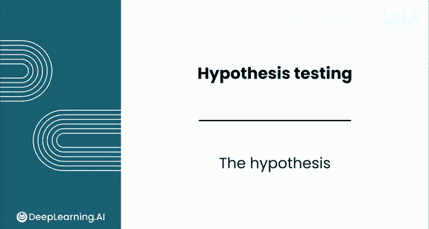
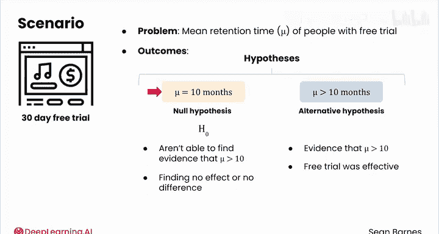
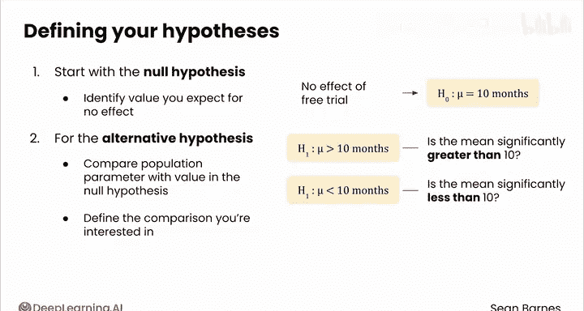
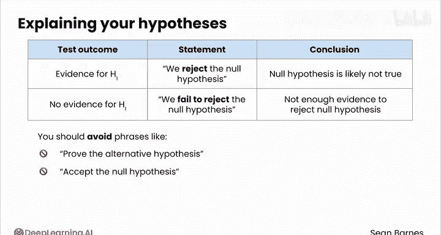
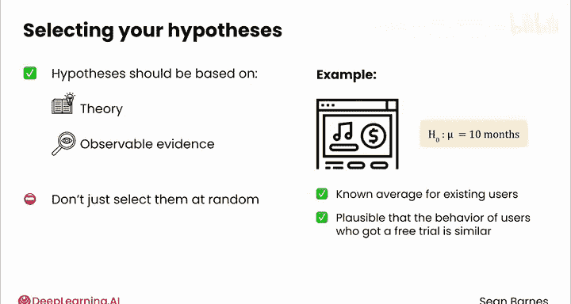

# 137：假设设定 📊

在本节课中，我们将学习统计学假设检验的核心概念：如何设定原假设与备择假设。这是进行任何统计推断的第一步。

## 概述

假设检验始于对研究问题的清晰陈述。我们需要定义两个互斥的假设：**原假设** 和 **备择假设**。它们共同构成了检验的基础框架。

## 原假设与备择假设

在统计假设检验中，你需要定义两个相关的假设：原假设和备择假设。这两个假设互为补充。

以音乐订阅服务的场景为例。你正在调查获得免费试用的用户的平均留存时间。你的检验有两种可能的结果：**μ = 10个月**，或 **μ > 10个月**。这就是你的假设。

现在，请问这两个假设中，哪一个对应“免费试用对订阅时长没有影响”这个想法？

那将是 **μ = 10**。这个假设被称为**原假设**。它代表了你未能找到证据证明 μ > 10 的情况。它与“没有效果”或“没有差异”相关联。这个假设写作 **H₀**。

反之，如果你能找到证据证明 **μ > 10个月**，那将非常理想。这个证据将表明免费试用能有效促使用户订阅更长时间。这个假设被称为**备择假设**。它是原假设的替代选项，写作 **H₁**。

## 如何定义假设

通常，在定义你的假设时，从原假设开始。确定如果没有任何效果，你期望的值是多少。

例如，如果免费试用没有效果，你会期望平均订阅时长为10个月，这与现有订阅用户的时长相同。这给出了你的原假设 **H₀: μ = 10**。

对于备择假设，你总是将总体参数与原假设中的值进行比较。在这个例子中，这个值是10。定义你感兴趣的比较方向：你是寻找证据证明均值**大于**、**小于**，还是**不等于**期望的均值？

你的选项将是：
*   **H₁: μ > 10** - 均值是否显著大于10？
*   **H₁: μ < 10** - 均值是否显著小于10？
*   **H₁: μ ≠ 10** - 均值是否显著不同于10？

你只能有一个备择假设。在之前的例子中，**H₁: μ > 10** 是最合适的，因为你希望找到证据证明免费试用**增加**了订阅时长。

## 解释检验结果

当你向业务相关方解释这些假设时，使用准确的术语至关重要。

如果你的检验表明支持备择假设的证据（具体如何判断将在后面详述），你会说 **“拒绝原假设”**。这意味着数据表明原假设很可能不成立。

如果你没有找到支持备择假设的证据，那么你会说 **“未能拒绝原假设”**。这并不意味着原假设就是真的，只是你没有足够的证据来拒绝它。

统计学的语言在这里很重要。你应该避免使用诸如“证明备择假设”或“接受原假设”这样的短语。这听起来可能像是在故意含糊其辞，但请记住，推断统计学全是关于管理不确定性的。你的结论总是有可能出错。这种术语有助于避免夸大结论，并提醒你的相关方，这些检验永远无法绝对确定地证明任何事情。

## 假设的合理性

与科学一样，你的假设应该基于某种理论或可观察的证据。换句话说，不要随意选择它们。

例如，在处理音乐订阅服务时，选择“订阅时长等于10个月”作为原假设是合理的，因为这是已知的现有用户的平均值。获得免费试用的用户行为与之相似是 plausible（合理的）。

## 总结

本节课中，我们一起学习了假设检验的起点——设定假设。我们明确了**原假设 (H₀)** 代表“无效果”的基准状态，而**备择假设 (H₁)** 代表我们希望找到证据支持的研究主张。记住，假设是检验策略的基石，必须首先定义。在接下来的课程中，你将练习如何根据具体的业务问题来识别和设定假设。