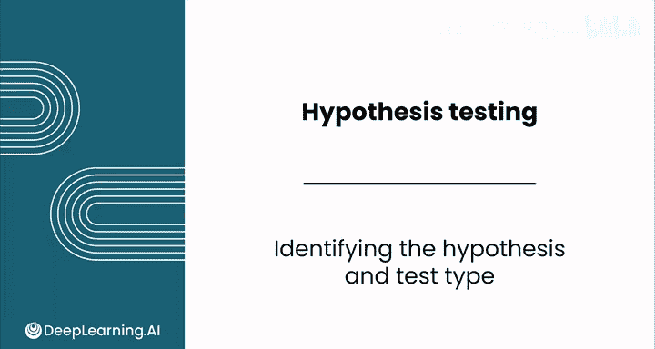
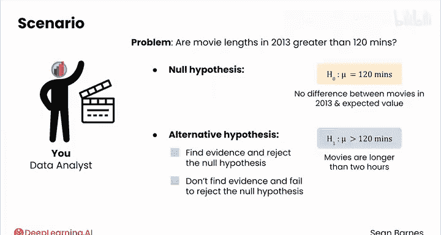
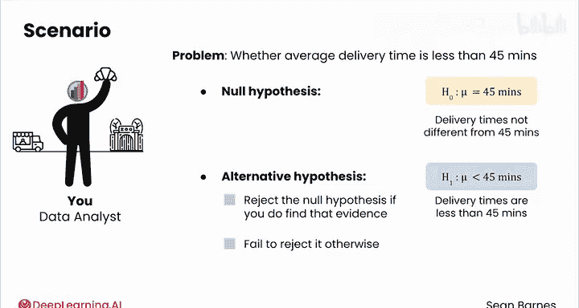
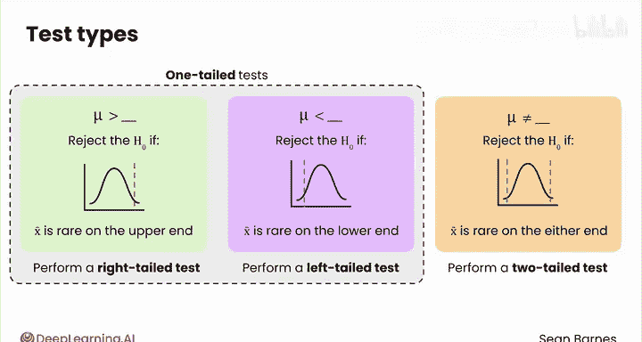
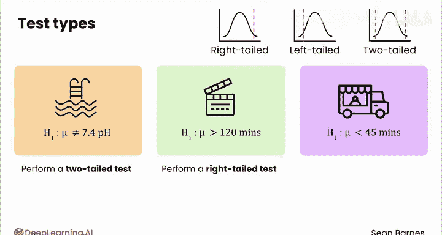

# 138：识别假设与检验类型 📊

在本节课中，我们将学习如何为实际业务问题构建假设，并确定应使用的假设检验类型。我们将回顾课程中已出现的几个案例，通过它们来掌握假设检验的基本步骤。

---

## 回顾业务问题与假设构建

上一节我们介绍了假设检验的基本概念，本节中我们来看看如何将其应用于具体场景。

### 游泳池水质安全测试

假设你需要测试游泳池的pH值，理想pH值为7.4。任何显著偏离7.4的值（无论偏高或偏低）都被认为不安全。

以下是针对此问题的假设：

*   **零假设 (H₀):** μ = 7.4。此值代表现状。
*   **备择假设 (H₁):** μ ≠ 7.4。如果pH值显著高于或低于7.4，你将拒绝零假设。

### 电影时长分析

我们曾研究过与电影时长相关的业务问题。例如，2013年电影的平均时长是否大于120分钟？

以下是针对此问题的假设：

*   **零假设 (H₀):** μ = 120分钟。此值代表2013年电影时长与预期无差异。
*   **备择假设 (H₁):** μ > 120分钟。你在寻找电影时长超过两小时的证据。若找到证据则拒绝零假设，否则无法拒绝零假设。

### 面包店配送时间评估

在之前的模块中，你为面包店配送时间构建了置信区间。假设记录了30天的配送时间，样本平均时间为43分钟。你可以使用假设检验来调查平均配送时间是否少于45分钟。

以下是针对此问题的假设：

*   **零假设 (H₀):** μ = 45分钟。这是现状，即配送时间与45分钟无差异。
*   **备择假设 (H₁):** μ < 45分钟。你希望找到配送时间少于45分钟的证据。若找到证据则拒绝零假设，否则无法拒绝。

请注意，你假设的总体均值（45分钟）与你计算的样本均值（43分钟）不同。你的目标是利用样本均值来理解总体均值低于45分钟的可能性有多大。

---

## 确定合适的检验类型

一旦定义了假设，就需要选择合适的检验类型。你在之前的视频中看到，备择假设有三种类型：

1.  μ > 某个数值
2.  μ < 某个数值
3.  μ ≠ 某个数值

这些假设分别对应不同的检验类型。

以下是每种情况对应的检验类型说明：

*   **情况一 (μ > 某个数值):** 如果样本均值出现在分布的高端罕见区域，你将拒绝零假设。你应执行**右尾检验**，因为你只对数值的上尾感兴趣。
*   **情况二 (μ < 某个数值):** 如果样本均值出现在分布的低端罕见区域，你将拒绝零假设。你应执行**左尾检验**，因为你只对均值以下的罕见值感兴趣。
*   **情况三 (μ ≠ 某个数值):** 你对两种可能性都感兴趣。因此，如果你发现样本均值在高端或低端都不同寻常，你将拒绝零假设。你应执行**双尾检验**，因为你关心样本均值是否落在数值的任一个尾部。

左尾检验和右尾检验都被视为**单尾检验**，因为你只检查数值是否落在分布的一侧。

---

## 应用检验类型到案例

让我们看看如何将检验类型应用到刚才的三个例子中。

### 1. 游泳池水质测试（备择假设：μ ≠ 7.4）

你会希望进行**双尾检验**，因为pH值过高或过低都不合适。

### 2. 电影时长分析（备择假设：μ > 120分钟）

你应该执行**右尾检验**，因为你想检查样本均值是否异常地高。

### 3. 配送时间评估（备择假设：μ < 45分钟）

你感兴趣的是**左尾检验**。

---

## 总结

本节课中我们一起学习了如何为业务问题构建统计假设（包括零假设H₀和备择假设H₁），并根据备择假设的方向（大于、小于、不等于）确定了相应的假设检验类型（右尾、左尾或双尾检验）。这是进行假设检验的关键第一步。

接下来，请跟随下一节视频，学习如何完成假设检验的下一步：计算检验统计量。