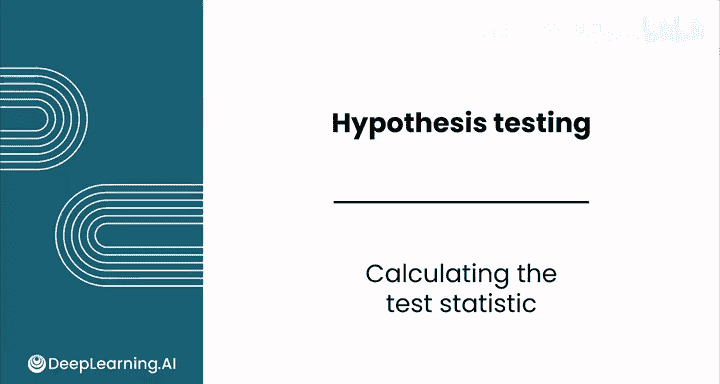
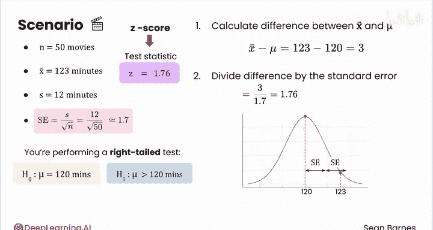
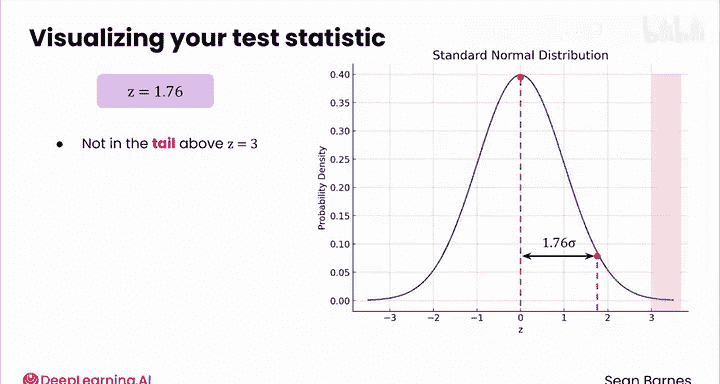

# 139：计算检验统计量 📊

在本节课中，我们将学习如何根据收集的样本数据计算检验统计量，以对假设做出决策。我们将通过一个具体的案例，理解检验统计量的计算过程及其在假设检验中的作用。

---

## 概述

假设检验是数据分析中的核心方法，用于根据样本数据对总体参数做出推断。计算检验统计量是这一过程中的关键步骤，它量化了样本数据与原假设之间的差异，并考虑了数据的变异性和样本大小。

---

## 案例背景

你的客户是一家剧院，你正协助他们分析电影时长以优化排片。客户希望了解电影的平均时长是否超过120分钟。

你收集了一个包含50部电影的随机样本，计算出样本均值为123分钟，样本标准差为12分钟。你正在进行一个右尾检验，假设如下：

*   **原假设 (H₀):** μ = 120 分钟
*   **备择假设 (H₁):** μ > 120 分钟

下图展示了基于原假设（μ = 120）的样本均值分布，其标准误为 **12 / √50 ≈ 1.7**。

你的样本均值（123分钟）与原假设的均值（120分钟）差异是否足够大，以至于我们可以有信心拒绝原假设？这很难直接判断，因为结论同时受到数据变异性和样本大小的影响。

---

## 理解检验统计量的作用

上一节我们介绍了案例背景和假设。本节中我们来看看，为何不能仅凭均值差异下结论。

如果数据变异性很高，你就不能那么确信样本均值与假设均值之间存在真实差异。同时，样本量也至关重要：样本量越大，检验的精确度越高；样本量越小，结果可能无法真实反映总体情况。

**检验统计量**的作用，正是将样本均值与原假设均值的差异，与数据的变异性（标准误）结合起来，形成一个标准化的度量值。计算它之后，你就能判断这个结果出现的可能性有多大。

---

## 计算检验统计量

以下是计算检验统计量的具体步骤：

1.  **计算均值差**：首先，计算样本均值 (`x̄`) 与原假设均值 (`μ`) 的差值。这步将计算中心化到0。
    *   公式：`x̄ - μ = 123 - 120 = 3`

2.  **计算标准误**：由于我们不知道总体标准差，我们使用样本标准差 (`S`) 和样本量 (`n`) 来估计标准误。
    *   公式：`S / √n = 12 / √50 ≈ 1.7`

3.  **计算检验统计量 (Z值)**：最后，将均值差除以标准误。这个结果告诉你，检验统计量距离假设均值有多少个标准误。
    *   公式：`Z = (x̄ - μ) / (S / √n) = 3 / 1.7 ≈ 1.76`

这个计算过程是否让你想起了什么？

---

## 检验统计量与Z分数

你刚刚计算的正是一个**Z分数**。

回想一下，Z分数表示一个值在标准正态分布中距离均值的标准差个数。本质上，你是将样本均值转换到了一个标准化尺度上，这个尺度的均值为0，每一步代表一个标准差。

让我们可视化这个Z值。下图是标准正态分布：

你能找到检验统计量 `Z = 1.76` 落在哪里吗？它在这里，位于均值上方1.76个标准差处。

仅通过观察图表，你觉得这个Z分数罕见吗？这很难说。它不在Z分数大于3的极端尾部，但也不在Z分数介于0到1之间的常见值区域。

---

## 总结与过渡

本节课中，我们一起学习了如何计算检验统计量（Z分数）。我们通过一个电影时长的案例，演示了如何将样本数据与原假设的差异进行标准化，得到一个可用于比较的统计量。

我们计算出的Z分数为1.76。这个值是否足够极端，以至于我们可以拒绝“电影平均时长为120分钟”的原假设？这取决于我们预先设定的标准。

在下一节课中，我们将通过确定**显著性水平**和**拒绝域**，来学习如何回答这个问题。