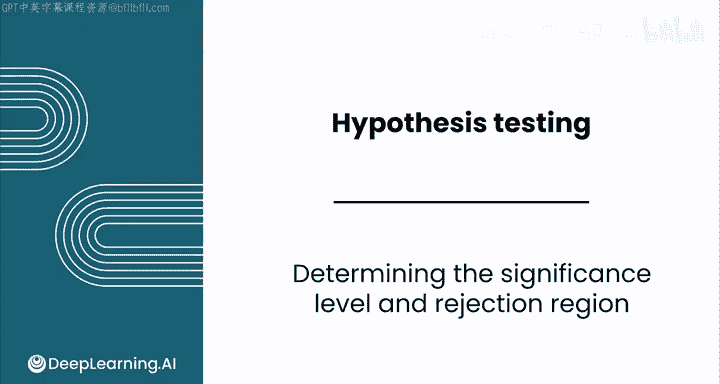
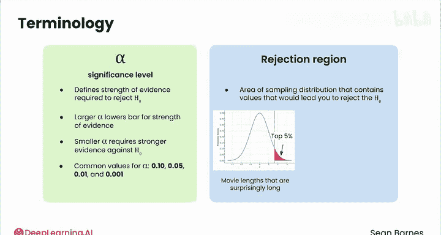

# 140：确定显著性水平与拒绝域 📊

在本节课中，我们将学习假设检验中的两个核心概念：**显著性水平**和**拒绝域**。你将了解如何设定检验的精确度，以及如何根据设定的标准决定是否拒绝原假设。

除了计算检验统计量，你还需要确定检验的精确度。你需要考虑，什么样的结果足够不可能发生，以至于你会拒绝原假设？

以电影时长为例，你想检验2013年的电影平均时长是否超过120分钟，以帮助安排影院排片。这个决策的风险有多高？你是否能接受有5%的概率得出错误结论？或者只接受1%的错误概率？

在之前学习置信区间时，你接触过“置信度”的概念，即你对结论的确定程度。你了解到可以构建90%、95%或99%的置信区间。你的选择取决于你的估计需要多精确。如果你需要对结果非常有把握，你会选择90%还是99%的置信度？你会选择99%。

假设检验依赖于类似的直觉。作为数据分析师，你需要做出判断，确定你能够接受的置信水平。请记住，与所有推断统计一样，你是在试图管理不确定性，而它永远无法被完全消除。

以下是你的样本描述性统计和假设。既然你已经计算了检验统计量的Z分数，你正在处理标准正态分布。

如果你想有95%的把握正确地拒绝原假设，你会寻找那些预期发生概率为5%或更低的、高于均值的检验结果。这个阴影区域代表了Z值预期发生概率为5%或更低的区域，它被称为**拒绝域**，因为任何落入此区域的检验统计量都会导致你拒绝原假设。这个结论可能会促使你调整影院的排片做法。

在进行置信水平为95%的单尾假设检验时，你拒绝原假设的能力取决于拒绝域的大小，其面积为0.05。这个值被称为**显著性水平**，用希腊字母α表示。α=0.05非常常见，常用于医学研究、制造业质量控制和社科的初步研究。

请注意，置信度是显著性水平的补集。如果你想有95%的把握，你就将α设为0.05，代表5%的犯错概率。

想象一下，影院的排片调整成本很高。选择减少每日放映场次可能会降低收入并导致员工班表变动。在调整排片之前，你希望绝对确定电影平均时长确实超过120分钟。在这种情况下，你会想要更高还是更低的显著性水平？

为了进行更精确的检验，你可以将α降低到0.01，这对应于拥有99%的置信度。因此，只有当检验统计量位于该分布中所有均值的前1%时，你才会拒绝原假设。α=0.01常用于临床试验、环境影响研究和财务审计，即错误拒绝原假设所导致的风险较高时。

在这种情况下，你从相同的分布开始。你认为α=0.01的拒绝域会比α=0.05的拒绝域更小还是更大？你的拒绝域会变得更小。这就是它的样子。你想更有把握，所以你只会在分布中前1%的值出现时才拒绝原假设。在影院场景中，这个更小的拒绝域意味着，你需要在有更强证据表明电影更长时，才会改变排片。

还有一个细微差别你应该注意。你刚刚看到了右尾检验的拒绝域。对于左尾检验，过程非常相似，它也只有一个拒绝域。然而，对于双尾检验，你关注的是均值之上和之下的值。

对于电影时长，你的原假设保持不变。但这次，你的备择假设H₁将是：μ ≠ 120。这就是它在分布上的样子。相同的分布，不同的假设，因此有不同的拒绝域。

看一下上方的拒绝域。与仅有的右尾检验相比，双尾检验的上方拒绝域更小。事实上，它小了一半。你的拒绝域在两侧（上侧和下侧）各包含2.5%的数据，总共5%。这是因为你想保持相同的精确度，即错误只发生在5%的情况下，但你有两个拒绝域。如果它们都包含5%的值，那实际上会导致10%的错误率，而不是5%。

好的，信息量很大。我们来回顾一下学到的术语。

**α**，你的显著性水平，有助于定义你需要多强的证据才能拒绝原假设。较大的α值使得用较少的证据更容易拒绝原假设，而较小的α值则需要更强的反对原假设的证据才能拒绝它。α的常见值包括0.10、0.05和0.01。

**拒绝域**是抽样分布中包含那些不可能发生的值的区域，这些值会导致你拒绝原假设。对于α=0.05，你看到这个拒绝域是分布的前5%。在影院例子中，拒绝域代表了那些长得令人惊讶的平均电影时长范围，以至于你得出结论：电影平均时长确实超过了120分钟。

你还看到了可以进行双尾检验，它有两个拒绝域。例如，当检验泳池的pH值是否显著高于或低于7.4时，对于α=0.05，这个检验将有两个拒绝域，每个区域覆盖分布两侧尾部的2.5%。

α，你的显著性水平，帮助你量化你能够接受的不确定性的量。它被用来确定你的检验统计量是否足够罕见，以至于你可以拒绝原假设。

请跟随我进入下一个视频，看看如何使用**P值**来计算这种罕见性，然后你可以将其与α进行比较来进行你的假设检验。

---

**本节课总结**

在本节课中，我们一起学习了假设检验的关键步骤：如何设定**显著性水平（α）** 以及如何确定**拒绝域**。我们了解到，α值的选择（如0.05或0.01）反映了我们对结论精确度的要求，并直接定义了拒绝原假设所需证据的强弱。拒绝域则是根据α值在抽样分布上划定的区域，检验统计量落入此区域将导致我们拒绝原假设。我们还区分了单尾检验和双尾检验中拒绝域的不同。理解这些概念是进行严谨假设检验的基础。