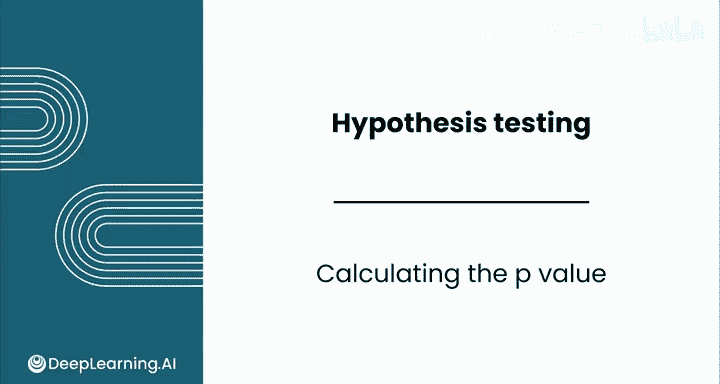
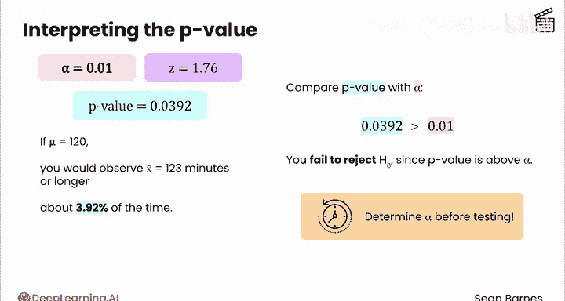
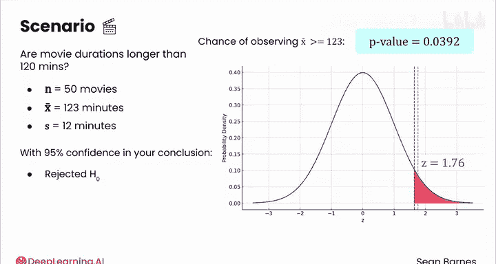

# 141：计算p值 📊

在本节课中，我们将要学习假设检验中的关键一步：计算p值。我们将理解p值的含义，学习如何计算它，并掌握如何通过比较p值与显著性水平来做出统计决策。

---

## 概述

上一节我们介绍了如何计算检验统计量（Z值）并将其与拒绝域进行比较。本节中我们来看看如何精确地量化样本结果的“稀有性”，即计算p值。

p值代表在原假设为真的情况下，观察到当前样本结果（或更极端结果）的概率。它是决定是否拒绝原假设的核心依据。

## 计算p值

你的下一步是判断样本均值是否足够“稀有”，以拒绝原假设。这是进行结果解释前的最后一步。

假设电影院决定选择显著性水平 α 为 0.05。你已经计算出检验统计量 Z 等于 1.76。这个值有多稀有？

我们可以通过观察这个值是否落在拒绝区域内来直观理解。可以看到，Z值确实落在拒绝区域内，略高于边界。因此，如果真实均值确实是120分钟，那么观察到123分钟的样本均值的情况将少于5%的时间。

现在，你可以使用p值（概率值的缩写）来精确计算这个值的稀有程度。p值表示得到与Z值一样稀有或更稀有（根据备择假设的方向）的样本均值的概率。

换句话说，就是得到Z值大于等于1.76的概率。对于这一步，你需要以下两样工具之一：查值表，或者能够进行计算的计算表格软件或编程语言。

让我们来讲解如何计算电影示例的p值。同样，你需要计算在标准正态分布上观察到Z分数大于等于1.76的概率。

回忆一下累积分布函数（CDF），它代表观察到Z分数小于或等于某个特定值的概率。这意味着你可以使用CDF来找到得到Z分数小于等于1.76的概率。

那么，你该如何使用CDF来计算你感兴趣的概率呢？

你需要使用互补法则。Z大于1.76的概率等于1减去Z小于等于1.76的概率，而后者正是CDF告诉你的值。

如果你手动计算了这个Z分数，你可以使用计算表格函数来计算p值。在本例中，Z小于等于1.76的概率约为0.9608。这个概率的互补概率则是1减去这个值，即0.0392。这就得到了p值，即观察到比你已观察到的检验统计量更极端结果的概率。

顺便提一下，当你直接处理样本数据（而不是自己计算Z分数）时，通常不需要在计算表格中执行此步骤。你将使用Z检验函数来执行之前看到的所有步骤（除了定义假设）。

由于p值等于0.0392，这意味着如果所有电影的真实平均时长是120分钟，那么你观察到样本均值为123分钟或更长的概率约为3.92%。

你认为这个概率足够稀有到可以拒绝原假设吗？

## 比较p值与显著性水平

将你的p值与显著性水平（本例中为0.05）进行比较。

由于你的p值低于显著性水平，你将拒绝原假设。直观上，通过这个比较，你是在问这个事件是否预期在少于5%的时间内发生，而本例中情况确实如此。

现在，考虑你在上一个视频中看到的案例，即电影排期难以调整的情况。那么，如果你要求假设检验的显著性水平为1%呢？当α等于0.01时，这个事件是否足够稀有到可以拒绝原假设？

在这种情况下，你不会拒绝原假设，因为p值（并未改变）大于α。你将没有观察到足够强的证据表明电影平均时长大于120分钟。

至关重要的是，你必须在进行检验之前确定你的显著性水平。避免为了做出你想要的决策而调整它，这种调整会引入分析偏差。

## 过程回顾与总结

让我们退一步，将所有内容整合起来。

你有一个关于电影平均时长是否超过120分钟的商业问题。你收集了50部电影的样本，发现它们的平均时长为123分钟，标准差为12分钟。你想知道是否有足够的证据表明电影时长超过120分钟。

接着，通过检验统计量，你计算了如果真实均值确实是120分钟，观察到样本均值为123分钟或更高的概率。根据你的p值，你发现你会观察到像123分钟这样极端或更极端的值的情况约占3.92%的时间。

由于你希望结论有95%的置信度，你拒绝了原假设，得出结论：有足够的证据相信真实均值高于120分钟。很棒，你完成了一次计算和解释！

---

## 总结

本节课中我们一起学习了假设检验中计算和解释p值的完整过程。我们了解到p值是原假设成立时获得当前或更极端样本结果的概率，并通过将其与预先设定的显著性水平α进行比较来做出统计决策。记住，必须在分析前设定α，并避免根据结果事后调整，这是保证分析客观性的关键。

这个过程涉及许多内容，不要求你记住所有细节。请跟随我到下一个视频，观看这个过程在计算表格中如何展开，这将帮助你培养对假设检验在实践中如何运作的直觉。