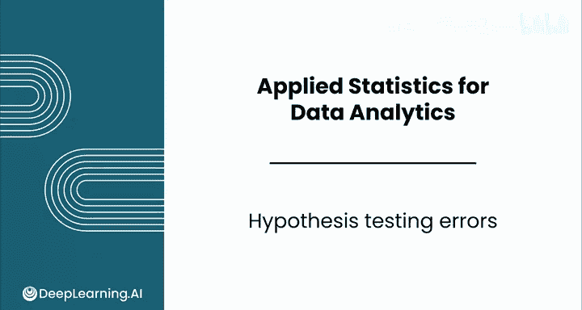
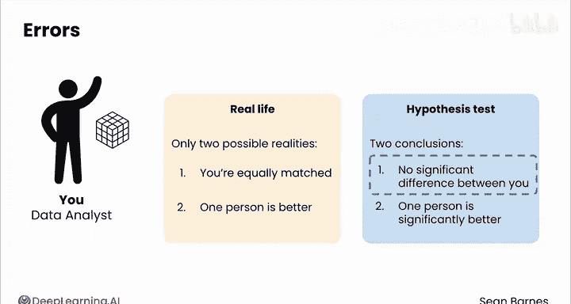
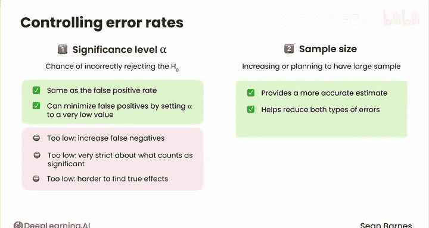
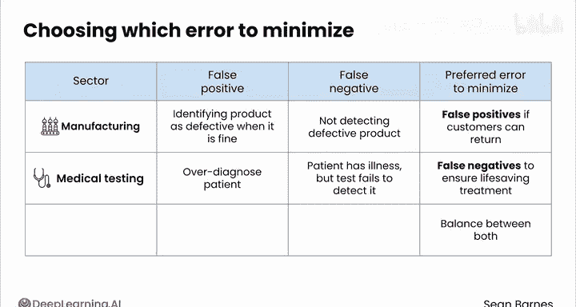

# 143：假设检验中的错误

在本节课中，我们将要学习假设检验中可能出现的两种关键错误：**第一类错误**和**第二类错误**。理解这些错误类型及其产生原因，对于正确解读统计检验结果、管理不确定性至关重要。

---

## 假设检验与不确定性

推断统计的核心在于管理不确定性。理解假设检验可能出错的方式，是管理不确定性的重要部分。

假设检验可能在两个关键方面出错：**你发现了一个效应，但现实中并不存在**；或者**你没有发现效应，但现实中确实存在一个效应**。让我们深入探讨。

---

## 假设检验的“窗口”与现实

你的假设检验使用样本作为窥探真实世界的“窗口”。

回想一下你和朋友比赛解魔方的例子，你们想通过比赛看看谁更厉害。在现实中，只存在两种可能的情况：**你们实力相当**，或者**其中一人更强**。

如果你进行假设检验来回答这个问题，你会得出两个结论之一：**你们之间没有显著差异**，或者**其中一人显著更强**。

*   **情况一**：如果你们实力相当，并且你的检验没有发现显著差异。这很好。你的“窗口”看到了正确的效应。这种情况称为**真阴性**。你没有发现显著差异，而现实中确实没有差异。
*   **情况二**：如果你们实力不相当，并且你的检验发现其中一人更强。这也很好。这种情况称为**真阳性**。现实世界中存在差异，而你的检验正确地识别了它。

然而，你也能看到有两种出错的方式。

---

## 两种错误类型

以下是假设检验可能出错的两种方式：

1.  **假阳性**：可能你们实力相当，但你的检验却得出结论认为其中一人更强。你发现了一个差异，但现实中并不存在。
2.  **假阴性**：也可能你的检验得出结论认为没有显著差异，但实际上其中一人确实更强。存在一个真实的效应，但你未能发现它。

让我们将这个例子推广到更一般的情况。

---

## 错误类型的矩阵分析

正如你在之前的视频中所见，你的假设检验有两个可能的结论：**拒绝原假设** 或 **未能拒绝原假设**。

同时，存在世界的真实状态：**原假设为真** 或 **原假设为假**。

我们可以用一个矩阵来清晰地展示这四种组合：

*   **假阳性**：如果你拒绝了原假设，但原假设实际上为真。
*   **假阴性**：如果你未能拒绝原假设，但原假设实际上为假。
*   **真阳性**：如果你拒绝了原假设，并且原假设确实为假。
*   **真阴性**：如果你未能拒绝原假设，并且原假设确实为真。

---

## 控制错误率的机制

你有几种机制来控制这些错误率。

### 显著性水平 α

其中之一是你的**显著性水平 α**。你的显著性水平代表了错误地拒绝一个真实原假设的概率。它是你必须承担的风险，基于你所知的信息。

α 对应的是假阳性率还是假阴性率？**它与假阳性率相同**。

你可以通过将 α 设置为一个非常低的值来尝试最小化假阳性，但这会增加假阴性的可能性。将 α 设得过低意味着你对“什么算作显著”非常严格，这使得发现真实效应变得更加困难。

### 样本量

增加你的样本量或计划拥有足够大的样本，是假设检验成功的一个重要因素。**大样本能提供更精确的估计，并有助于减少两类错误**。大样本还能帮助你检测非常细微的效应。

---

## 权衡错误类型：实际应用

你是希望最小化假阳性还是假阴性，取决于与每种结果相关的成本和风险。

以下是不同场景下的权衡考量：

*   **制造业**：在发货前测试产品缺陷。假阳性意味着将一个完好的产品识别为有缺陷，而假阴性则是未能检测出有缺陷的产品。如果客户可以轻松退货，你可能更倾向于最小化假阳性，以避免浪费实际完好的产品。
*   **医疗检测**：对于严重疾病的检测，通常更希望最小化假阴性。假阴性发生在患者确实患有某种疾病，但检测未能发现该疾病时。虽然诊断会给患者带来压力，但通常更希望过度诊断，因为诊断可以通过进一步检测来纠正。与此同时，未被检测出疾病的患者将无法接受可能挽救生命的治疗。
*   **银行业**：审批贷款申请。假阳性可能意味着批准了一个最终会违约的人的贷款，而假阴性可能意味着拒绝了一个会全额还款的人的贷款。银行可能会进行重大的风险评估，以最小化假阳性带来的损失，同时最大化盈利贷款的数量。

平衡错误类型只是你作为数据分析师在处理不确定性时必须做出的又一个妥协。你无法真正做到100%的准确。

---

## 总结

本节课中我们一起学习了假设检验中的两种核心错误。**假阳性**是错误地声称存在效应，而**假阴性**是未能发现真实存在的效应。通过理解**显著性水平 α** 与假阳性率的关系，以及**大样本量**对减少两类错误的重要性，我们可以在实际应用中根据具体成本和风险（如医疗、制造、金融等领域）来权衡和优化我们的检验策略。管理这些错误是数据分析中处理不确定性的关键部分。

现在，你已接近本课的尾声。关于假设检验，还有一个细微之处需要了解。请跟随我进入下一个视频继续学习。