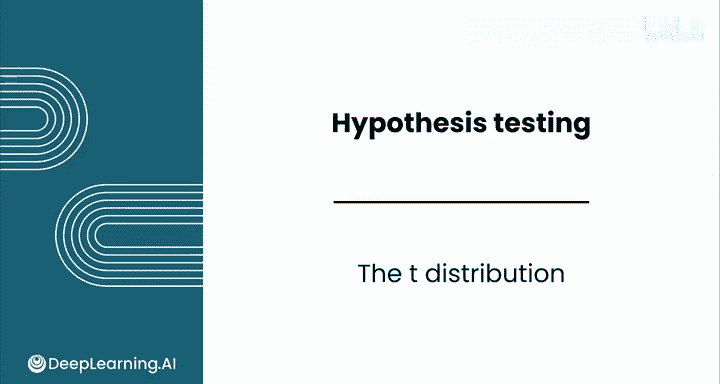
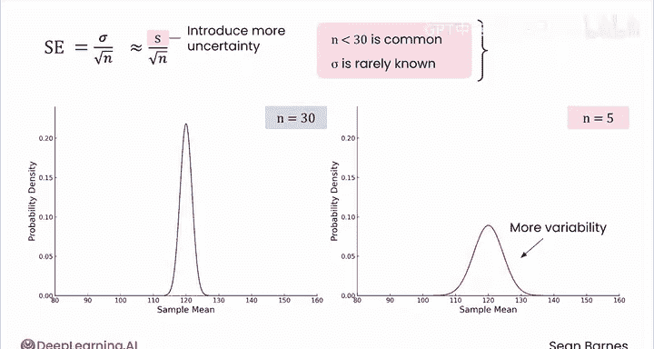
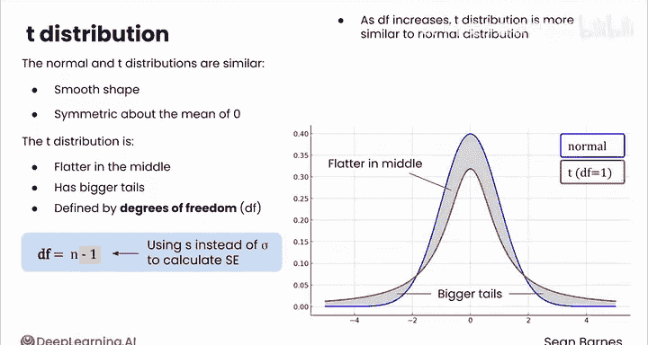
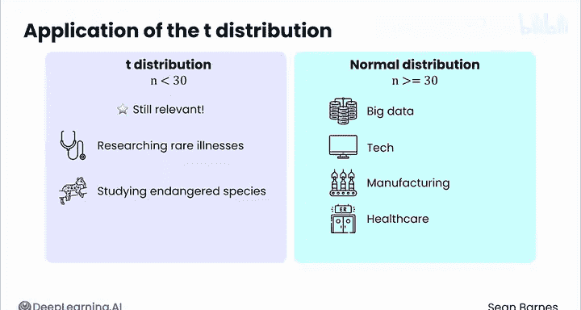

# 144：t分布 📊

在本节课中，我们将要学习一种特殊的概率分布——t分布。当样本量较小或总体标准差未知时，t分布是进行假设检验的更合适选择。

## 中心极限定理的局限性

上一节我们介绍了假设检验的基本流程，其核心依赖于样本均值的抽样分布服从正态分布。然而，这里存在一个额外的复杂因素：在某些情况下，样本均值的抽样分布并非正态分布，此时你必须使用另一种分布来进行假设检验。

回想中心极限定理的条件：当基于一个大样本（通常为30个或更多观测值）计算样本均值时，样本均值的抽样分布是正态分布的。

那么，如果你基于少于30个观测值计算样本均值，会发生什么？你认为均值的抽样分布的变异性会更大还是更小？

## 小样本带来的不确定性

小样本的样本均值很可能比大样本具有更大的变异性。这个条件给你的估计引入了更多的不确定性。

你还记得，均值的抽样分布的标准误等于总体标准差σ除以样本量的平方根：`标准误 = σ / √n`。当你使用样本标准差作为σ的估计值时，会引入更多的不确定性。

小样本量在许多领域都很常见，包括医疗保健，而总体标准差通常是未知的。当以下任一或两个条件成立时：样本量小于30，或σ未知，对于均值的抽样分布，有一个更合适的选择，即t分布。

## 认识t分布 📉

t分布与标准正态分布非常相似。它们都具有平滑的形状，并且关于均值0对称。然而，t分布在中间更平坦，尾部更大。

直观地说，这意味着你更有可能观察到远离均值的值。这一观察结果与t分布反映了对基础数据更多不确定性的观点是一致的。

不过，一个区别在于t分布由一个称为**自由度**的参数定义。自由度是一个统计量，试图量化从有限样本估计总体参数时引入的不确定性。这是一个有点抽象的概念。

对于当前场景，**自由度**的计算公式为：`df = n - 1`。这里的减1源于使用样本标准差而非总体标准差来构建分布。因为你使用的是估计值，所以你的计算引入了更多的不确定性。

随着自由度的增加，t分布变得越来越接近正态分布。因此，你选择使用哪种分布就变得不那么重要了。这种向正态分布的收敛反映了随着样本量越来越大，你可以对结论有更大的把握。随着样本量的增加，你能获得关于总体变异性的更好信息；但对于较小的样本，你使用的是不那么精确的估计。

## 使用t分布进行假设检验

你将遵循与之前学习过的类似的流程来进行假设检验。你将以相同的方式定义假设，并收集计算检验统计量所需的样本统计量。

然而，你将使用t分布而非正态分布来判断你的样本统计量是否足够罕见，从而拒绝原假设。你的检验统计量将被称为**T**而非Z，并且你将使用`t.test`函数而非`z.test`函数。

拒绝区域以及P值也不同，因为你现在使用t分布来定义它们。

考虑电影时长的例子，假设总体均值为120，样本标准差为12，但样本量仅为5。观察一下正态分布和t分布之间的差异。

你可以看到t分布的尾部更大。对于α=0.05，拒绝区域也不同。注意，正态分布的拒绝区域大约从128分钟开始，而t分布的拒绝区域大约从132分钟开始。这意味着t分布需要更强的证据来拒绝原假设。

举例来说，假设你观察到的五部电影的样本均值为130分钟。在正态分布中，130分钟落在这里，P值为0.031，这意味着你会拒绝原假设，因为0.031小于你的α值0.05。而在t分布中，130分钟落在这里，P值为0.068。在这种情况下，你将无法拒绝原假设。

由此可见，对于小样本量，选择t分布而非正态分布是有影响的。它对小样本量应用了更严格的标准。

## t分布的现代应用

当t分布最初被开发时，处理样本量为10或15的情况并试图从这个小群体中得出关于总体的结论更为常见。如今，你更可能处理样本量大于30的大样本。

对于遵循中心极限定理的大样本，经验法则是：你在数据分析基础中学到，在科技领域你经常会处理大数据。如果你想调查用户，你或许能获得成千上万人的数据。在制造业，你的系统可能会记录每个产品的生产时间。如果你处理急诊室数据，你可能拥有数千次就诊记录，而不是几十次。

t分布在许多情况下仍然相关，例如在研究罕见疾病或研究濒危物种时，当你处理的是小样本。当你的样本量超过30左右时，这种差异不太可能影响你的决策。

## 总结

本节课中我们一起学习了关于假设检验的第一课，你学到了很多：从如何构建假设，到确定拒绝区域，计算检验统计量，以及解释P值。

接下来，你将完成实践评估和练习实验，内容涉及检查人类的睡眠模式。当你完成实践评估和实验后，请加入下一节课，学习可以在不同商业案例中使用的各种假设检验。我们下节课见。