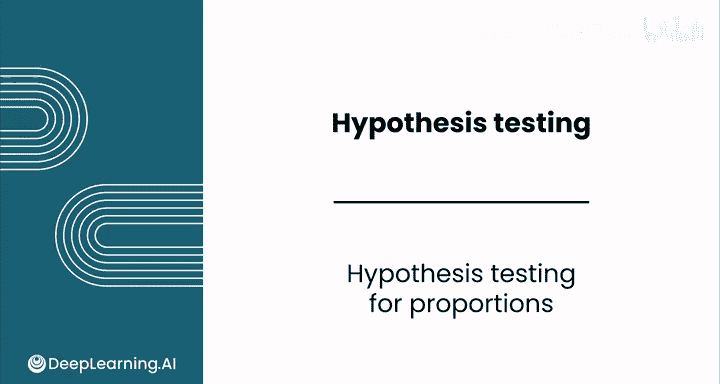
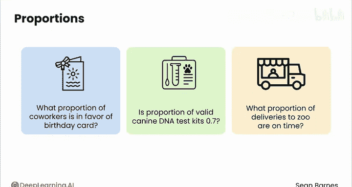
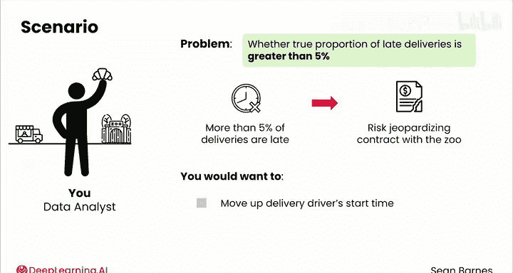
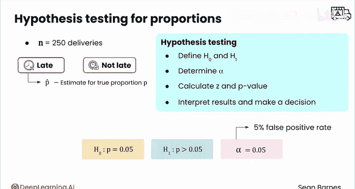
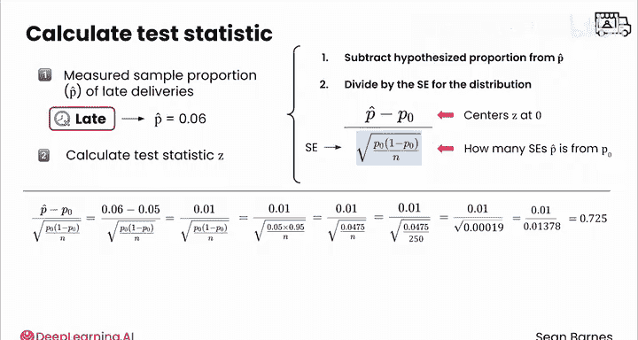
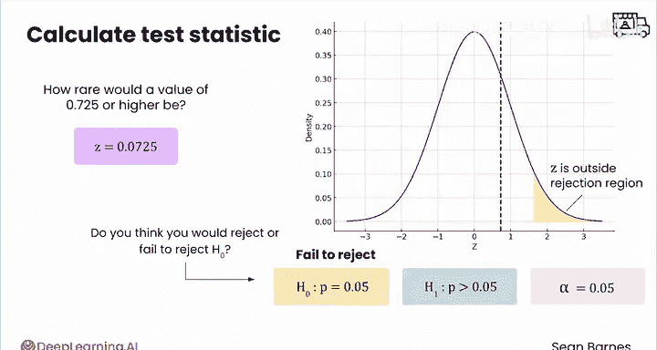
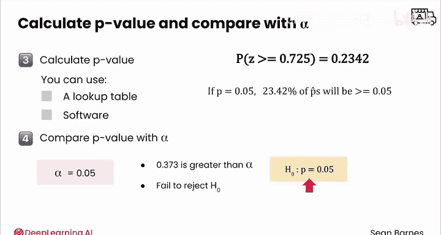
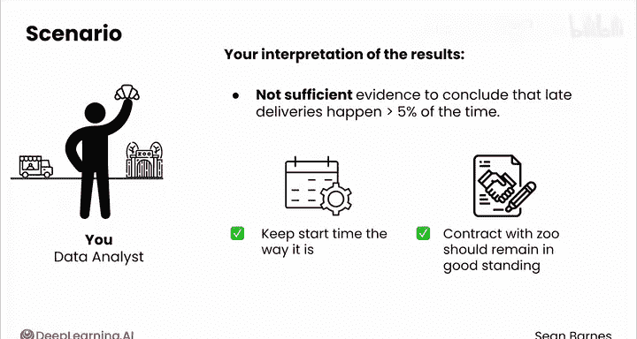

# 145：比例假设检验 📊

在本节课中，我们将学习如何对比例进行假设检验。你将了解到，用于均值检验的假设检验流程同样适用于比例检验。我们将通过一个具体的商业案例，一步步学习如何定义假设、计算检验统计量、得出P值并做出决策。

---

## 概述

上一节我们介绍了均值假设检验的流程。本节中，我们来看看如何将同样的流程应用于**比例**的假设检验。比例检验在商业分析中非常常见，例如评估产品合格率、客户满意度比例或交付准时率。

## 假设检验流程回顾

进行假设检验通常遵循以下四个步骤：
1.  定义原假设和备择假设。
2.  确定显著性水平。
3.  计算检验统计量和P值。
4.  解释结果并做出决策。

这个流程对均值检验和比例检验都适用。

## 案例背景：面包店配送

假设你在一家向当地动物园配送糕点的面包店工作。面包店刚刚获得一份大合同，需要将每日配送次数从1次增加到5次。

根据合同条款，如果**迟到配送的比例超过5%**，面包店将面临失去合同的风险。因此，你需要评估是否应提前司机的上班时间，以确保配送准时。

你关心的核心问题是：**真实的迟到配送比例是否大于5%？**

## 第一步：定义假设

首先，我们需要建立假设。

*   **原假设 (H₀)**： 代表现状。此处我们假设真实的迟到比例 `p` 等于合同允许的临界值，即 `p = 0.05`。如果原假设成立，则无需改变上班时间。
*   **备择假设 (H₁)**： 代表我们想要验证的猜测。此处我们怀疑真实的迟到比例高于合同允许值，即 `p > 0.05`。

用公式表示如下：
**H₀: p = 0.05**
**H₁: p > 0.05**

## 第二步：确定显著性水平

这个决策风险中等，因此你选择将显著性水平 `α` 设定为 `0.05`。这意味你允许有5%的概率错误地拒绝原本正确的原假设（即第一类错误）。

在抽样分布中，这对应着拒绝域位于分布右侧的5%区域。

## 第三步：收集数据并计算检验统计量

你收集了250次配送的样本数据，并计算出样本中的迟到比例 `p̂`（读作“p-hat”）为 `0.06`。

接下来，需要计算检验统计量 `Z`，它衡量了样本比例与原假设假设的比例之间的差距，以标准误差为单位。

检验统计量 `Z` 的计算公式为：
**Z = (p̂ - p) / SE**
其中，`SE` 是标准误差。

标准误差 `SE` 的计算公式为：
**SE = √[ p * (1 - p) / n ]**

请注意，在比例检验中，我们使用**原假设中假设的比例 `p`**（此处为0.05）来计算标准误差，而不是使用样本比例 `p̂`。这是因为在原假设成立的假设下，`p` 被视为已知的真实值。

现在，代入数值进行计算：
1.  `p̂ - p = 0.06 - 0.05 = 0.01`
2.  `p * (1 - p) = 0.05 * 0.95 = 0.0475`
3.  `0.0475 / 250 = 0.00019`
4.  `SE = √0.00019 ≈ 0.01378`
5.  `Z = 0.01 / 0.01378 ≈ 0.725`

计算出的 `Z` 值约为 `0.725`，这意味着样本比例 `0.06` 比原假设的 `0.05` 高出约 `0.725` 个标准误差。

## 第四步：计算P值并做出决策

`Z` 值 `0.725` 在标准正态分布中对应的右侧概率（即P值）约为 `0.2342`。

P值的含义是：**如果原假设成立（真实迟到比例就是5%），那么得到样本比例为6%或更高（即Z值≥0.725）的概率是23.42%。**

现在，将P值与预先设定的显著性水平 `α=0.05` 进行比较：
`0.2342 > 0.05`

由于P值远大于 `α`，我们没有足够的证据拒绝原假设。

## 结果解读与决策

以下是基于假设检验的决策逻辑：

*   **决策**： 无法拒绝原假设。
*   **业务解读**： 目前的样本数据未能提供充分证据表明迟到配送的比例超过了5%。因此，从统计角度看，没有必要改变司机当前的上班时间。
*   **合同影响**： 基于此分析，面包店与动物园的合同应能继续保持良好状态。

---

## 总结

本节课中我们一起学习了比例假设检验。我们通过一个面包店配送的案例，完整演练了假设检验的四个步骤：定义假设、确定显著性水平、计算检验统计量和P值、并做出决策。关键点在于，比例检验的流程与均值检验一致，但计算标准误差时使用的是原假设中的比例 `p`。当P值大于显著性水平 `α` 时，我们无法拒绝原假设，即认为没有足够证据支持备择假设所声称的情况。